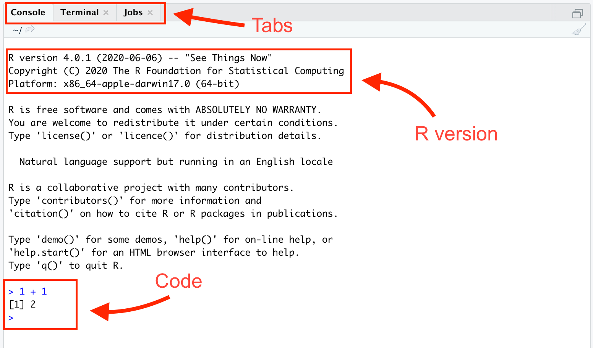
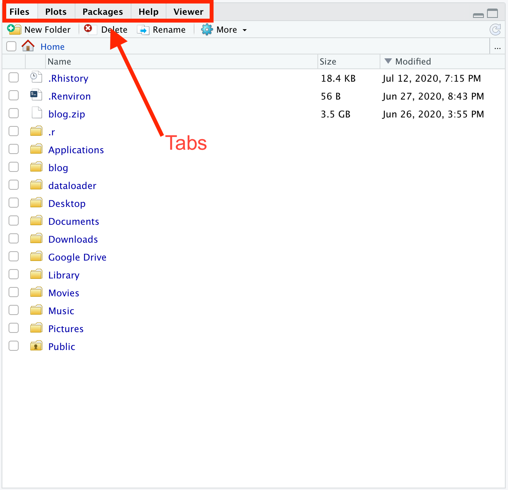

# Getting Started {-}

<!-- At the end of RStudio set up, have them start a new project, and show them screen shots of putting the default folder someplace like ~/Desktop/projects. Not on OneDrive. -->

<!-- Add more material about Happy Git with R and how to use it. Add more material from R basics. They need to know how to create and knit an Rmd file. -->

<!-- How should we end this chapter? Perhaps with some cool example graphics. Take this course to build these things? Perhaps even a curl() grab of an Rmd which they then knit into something cool. Maybe the plot from chapter 1? -->

<!-- Update some of the graphics, especially since the tutorials now live in a different package. Need new gif for the tutorial save process. Or maybe the process is so simple now that we don't need a gif at all.  -->

The world confronts us. Make decisions we must.

### Installing R and RStudio {-}

```{r, echo = FALSE, fig.cap = "Analogy of difference between R and RStudio."}
knitr::include_graphics("00-getting-started/images/R_vs_RStudio_1.png")
```

Throughout this book, we assume that you are using R via RStudio. R is to RStudio as a car's engine is to its dashboard.

More precisely, R is a programming language that runs computations, while RStudio is an *integrated development environment (IDE)* that provides an interface with many convenient features. Just as having access to a speedometer, rearview mirrors, and a navigation system makes driving much easier, using RStudio's interface makes using R much easier. 

Download and install both R and RStudio (Desktop version) on your computer. 

1. **Do this first:** [Download and install R](https://cloud.r-project.org/). 

2. **Do this second:** [Download and install RStudio Desktop](https://rstudio.com/products/rstudio/download/#download) (the free version).

### Using R via RStudio {-}

```{r echo = FALSE, fig.cap = "Icons of R versus RStudio on your computer."}
knitr::include_graphics("00-getting-started/images/R_vs_RStudio.png")
```

Much as we don't drive a car by interacting directly with the engine but rather by interacting with elements on the car's dashboard, we won't be using R directly but rather we will use RStudio's interface. After you install R and RStudio on your computer, you'll have two new *programs* (also called *applications*) you can open. Always work in RStudio and not directly in the R application. 


Let's begin with getting familiar with RStudio. Open up RStudio. You should see three *panes*, or panels, dividing the screen: the *Console pane*, the *Files pane*, and the *Environment pane*. 

<!-- DK: Change image to have names of panes in  big red letters. -->


```{r, echo = FALSE}
knitr::include_graphics("00-getting-started/images/rstudio.png")
```

This is your workspace. Start with the big pane on the left:

```{r, echo = FALSE}

```


There are three panels (or tabs) in this window, we'll be focusing on the Console and Terminal. When you first start R, the Console gives you some information about your version of R. The Console is where you can type and run R code. For example, if you type 1 + 1 and hit return, the Console returns 2.

Look at the top right:

```{r, echo = FALSE}
knitr::include_graphics("00-getting-started/images/top_right_window.png")
```


The main two tabs you'll be using are Environment and Git (which is not yet visible). The Environment tab shows you the datasets and variables you currently have loaded into R. In this case, we loaded in a dataset with 3407 rows and 5 columns and a variable `x` equal to 5. For you, the Environment should be empty. Let's change that. Go to your Console and type:

```{r, eval = FALSE}
x <- 5
```

Now, hit return/enter and you should see a variable x equal to 5 in your Environment tab. You must always hit return/enter after typing a command, otherwise RStudio will not realize that you want R to execute the command. Look at the bottom right window:

```{r, echo = FALSE}

```


The Files tab displays your computer's file system. When you create a project later, this tab will automatically show the contents of your project's folder. The Plots tab will show you a preview of any plots you make in RStudio. Help will be [discussed later](#how-to-get-help).


### Package installation {-}

R *packages*, also known as *libraries*, extend the power of R by providing additional functions and data. 

```{r echo = FALSE, fig.cap = "Analogy of R versus R packages."}
knitr::include_graphics("00-getting-started/images/R_vs_R_packages.png")
```

R is like a new mobile phone: while it has a certain amount of features when you use it for the first time, it doesn't have everything. R packages are like the apps you can download onto your phone. 

Consider an analogy to Instagram. If you have a new phone and want to share a photo with friends. You need to:

1. *Install the app*: Since your phone is new and does not include the Instagram app, you need to download the app. You do this only once. (You might need to do this again in the future when there is an update to the app.)
1. *Open the app*: After you've installed Instagram, you need to open it. You need to do this every time you use the app.

The process is very similar for an R package. You need to:

```{r, echo = FALSE, fig.cap = "Installing versus loading an R package"}
knitr::include_graphics("00-getting-started/images/install_vs_load.jpg")
```

1. *Install the package*: This is like installing an app on your phone. Most packages are not installed by default when you install R and RStudio. Thus if you want to use a package for the first time, you need to install it. Once you've installed a package, you likely won't install it again unless you want to update it to a newer version.
1. *"Load" the package*: "Loading" a package is like opening an app on your phone. Packages are not "loaded" by default when you start RStudio. You need to "load" each package you want to use every time you restart RStudio.

Let's install three of the packages which we will need in the *Primer*. At the Console pane within RStudio, type: 

```{r, eval = FALSE}
install.packages(c("remotes", "tidyverse", "usethis"))
```

And press Return/Enter on your keyboard. Note you must include the quotation marks around the names of the packages. Note that these packages depend on other packages, which will be automatically installed.

One tricky aspect of this process is that R will occasionally ask you:

```{bash, eval=FALSE}
Do you want to install from sources the packages which 
need compilation? (Yes/no/cancel)
```

Unless you have a good reason not to, always answer "no" to this question. 

R packages generally live in one of two places: 

* CRAN (rhymes with "clan") for more mature, popular packages. Use `install.packages()`, as you did above.

* Github for more experimental, less stable packages. Use `remotes::install_github()`. At the end of this section, we will install one package from Github.


### Package loading {-}

Recall that after you've installed a package, you need to "load" it. We do this by using the `library()` command.

For example, to load the **remotes** package, run the following code in the Console. What do we mean by "run the following code"? Either type or copy-and-paste the code into the Console and then hit the enter/return key. 

```{r, eval = FALSE}
library(remotes)
```

After running the earlier code, a blinking cursor should appear next to the `>` symbol. (The `>`  is generally referred to as the "prompt.") This means you were successful and the **remotes** package is now loaded and ready to use. If, however, you get a red "error message" that reads:

```
Error in library(remotes) : there is no package called ‘remotes’
```

then you haven't successfully installed the package. If you get this error message, make sure to install the **remotes** package before proceeding. 

For historical reasons *packages* are also known as *libraries*, which is why the relevant command for loading them is `library()`.

Note that R will occasionally ask you if you want to install some packages. Almost all the time you do want to, otherwise R would not be asking you. 

### Package use {-} 

*You have to load each package you want to use every time you start RStudio.* If you don't load a package before attempting to use one of its features, you will see an error message like:

```
Error: could not find function
```

This is a different error message than the one you just saw about a package not having been installed yet. R is telling you that you are trying to use a function in a package that has not yet been loaded. R doesn't know where to "find" the function you want to use. 

Let's install a package that is not available from CRAN: **primer.tutorials**. Copy and paste the following to the R Console:

```{r, eval = FALSE}
library(remotes)
remotes::install_github("PPBDS/primer.tutorials")
```

Depending on your computer/browser/locale, this might fail, especially if the quotation marks you paste overturn "curly." In that case, type the commands yourself.

Many other new packages will be installed, including **primer.data**, which provides the data sets we use in the *Primer*.  It may take a few minutes. If something gets messed up, it is often useful to use the `remove.packages()` command to remove the problematic package and then install it again. 

### RStudio set up {-}

You will thank us later if you run these commands now:

```{r, eval = FALSE}
library(usethis)
use_blank_slate()
```

<!-- DK: Give them a tour of hidden files in the Files tab. -->

This changes the default value of RStudio to start each session afresh, with no junk leftover from your last session. This makes it much easier to create a *reproducible* analysis. 

### Tutorials {-}

For each chapter of the textbook, there are one or more tutorials available in the **primer.tutorials** package. In order to access these tutorials, you should run `library(primer.tutorials)` in the R Console.

<!-- DK: Need new png -->

```{r, echo = FALSE}
knitr::include_graphics("00-getting-started/images/run_ppbds.png")
```

You can access the tutorials via the Tutorial pane in the top right tab in RStudio. Click "Start tutorial" for the "Getting Started" tutorial. If you don't see any tutorials, try clicking the "Home" button -- the little house symbol with the thin red roof in the upper right. You may need to restart your R session. Click on the "Session" menu and select "Restart R".

```{r, echo = FALSE}
knitr::include_graphics("00-getting-started/images/tutorial_pane.gif")
```

In order to expand the window, you can drag and enlarge the tutorial pane inside RStudio. In order to open a pop-up window, click the "Show in New Window" icon next to the home icon.

You may notice that the Jobs tab in the lower left will create output as the tutorial is starting up. This is because RStudio is running the code to create the tutorial. If you accidentally clicked "Start Tutorial" and would like to stop the job from running, you can click the back arrow in the Jobs tab, and then press the red stop sign icon.

**Your work will be saved between RStudio sessions**. You can complete the tutorial in multiple sittings. Once you have completed the tutorial, follow the instructions on the tutorial **Submit** panel and upload the resulting file to Canvas.

Tutorials are graded pass/fail. It is very hard to fail. As long as you make an honest attempt, you will pass easily.

Now what? There are a few ways you can close out of a tutorial safely so you can quit your RStudio session.

* If you clicked "Show in new window" and were working on the tutorial in a pop-up window, simply X out of the pop-up window.  
* If you were working on the tutorial inside the Tutorial pane of RStudio, simply press the red stop sign icon.   


<!-- DK: Need a better way to end this chapter. -->

## Summary {-}

You should have done the following:

* Installed the *latest* versions of R and RStudio. 

* Installed, from CRAN, these three packages:

```{r, eval = FALSE}
install.packages(c("remotes", "tidyverse", "usethis"))
```

* Installed, from Github, this package:

```{r, eval = FALSE}
remotes::install_github("PPBDS/primer.tutorials")

```

* Set up your RStudio preferences:

```{r, eval = FALSE}
usethis::use_blank_slate()
```


