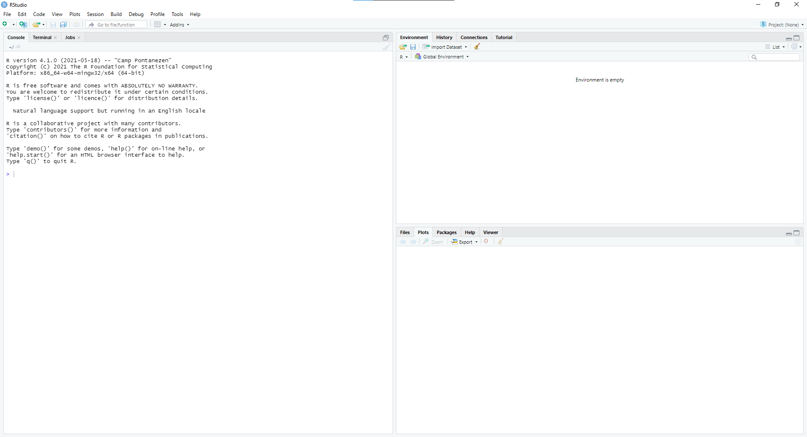

# Visualization

Everyone loves visualizations. 

<!-- Re-read the chapter and add a bunch of comments with your initials. KX: -->

<!-- Read Chapter 5 and 6 and 7. -->

<!-- Fix opening graph so that it looks nicer.  Or maybe change it completely? e.g,,-->

<!-- Learn about tutorials. Do the same create_from_github. Read instructions.Rmd. Start Visualization-D, which is like Visualization-C, except better. This is harder then it looks. -->


<!-- Would be nice if the plot featured a statistical measure of some kind (maybe a 95% confidence interval) so that we have a motivation for learning about distributions. Probably need a very different plot. Maybe something political? Election 2020? -->

<!-- Plot should be much cooler, perhaps even using bigger data. And an associated map. Precinct level voting changes 2012 -> 2016 -> 2020, perhaps. But still needs to be something which we can easily use with plotly. Necessary for it to be animateable? -->

<!-- Old stuff: -->

<!-- New section on cool packages. gghighlights, ggsides, -->

<!-- Add section which explains plotly. -->

<!-- Switch all ifelse to if_else -->

<!-- Should discuss `group` aesthetic, especially for line plots. -->

<!-- Better explain Tidyverse. -->

```{r, message = FALSE, echo = FALSE}
library(tidyverse)
library(ggthemes)
library(scales)
library(gapminder)

gap_p <- gapminder %>%
  filter(continent != "Oceania") %>%
  filter(year == max(year)) %>% 
  ggplot(aes(gdpPercap, lifeExp, color = continent)) +
    geom_point(alpha = 0.7) +
    geom_smooth(method = "lm", 
                formula = y ~ x,
                se = FALSE) + 
    facet_wrap(~continent, nrow = 2) +
    labs(title = "Life Expectancy and GDP per Capita",
         subtitle = "Connection between GDP and life expectancy is weakest in Africa",
         x = "GDP per Capita",
         y = "Life Expectancy") +
    scale_x_log10(breaks = c(500, 5000, 50000),
                  labels = scales::dollar_format(accuracy = 1)) + 
    theme_clean() + #KX: theme_economist() did some uniquely weird stuff
    theme(legend.position = "none")

gap_p
```

Once you have read this chapter, and completed the associated tutorials, you will be able to create graphics like this one with your data. Join us on the journey.

**Remember:** *You need to practice every day.* Learning to code/program is like learning a foreign language. Daily practice is the *sine qua non* for progress.

<!-- KX: Moved reminder from later in the text to where it's more relevant. -->

<!-- Fix the graph. The subtitle overlapping with the title isn't great aesthetically and also probably isn't the best "hey look pretty graphs" appeal -->

## Basics of R & RStudio

R is an [interpreted language](https://www.geeksforgeeks.org/difference-between-compiled-and-interpreted-language/#:~:text=An%20interpreted%20language%20is%20a,executed%20by%20some%20other%20program.). This means you have to type in commands written in *R code*. In other words, you have to code/program in R. We use the terms "coding" and "programming" interchangeably.
<!-- KX: Replaced Wikipedia link with a more helpful definition -->

<!-- DK: This is awkward. When are we teaching about R Markdown? -->

If you want a slower introduction than we are providing here, check out the short book, [*Getting Used to R, RStudio, and R Markdown*](https://rbasics.netlify.com/). @usedtor2016 include screencast recordings that you can follow along and pause as you learn. They include an introduction to R Markdown, a tool used for reproducible research in R.

With the rest of this primer, we will use a different font to distinguish regular text from `computer_code`.
<!-- KX: Moved from later in the text to where it's more relevant. -->
### Fundamentals of the RStudio Application
<!-- DK: Should have an entire tutorial devoted to this section, hitting every single section. -->

When opening RStudio (Version 1.4.1106), you should be greeted by a window that resembles the image below:
```{r, echo = FALSE, fig.cap = "Analogy of difference between R and RStudio."}

```

* *Console pane*: where you enter in commands in RStudio.

<!-- 
KX: Panes to be discussed:
Terminal
Jobs
Environment
History
Connections
Tutorial
Files
Plots
Packages
Help
Viewer
-->


### Fundamentals of R
<!-- KX: can we copy the order from https://www.tutorialspoint.com/r/r_data_types.htm? -->
If you'd like to follow along with this section, you can open open the *Console pane* in RStudio.

* *Running code*: the act of telling R to put our code into action. 

* *Objects*: where values are stored in R. You can *assign* values to objects and display the contents of objects. Use the assignment operator `<-` to do so.  You can choose almost any name you like for an object, as long as the name does not begin with a number or a special character like `+`, `*`, `-`, `/`, `^`, etc.

For example we can save the result of `4 + 3` to an object named `x`. 

```{r}
x <- 4 + 3
```

Now, whenever we type `x`, the value of 4 + 3 will appear:

```{r}
x
```


* *Data types*: integers, doubles/numerics, logicals, and characters. 
  + Integers are values like -1, 0, 2, 4092. 
  + Doubles or numerics are a larger set of values containing both the integers but also fractions and decimal values like -24.932 and 0.8.
  + Logicals are either `TRUE` or `FALSE`. Characters are text like "cabbage", "Hamilton", or "The Wire is the greatest TV show ever."
  + Characters are often denoted with the quotation marks around them.

* *Vectors*: a collection of values. These are created using the `c()` function, where the `c` stands for **c**ombine. 

For example, `c(2, 4, 6, 8)` creates a four element vector of numeric values.

```{r}
c(1, 2, 3, 4)
```


* *Factors*: used to represent "categorical data." We will go into detail about these and other variable types in Chapter \@ref(wrangling).

<!-- Explain factors and categorical data more, even after reading wrangling I'm still somewhat unsure what it means and it might be good to have a more in-depth explanation here for those of us who aren't super familiar with data terms. Maybe just a paragraph.  -->

* *Data frames*: rectangular arrangements of data. Think of a [spreadsheet](https://en.wikipedia.org/wiki/Spreadsheet). Rows correspond to *units*. Columns correspond to *variables*. Modern data frames are called *tibbles*. 

<!-- It's somewhat unclear what "modern data frame" means, maybe elaborate. -->

* *Boolean algebra*: `TRUE/FALSE` statements and mathematical operators such as `<` (less than), `<=` (less than or equal to), and `!=` (not equal to). For example, `4 + 2 >= 3` will return `TRUE`, but `3 + 5 <= 1` will return `FALSE`. 

* *Inclusion*: Tested for with the `%in%` operator. For example, `"B" %in% c("A", "B")` returns `TRUE` while `"C" %in% c("A", "B")` returns `FALSE`. 

* *Equality*: Tested for using `==`. For example, `2 + 1 == 3` compares `2 + 1` to `3` and is legal R code, returning `TRUE`. On the other hand, `2 + 1 = 3` will return an error because we can not assign one number to another. 

* *Logical operators*: `&` representing "and" as well as `|` representing "or." For example, `(2 + 1 == 3) & (2 + 1 == 4)` returns `FALSE` since at least one of the two parts is not `TRUE`. On the other hand, `(2 + 1 == 3) | (2 + 1 == 4)` returns `TRUE` since at least one of the two parts is `TRUE`. 

* *Functions*: perform tasks, and are also called *commands*. They take in inputs called *arguments* and return outputs. You can either manually specify a function's arguments or use the function's *default values*. 

For example, `sqrt(64)` is the function `sqrt()` with 64 as its argument. 

```{r}
sqrt(64)
```

* *Help files*: provide documentation for functions and datasets. You can bring up help files by adding a `?` before the name of the object then run this in the console.

* *Code comments*: are text placed after a `#` symbol. Nothing will be run after a `#` symbol, which is useful when you include comments in your code, as you always should.

* *Errors, warnings, and messages*: generally reported in a red font. When there is an error, the code will not run. Read (and/or google) the message and try fix it. Warnings don't prevent code from completing. For example, if you create a scatterplot based on data with two missing values, you will see this warning: 

````
Warning message:
Removed 2 rows containing missing values (geom_point).  
````

<!-- DK: Indent this so that it is connected to the bullet point above. -->

Messages are similar. In both cases, you should fix the underlying issue until the warning/message goes away.    


## Getting Started with Visualizing Data

This chapter focuses on **ggplot2**, one of the core packages in the **tidyverse**. To access the datasets, help pages, and functions that we will use in this chapter, load the tidyverse:

```{r} 
library(tidyverse)
```

That one line of code loads all the packages associated with the **tidyverse**, packages which you will use in almost every data analysis. The first time you load the tidyverse, R will report which functions from the tidyverse conflict with functions in base R or with other packages you may have loaded. (We hide these and other messages in this book because they are ugly.)

You might get this error message:

````
Error in library(tidyverse) : there is no package called ‘tidyverse’
````

If that happens, you need to install the package: 


```{r, eval = FALSE}
install.packages("tidyverse")
```

Then, run `library(tidyverse)` once again.


### Examining `trains`

Most data comes to us in "spreadsheet"-type format.  These datasets are called *data frames* or *tibbles* in R. Let's explore the `trains` tibble from the **primer.data** package. This data comes from @enos2014, which investigated attitudes toward immigration among Boston commuters.


```{r}
library(primer.data)
trains
```

Let's unpack this output:

* A `tibble` is a specific kind of data frame. This particular data frame has `r nrow(trains)` rows corresponding to different *units*, meaning people in this case. 

* The tibble also has `r ncol(trains)` columns corresponding to *variables* which describe each unit or observation. 

* We see, by default, the top 10 rows and some of the columns. You can see more (or fewer) rows and columns by using the `print()` command:

```{r}
print(trains, n = 15, width = 100)
```

The `n` argument to `print()` tells R the number of rows you want to see. `width` refers to the number of characters to print across the screen. Want to see every row and every column? Try:

```{r, eval = FALSE}
print(trains, n = Inf, width = Inf)
```

`Inf` is an R object which means "infinity".

### Exploring tibbles

There are many ways to get a feel for the data contained in a tibble like `trains`. 


#### `view()`

Run `view(trains)` in the Console in RStudio, either by typing it or cutting-and-pasting it into the Console pane. Explore this tibble in the resulting pop up viewer. 

`view()` allows us to explore the different variables listed in the columns. Observe that there are many different types of variables.  Some of the variables are *quantitative*. These variables are numerical in nature.  Other variables here, including `gender` and  `treatment`, are *categorical*.

<!-- Explain the difference between categorical and quantitative variables.  -->

#### `glimpse()`

We can also explore a tibble by using `glimpse()`. 

```{r}
glimpse(trains)
```

We see the first few values for each variable in a row after the variable name.  In addition, the *data type* of the variable is given immediately after each variable's name, inside `< >`. 

`dbl` refers to "double", which is computer terminology for quantitative/numerical variables. `int` is for  "integer." `fct` is refers to a "factor," a variable that is "nominal," meaning a member of a smallish number of categories. `chr` is for character data.

<!-- HL: the definitions for these terms feel sort of all over the place, maybe the terms + the abbreviations R uses should just all be in the glossary so people have one place to reference when they're confused -->


#### `$` operator

The `$` operator allows us to extract a single variable from a tibble and return it as a vector.

```{r}
trains$age
```


## Basic Plots

There are three essential components to a plot:

* `data`: the dataset containing the variables of interest.
* `geom`: the geometric object to display, e.g., scatterplot, line, bar.
* `aes`: aesthetic attributes of the geometric object. The most important are the names of the variables that should be on the x and y axes. Additional attributes include color and size. Aesthetic attributes are *mapped* to variables in the dataset.

Consider a basic scatterplot using data from @enos2014 for `r nrow(trains)` Boston commuters.

```{r}
ggplot(data = trains, 
       mapping = aes(x = age, 
                     y = income)) + 
  geom_point()
```

Notice how `data` and `aes` are specified in the call to `ggplot()`, followed by our choice of geom.

Plots are composed of *layers*, combined using the `+` sign. The most essential layer specifies which type of `geom`etric object we want the plot to involve: points, lines, bars, and others. In our graph above, the geom we used is `geom_point()`.  

The `+` sign comes at the end of the code line and not at the beginning. When adding layers to a plot, start a new line after the `+` so that the code for each layer is on a new line.

### `geom_point()`

*Scatterplots*, also called *bivariate plots*, allow you to visualize the *relationship* between two numerical variables. 

Recall our scatterplot from above.

```{r}
ggplot(data = trains, 
       mapping = aes(x = age, 
                     y = income)) + 
  geom_point()
```

Let's break down this code, piece-by-piece.

* The `data` argument is set to `trains` via `data = trains`.

* The `aes`thetic `mapping` is set via `mapping = aes(x = age, y = income)`. Here, we map `age` to the `x` axis and `income` to the `y` axis.

* The `geom`etric object is specified using `geom_point()`, telling R we want a scatterplot. We added a layer using the `+` sign.

If we do not specify the `geom`etric object, we have a blank plot:

```{r}
ggplot(data = trains, 
       mapping = aes(x = age, 
                     y = income))
```


In addition to mapping variables to the `x` and `y` axes, we can also map variables to `color`. 

```{r}
ggplot(data = trains, 
       mapping = aes(x = age, 
                     y = income,
                     color = party)) + 
  geom_point()
```

<!-- Size here? -->

We use the function `labs()` to add a plot title, axis labels, subtitles, and captions to our graph. By default, R simply uses the names of variables for axes and legends. Add better titles and labels.

```{r}
ggplot(data = trains, 
       mapping = aes(x = age, 
                     y = income)) + 
  geom_point() +
  labs(title = "Age and Income Among Boston Commuters",
       subtitle = "Older commuters don't seem to make more money",
       x = "Age",
       y = "Income",
       caption = "Data source: Enos (2014)")
```

Note that like with `geom`s, we add a layer using `+` when creating `labs()`for our plot. In general, every plot should give a title and axes labels. You should also add a `subtitle`, the purpose of which is to give a short "main point" of the graphic. What do you want the viewer to notice? You should also provide the source for the data, usually via the `caption` argument.

Let's now take a tour of some of the more useful geoms.

### `geom_jitter()`

Consider a different scatter plot using the `trains` data.

```{r}
ggplot(data = trains, 
       mapping = aes(x = att_start, 
                     y = att_end)) + 
  geom_point() +
  labs(title = "Immigration Attitudes Among Boston Commuters",
       subtitle = "Attitudes did not change much after the experiment",
       x = "Attitude Before Experiment",
       y = "Attitude After Experiment",
       caption = "Data source: Enos (2014)")
```

The problem with this display is "overplotting." Because attitudes are measured as integers, we do not know if a given point represents just one person or a dozen. There are two methods we can use to address overplotting: transparency and jitter.

**Method 1: Changing the transparency**

We can change the transparency/opacity of the points by using the `alpha` argument within `geom_point()`. The `alpha` argument can be set to any value between `0` and `1`, where `0` sets the points to be 100% transparent and `1` sets the points to be 100% opaque. By default, `alpha` is set to `1`. 

Use a new `alpha` value to the scatterplot. 

```{r}
ggplot(data = trains, 
       mapping = aes(x = att_start, 
                     y = att_end)) + 
  geom_point(alpha = 0.2) +
  labs(title = "Immigration Attitudes Among Boston Commuters",
       subtitle = "Attitudes did not change much after the experiment",
       x = "Attitude Before Experiment",
       y = "Attitude After Experiment",
       caption = "Data source: Enos (2014)")
```

Note that there is no `aes()` surrounding `alpha = 0.2`. This is because we are not mapping a variable to an aesthetic attribute, but only changing the default setting of `alpha`. 

**Method 2: Jittering the points**

We can also decide to jitter the points on the plot. We do this by replacing `geom_point()` with `geom_jitter()`. Keep in mind that jittering is strictly a visualization tool; even after creating a jittered scatterplot, the original values saved in the data frame remain unchanged. 

In order to specify how much jitter to add, we use the `width` and `height` arguments to `geom_jitter()`. This corresponds to how hard you'd like to shake the plot in horizontal x-axis units and vertical y-axis units, respectively. It is important to add just enough jitter to break any overlap in points, but not to the extent where you alter the original pattern in points.

```{r}
ggplot(data = trains, 
       mapping = aes(x = att_start, 
                     y = att_end)) + 
  geom_jitter() +
  labs(title = "Immigration Attitudes Among Boston Commuters",
       subtitle = "Attitudes did not change much after the experiment",
       x = "Attitude Before Experiment",
       y = "Attitude After Experiment",
       caption = "Data source: Enos (2014)")
```

When deciding whether to jitter a scatterplot or use the `alpha` argument to `geom_point()`, know that there is no single right answer. We suggest you play around with both methods to see which one better emphasizes the point you are trying to make. 

### `geom_line()`

Linegraphs show the relationship between two numerical variables when the variable on the x-axis, also called the *explanatory*, *predictive*, or *independent* variable, is of a sequential nature. In other words, there is an inherent ordering to the variable. 


```{r, echo = FALSE}
knitr::include_graphics("https://imgs.xkcd.com/comics/decline.png")
```

The most common examples of linegraphs have some notion of time on the x-axis: hours, days, weeks, years, etc. Since time is sequential, we connect consecutive observations of the variable on the y-axis with a line. Linegraphs that have some notion of time on the x-axis are also called *time series* plots. 

Let's plot the median duration of unemployment in the United States over the last 50 years.


```{r}
ggplot(data = economics,
       mapping = aes(x = date, y = uempmed)) +
  geom_line() +
  labs(title = "Unemployment Duration in the United States: 1965 -- 2015",
       subtitle = "Dramatic increase in duration after the Great Recesssion",
       x = "Date",
       y = "Median Duration in Weeks",
       caption = "Source: FRED Economic Data")
```

Almost every aspect of the code used to create this plot is identical to our scatter plots, except for the geom we used.


### `geom_histogram()`

<!-- DK: All awk. Rewrite. Passing by position is important! -->

A histogram is a plot that visualizes the *distribution* of a numerical value.

1. We first cut up the x-axis into a series of *bins*, where each bin represents a range of values. 
1. For each bin, we count the number of observations that fall in the range corresponding to that bin.
1. We draw a bar whose height indicates the corresponding count.


<!-- HL: I feel like this stuff below about you not needing to specify the arguments is sort of randomly dropped in the middle here, maybe this could be added to an "additional info" section at the bottom? isn't really crucial to the lesson after all. Agreed. -->

Let's consider the `income` variable from the the `trains` tibble. Pay attention to how we have changed the two arguments to `ggplot()`. We have removed `data = ` and `mapping = `. The code still works because R functions allow for passing in arguments by *position*. The first argument to `ggplot()` is the `data`. We don't need to tell R that `trains` is the value for `data`. R assumes that it is because we passed it in as the first argument. Similarly, the second argument to `ggplot()` is `mapping`, so R assumes that `aes(x = income)` is the value we want for `mapping` because it is the second item passed in.

```{r}
ggplot(trains, 
       aes(x = income)) +
  geom_histogram()
```

Note the message printed above:

> `stat_bin()` using `bins = 30`. Pick better value with `binwidth`.

You would get the same message if you ran this code yourself. Try it!

The message is telling us that the histogram was constructed using `bins = 30` for 30 equally spaced bins. This is the default value. Unless you override this default number of bins with a number you specify, R will choose 30 by default. Because this is an important aspect of making a histogram, R insists on informing you with this message. You make this message go away by specifying the `bin` number yourself, as you should always do.

Let's specify `bins` and also add some labels.

```{r}
ggplot(trains, 
       aes(x = income)) +
  geom_histogram(bins = 50) +
  labs(title = "Income Among Boston Commuter",
       subtitle = "Why are there so few people with `middle' incomes?",
       x = "Income",
       y = "Count",
       caption = "Data source: Enos (2014)")
```


Unlike scatterplots and linegraphs, there is now only one variable being mapped in `aes()`. Here, that variable is `income`. The y-aesthetic of a histogram, the count of the observations in each bin, gets computed for you automatically. Furthermore, the geometric object layer is now a `geom_histogram()`. 


We can use the `fill` argument to change the color of the actual bins. Let's set `fill` to "steelblue". 

```{r}
ggplot(trains, 
       aes(x = income)) +
  geom_histogram(bins = 50,
                 fill = "steelblue") +
  labs(title = "Income Among Boston Commuter",
       subtitle = "Why are there so few people with `middle' incomes?",
       x = "Income",
       y = "Count",
       caption = "Data source: Enos (2014)")
```

We can also adjust the number of bins in our histogram in one of two ways:

1. By adjusting the number of bins via the `bins` argument to `geom_histogram()`. 

2. By adjusting the width of the bins via the `binwidth` argument to `geom_histogram()`. 

In this data, however, there are not many unique values for `income`, so neither approach will have much effect. Replace `income` with `age` if you want to experiment with these options.


### `geom_bar()` 

`geom_bar()` visualizes the distribution of a categorical variable. This is a simpler task than creating a histogram, as we are simply counting different categories within a categorical variable, also known as the *levels* of the categorical variable. Often the best way to visualize these different counts, also known as *frequencies*, is with a barplot.


```{r}
ggplot(data = trains, 
       mapping = aes(x = race)) +
  geom_bar()
```


`geom_col()` is very similar to `geom_bar()`, except that `geom_col()` requires you to calculate the number of observations in each category ahead of time. `geom_bar()` does the calculation for you.

<!-- HL: could we elaborate on geom_col() more? give it its own mini section bc I think it's distinct enough and people might not understand why you need to use geom_col if it's so similar to geom_bar. Add a code chunk with does group_by and summarize and then pipes to geom_col. See new section in tutorials. Agreed. -->


#### No pie charts!

One of the most common plots used to visualize the distribution of categorical data is the pie chart. While they may seem harmless enough, pie charts actually present a problem in that humans are unable to judge angles well. @robbins2013 argues that we overestimate angles greater than 90 degrees and we underestimate angles less than 90 degrees. In other words, it is difficult for us to determine the relative size of one piece of the pie compared to another. *Do not use pie charts.*


#### Two categorical variables

Another use of barplots is to visualize the *joint* distribution of two categorical variables. (See Chapter \@ref(probability) for the definition of a joint distribution.) Let's look at `race`, as well as `treatment`, in the `trains` data by using the `fill` argument inside the `aes()` aesthetic mapping. Recall the `fill` aesthetic corresponds to the color used to fill the bars.


```{r}
ggplot(trains, 
       aes(x = race, fill = treatment)) +
  geom_bar()
```

This is an example of a *stacked barplot*.  While simple to make, in certain aspects it is not ideal. For example, it is difficult to compare the heights of the different colors between the bars, corresponding to comparing the number of people of different races within each region. 

An alternative to stacked barplots are *side-by-side barplots*, also known as *dodged barplots*. The code to create a side-by-side barplot includes a `position = "dodge"` argument added inside `geom_bar()`. In other words, we are overriding the default barplot type, which is a *stacked* barplot, and specifying it to be a side-by-side barplot instead.


```{r}
ggplot(trains, 
       aes(x = race, fill = treatment)) +
  geom_bar(position = "dodge")
```

Whites are over-represented in the Control group even though the `treatment` was assigned at random.

### `geom_smooth()`

We can add trend lines to the plots we create using the `geom_smooth()` function. 

<!-- DK: Will handle geom_smooth().explain method, se, and formula -->

Recall the following scatterplot from our previous work. 

```{r}
ggplot(trains, 
       aes(x = att_start, 
           y = att_end)) + 
  geom_point() +
  labs(title = "Immigration Attitudes Among Boston Commuters",
       subtitle = "Attitudes did not change much after the experiment",
       x = "Attitude Before Experiment",
       y = "Attitude After Experiment",
       caption = "Data source: Enos (2014)")
```

We can add a trend line to our graph by adding the layer `geom_smooth()`. Including trend lines allow us to visualize the relationship between `att_start` and `att_end`.

```{r}
ggplot(trains, 
       aes(x = att_start, 
           y = att_end)) + 
  geom_point() +
  labs(title = "Immigration Attitudes Among Boston Commuters",
       subtitle = "Attitudes did not change much after the experiment",
       x = "Attitude Before Experiment",
       y = "Attitude After Experiment",
       caption = "Data source: Enos (2014)") +
  geom_smooth()
```

Note the message. R is telling us that we need to specify the `method` and `formula` argument, just the way it told us to provide the `bins` argument when we used `geom_histogram()` before.

Let's add the argument `method = "lm"`, where "lm" stands for **l**inear **m**odel. This causes the fitted line to be straight rather than curved. Let's also add the argument `formula = y ~ x`. This makes both messages go away. Again, R was not giving us an error before. It was simply telling us what options it was using since we did not specify the options ourselves.

<!-- HL: should we explain why we make the argument formula = y~x? -->

*Always include enough detail in your code to make those messages disappear.*

```{r}
ggplot(trains, 
       aes(x = att_start, 
           y = att_end)) + 
  geom_point() +
  labs(title = "Immigration Attitudes Among Boston Commuters",
       subtitle = "Attitudes did not change much after the experiment",
       x = "Attitude Before Experiment",
       y = "Attitude After Experiment",
       caption = "Data source: Enos (2014)") +
  geom_smooth(method = "lm", 
              formula = y ~ x)
```

Notice the gray section surrounding the line we plotted. This area is called the confidence interval, which is set to 95% by default. We will learn about confidence intervals in Chapter \@ref(probability). You can make the shaded are disappear by adding `se = FALSE` as another argument to `geom_smooth()`.

### `geom_density()`

Recall our plot from the `geom_histogram()` section.

```{r}
ggplot(trains, 
       aes(x = income)) +
  geom_histogram(bins = 50) +
  labs(title = "Income Among Boston Commuter",
       subtitle = "Why are there so few people with `middle' incomes?",
       x = "Income",
       y = "Count",
       caption = "Data source: Enos (2014)")
```

Change `geom_histogram()` to `geom_density()` to make a density plot, which is a smoothed version of the histogram. 

```{r}
ggplot(trains, 
       aes(x = income)) +
  geom_density() +
  labs(title = "Income Among Boston Commuter",
       subtitle = "Why are there so few people with `middle' incomes?",
       x = "Income",
       y = NULL,
       caption = "Data source: Enos (2014)")
```

The values on the y-axis are scaled so that the total area under the curve equals one. 

<!-- DK: Other stuff to finish this section with? -->

<!-- HL: could we just list other uncommonly used geom functions that people have the option of using if they want to and point them to another resource that they can learn from if they want? -->


## The Tidyverse

Going forward, most `ggplot()` code will omit the `data = ` and `mapping = ` explicit naming of arguments while relying on the default ordering. Most of the time, we include argument names and, as a rule, you should to. But we create so many plots in *The Primer* that these omissions are unlikely to cause problems.


### Data wrangling 

We can't use all the beautiful plots that we learned in the previous chapter until we have "wrangled" the data into a convenient shape. Key wrangling functions include:

* `filter()`: to pick out the *rows* we want to keep from a tibble.

* `select()`: to pick out the *columns* we want to keep from a tibble.

* `arrange()`: to sort the rows in a tibble, in either ascending or descending order. 

* `mutate()`: to create new columns.

* `group_by()`: to assign each row in a tibble to a "group." This allows statistics to be calculated for each group *separately*. You will usually use `group_by()` with `summarize()`.

* `summarize()`: to create a new tibble comprised of summary statistics for one (or more) rows for each grouped variable, or for the tibble as a whole if it is ungrouped. 

### The pipe operator: `%>%`

The pipe operator (`%>%`) allows us to combine multiple operations in R into a single sequential *chain* of actions. Much like how the `+` sign has to come at the end of the line when constructing plots --- because we are building the plot layer-by-layer --- the pipe operator `%>%` has to come at the end of the line because we are building a data wrangling pipeline step-by-step. If you do not include the pipe operator, R assumes the next line of code is unrelated to the layers you built and you will get an error.

### `filter()` rows

```{r, echo = FALSE, fig.cap = "filter() reduces the rows in a tibble."}
knitr::include_graphics("01-visualization/images/filter.png")
```

The `filter()` function works much like the "Filter" option in Microsoft Excel. It allows you to specify criteria about the values of a variable in your dataset and then selects only the rows that match that criteria.


```{r}
trains %>% 
  filter(gender == "Male")
```

The result of using `filter()` will be a tibble with just the rows that you want. When we alter our data, it can be a good idea to save the result in a new data frame by using the `<-` assignment operator.

```{r}
trains_men <- trains %>% 
  filter(gender == "Male")
```

Let's break down the code. We assigned our new data to an object named `trains_men` via `trains_men <-`. Because we assigned this modified data frame to `trains_men`, it is a separate entity from the initial `trains` data frame. If, however, we had written the code as `trains <- trains` we would have overwritten the already-existing tibble. 

We start with the `trains` tibble and  *then* `filter()` so that only those observations where the `gender` equals "Male" are included. We test for equality using the double equal sign `==` and not a single equal sign `=`. In other words, `filter(gender = "Male")` will produce an error. This is a convention across many programming languages. 

You can use other operators beyond just the `==` operator.

- `>` for  "greater than"
- `<` for  "less than"
- `>=` for  "greater than or equal to"
- `<=` for  "less than or equal to"
- `!=` for  "not equal to." The `!` indicates "not."

Furthermore, you can combine multiple criteria using operators that make comparisons:

- `|` for  "or"
- `&` for  "and"

For example, let's `filter()` the `trains` tibble to include only women who are Republicans and younger than 40.

```{r}
trains %>% 
  filter(gender == "Female" & 
           party == "Republican" &
           age < 40)
```

Instead of creating a single criterion with many parts, like with an `&`, you can just separate the parts with a comma. The resulting tibble is the same.

```{r}
trains %>% 
  filter(gender == "Female",
         party == "Republican",
         age < 40)
```

<!-- DK: More examples? -->

### `select` variables

```{r, echo = FALSE, fig.cap = "select() reduces the number of columns in a tibble."}
knitr::include_graphics("01-visualization/images/select.png")
```

Using the `filter()` function we were able to pick out specific *rows* (observations) from the tibble. The `select()` function allows us to pick specific *columns* (variables) instead.

Use `glimpse()` to see the names of the variables in `trains`:

```{r}
glimpse(trains)
```

However, if you only need two of these variables, say `gender` and `treatment`. You can `select()` just these two:

```{r}
trains %>% 
  select(gender, treatment)
```

You can drop, or "de-select," certain variables by using the minus (`-`) sign:

```{r}
trains %>% 
  select(-gender, -liberal, -party, -age)
```

You can specify a range of columns by using the `:` operator. 

```{r}
trains %>% 
  select(gender:age)
```

This will `select()` all columns between the two specified variables. 
The `select()` function can also be used to rearrange columns when used with the `everything()` helper function. We can put the `treatment` and `gender` variables first with:  

```{r}
trains %>% 
  select(treatment, gender, everything())
```

The helper functions `starts_with()`, `ends_with()`, and `contains()` can be used to select variables/columns that match those conditions. Examples:

```{r}
trains %>% 
  select(starts_with("a"))
```

### `slice()` and `pull()` and `[]`

`slice()` and `pull()` are additional functions that you can use to pick out specific rows or columns within a data frame.

Using `slice()` gives us specific rows from the `trains` tibble:

```{r}
trains %>% 
  slice(2:5)
```

Unlike `filter()`, `slice()` relies on numeric order of the data. 

`pull()` grabs out a variable as a vector, rather than leaving it within a tibble, as `select()` does:

```{r}
trains %>% 
  slice(2:5) %>% 
  pull(age)
```


### `arrange()`

<!-- DK: Where is the graphic? -->

`arrange()` allows us to sort/reorder a tibble's rows according to the values of a specific variable. Unlike `filter()` or `select()`, `arrange()` does not remove any rows or columns from the tibble. Example:

```{r}
trains %>% 
  select(treatment, gender, age) %>% 
  arrange(age)
```

`arrange()` always returns rows sorted in ascending order by default. To switch the ordering to descending order instead, use the `desc()` function:

```{r}
trains %>% 
  select(treatment, gender, age) %>% 
  arrange(desc(age))
```

This is the first of many "pipes" which we will create in *The Primer*. First, we have the `trains` tibble. Second, we pipe that to the `select()` function. Third, we pipe the results of `select()` to the `arrange()` function. *Each step in the pipe starts with a tibble and then, once it is done, produces a tibble. It is tibbles all the way down!*

<!-- DK: Need a graphic of turtle tibbles stacked on each other. -->


### `mutate()` 

```{r, echo = FALSE, fig.cap = "`mutate() adds a column to a tibble."}
knitr::include_graphics("01-visualization/images/mutate.png")
```

`mutate()` takes existing columns and creates a new column. Recall that the `income` variable in the `trains` tibble is in dollars. Let's use `mutate()` to create a new variable which is income in thousands of dollars. (We use `select()` at the start of the pipe so that it is easier to see the new and old variables at the same time.)

```{r}
trains %>% 
  select(gender, income) %>% 
  mutate(income_in_thousands = income / 1000)
```


Notice that we have a newly created column at the right-hand side of our tibble named `income_in_thousands`. 

When creating new variables we can also *overwrite* the original tibble:

```{r}
trains <- trains %>% 
  mutate(income_in_thousands = (income) / 1000)
```

<!-- DK: Awk -->

Whenever we create a new tibble, or a new variable within a tibble, we face a dilemma: Should we overwrite the existing tibble/variable or create a new one? There is no right answer. 

For example, instead of overwriting `trains` in the code above, we could have created a new tibble `trains_new`. Similarly, instead of creating a new variable, `income_in_thousands`, we could have overwritten the current value of `income`. Use your best judgment and be careful. 


#### `if_else()`


<!-- DK: Edit these lines from R4DS. Are there other functions which we should mention here? Do something sensible with group_by. To get `_` to work in caption title. Found at https://github.com/rstudio/bookdown/issues/209  -->

`if_else()` is often used within calls to `mutate()`. It has three arguments. The first argument `test` should be a logical vector. The result will contain the value of the second argument, `yes`, when test is TRUE, and the value of the third argument, `no`, when it is FALSE. 

Imagine that we want to create a new variable `old`, which is TRUE when `age > 50` and FALSE otherwise. 

```{r}
trains %>% 
  select(age) %>% 
  mutate(old = ifelse(age > 50, TRUE, FALSE))
```

Another function similar to `if_else()`, is `dplyr::case_when()`. `case_when()` is particularly useful inside mutate when you want to create a new variable that relies on a complex combination of existing variables. Note that there is a different version of `ifelse()` in **dplyr**: `if_else()`. This works exactly the same as the standard version but is somewhat more robust. 

<!-- HL: what does somewhat more robust mean, also why do we teach ifelse() first if if_else() is the "robust" version and presumably if it's stronger it's the one people should use? -->

<!-- DK: More details? -->


### `summarize()`

A musical interlude inspired by the Tidyverse:


```{r, echo = FALSE}
knitr::include_app("https://www.youtube.com/embed/p8Py9C8iq2s")
```


We often need to calculate *summary statistics*, things like the *mean* (also called the average) and the *median* (the middle value). Other examples of summary statistics include the *sum*, the *minimum*, the *maximum*, and the *standard deviation*.

The function `summarize()` allows us to calculate these statistics on individual columns from a tibble. Example:

```{r}
trains %>% 
  summarize(mn_age = mean(age), 
            sd_age = sd(age))
```

The `mean()` and `sd()` summary functions go inside the `summarize()`  function. The `summarize()` function takes in a tibble and returns a tibbles with only one row corresponding to the summary statistics. Remember: Tibbles go in and tibble come out.

<!-- HL: can we specify why we're assigned mean(age) to mn_age? just to clarify that it gives them proper column headings -->

### Statistics for distributions

<!-- HL: should we include this at the beginning? up with terminology and such. We use means and summarize before we actually introduce what they mean, so it feels a little out of place to be introducing them after we've used them already -->

A variable in a tibble is a column, a vector of values. We sometimes refer to this vector as a "distribution." This is somewhat sloppy in that a distribution can be many things, most commonly a mathematical formula. But, strictly speaking, a "frequency distribution" or an "empirical distribution" is a list of values, so this usage is not unreasonable.

*There are two distinct concepts: a distribution and a set values drawn from that distribution.*  But, in everyday use, we use "distribution" to both. When given a distribution (meaning a vector of numbers), we often use `geom_histogram()` or `geom_density()` to graph it. But, sometimes, we don't want to look at the whole thing. We just want some summary measures which report the key aspects of the distribution. The two most important attributes of a distribution are its *center* and its *variation* around that center.

We use `summarize()` to calculate statistics for a variable, a column, a vector of values or a distribution. Note the language sloppiness. For the purposes of this book, "variable," "column," "vector," and "distribution" all mean the same thing. Popular statistical functions include: `mean()`, `median()`, `min()`, `max()`, `n()` and `sum()`. Functions which may be new to you include three measures of the "spread" of a distribution: `sd()` (the standard deviation), `mad()` (the scaled median absolute deviation) and `quantile()`, which is used to calculate an *interval* which includes a specified proportion of the values. 

**`mean()`**

The mean, or average, is the most commonly reported measure of the center of a distribution.  The mean is the sum of all of the data elements divided by the number of elements. If we have $N$ data points, the mean is given by: 

$$\bar{x} = \frac{x_1 + x_2 + \cdots + x_N}{N}$$

**`median()`**

<!-- DK: Use math formula, like this one: https://math.stackexchange.com/questions/1097546/what-is-the-general-formula-for-calculating-the-median -->

The median is another commonly reported measure of the center of a distribution, calculated by first sorting the vector of values from smallest to largest. The middle element in the sorted list is the *median*.  If the middle falls between two values, then the median is the mean of those two middle values. The median and the mean are the two most common measures of the *center* of a distribution. The median is more stable, less affected by outliers. There is no widely accepted symbol for the median, although $\tilde{x}$ is not uncommon.

**`sd()`**

The standard deviation (*sd*) of a distribution is a measure of its variation around the mean.  

$$\text{sd} = \sqrt{\frac{(x_1 - \bar{x})^2 + (x_2 - \bar{x})^2 + \cdots + (x_n - \bar{x})^2}{n - 1}}$$

<!-- DK: More detail. How much does it cover? Plot a not-too-weirdish distribution and show two sd's on it. -->


**`mad()`**

The scaled median absolute deviation (*mad*) is a measure of variation around the median.  It is not as popular as the standard deviation. The formula for calculating *mad* is a bit mysterious.


$$\text{mad} = 1.4826 \times \text{median}(abs(x - \tilde{x}))$$

The basic idea for both *sd* and *mad* is that we need a measure of variation around the center of the distribution. *sd* uses the mean, $\bar{x}$, as its estimate of the center while *mad* uses the median, $\tilde{x}$. Because *mad* uses the absolute difference, as opposed to the squared difference, it is more robust to outliers. The 1.4826 multiplier causes the *mad* and the *sd* to be identical in the (important) case of standard normal distributions, a topic we will cover in Chapter \@ref(wrangling).

<!-- DK: Could have more conversation. -->

<!-- DK: These formulas are inconsistent, with one using vectors. Should make these consistent, perhaps even give formula for median. -->


**`quantile()`**

The *quantile* of a distribution is the value of that distribution which occupies a specific percentile location in the sorted list of values. 

The 5th percentile distribution is the point below which 5% of the data falls. The 95th percentile is, similarly, the point below which 95% of the data falls. The 50th percentile, the median, splits the data into two separate, and equal, parts. The minimum is at the 0th percentile. The maximum is at the 100th percentile.

<!-- HL: it's kinda unclear what the relationship between this paragraph and quantiles is? Also I sort of think the definition of quantile is rather wordy and not super clear -->

Let's take a look at the `poverty` variable in the `kenya` tibble from the **primer.data** package. `poverty` is the percentage of residents in each community with incomes below the poverty line. Let's first confirm that  `quantile()` works by comparing its output with that from simpler functions.

```{r}
c(min(kenya$poverty), median(kenya$poverty), max(kenya$poverty))
quantile(kenya$poverty, probs = c(0, 0.5, 1))
```

The `probs` argument allows us to specify the percentile(s) we want. Two of the most important percentiles are the 2.5th and 97.5th because they define the *95% interval*, a central range which includes 95% of the values.

```{r}
quantile(kenya$poverty, probs = c(0.025, 0.975))
```

The interval between these two percentiles includes 95% of all the values in the distribution. Depending on the context, this interval is sometimes called a "confidence interval" or "uncertainty interval" or "compatibility interval." Different percentile ranges create intervals of different widths. 

An interesting fact is that, most of the time, the 95% confidence interval is, roughly, the same as the center of the distribution $\pm$ two times the standard deviation.

In distributions without major outliers, the mean/median and sd/mad will be very similar to each other.

```{r}
kenya %>% 
  summarise(mean = mean(poverty),
            median = median(poverty),
            sd = sd(poverty),
            mad = mad(poverty))
```

It follows that intervals defined with them will be similar.

```{r}
kenya %>% 
  summarise(interval_1_bottom = mean(poverty) - 2 * sd(poverty),
            interval_1_top = mean(poverty) + 2 * sd(poverty),
            interval_2_bottom = median(poverty) - 2 * mad(poverty),
            interval_2_top = median(poverty) + 2 * mad(poverty))
```

These intervals are similar to each other and similar to the 95% interval calculated above. The match is only roughly true, but it is good enough for most applied work.

If there is an `NA` value in the variable, any statistical function like `mean()` will return `NA`. You can fix this by using `na.rm = TRUE` with the statistical function.

<!-- HL: can we give an example of using na.rm = TRUE? -->

<!-- DK: Might make a nice looking plot. -->

### `group_by()`

We can the use `mean()` with `summarize()` to calculate the average age for all the people in `trains`, as we did above.

```{r}
trains %>% 
  summarize(mean = mean(age))
```

What if we want the mean `age` for each `gender`? Consider:


```{r}
trains %>% 
  group_by(gender)
```

The data is the same as before, but note the "Groups" message at the top. R is informing you that this tibble has been grouped so that any operation you perform now will be done for each `gender`. 

```{r}
trains %>% 
  group_by(gender) %>% 
  summarize(mean = mean(age))
```

Notice the message R sends us. The warning means that the tibble which issues forth from the end of the pipe has been "ungrouped". This means the group attribute we applied with `group_by()` has been removed. This behavior is the (sensible) default.

The proper way to handle the situation, here and everywhere else that we use `group_by()` and `summarize()`, is to specify the `.groups` argument.

```{r}
trains %>% 
  group_by(gender) %>% 
  summarize(mean = mean(age),
            .groups = "drop")
```

This code does the same thing as the first version, but does not issue a message, since we have made an affirmative decision to drop any grouping variables.

The `group_by()` function doesn't change data frames by itself. Rather it changes the *meta-data*, or data about the data, specifically the grouping structure. It is only after we apply the `summarize()` function that the tibble changes.

If you have a tibble which has been grouped, you can remove the grouping variable by using `ungroup()`. 

*When your R code is behaving in a weird way, especially when it is "losing" rows, the problem is often solved by using `ungroup()` in the pipeline.*


## Advanced Plots

<!-- DK: Other stuff needed here? after_stat; plotting two geoms at once; scale_x for changing labels; scales:: for axis formatting. coord_cartesian() and xlim/ylim, which allows for zooming/rescaling graphs. Other? -->

<!-- - using scales to change the name and labels of a legend. -->

<!-- - facet_grid() to facet by more than 1 variable. -->

<!-- 1) Plots are ordered alphabetically if it is a character and by levels if it is a factor. Dates appear differently in plots. reorder() is useful. Cover this at start of advanced plotting. -->

<!-- 2) Purpose of Advanced plotting is to show the tools for making the plots that appear in socviz.co, chapters 3 and 4.  -->

<!-- BG: teach scalexcont, scaleycont, afterstat, late tricks in the book, do not worry about building gapminder -->

Good visualizations teach. When you construct a plot, decide what message you want to convey. Here are some functions which may be helpful. 

### Plot objects

Plots are R objects, just like tibbles. We can create them, print them and save them. Up until now, we have just "spat" them out in an R code chunk. Nothing wrong with that! Indeed, this is the most common approach to plotting in R. Sometimes, however, it is handy to work with a plot object. Consider:

```{r}
train_plot <- ggplot(data = trains, 
       mapping = aes(x = age, 
                     y = income)) + 
  geom_point()
```

This is the same code as our first example with `geom_point()`. `train_plot` is an R object. This code does not print anything out. In order to make this plot appear, we need to print it out explicitly:

```{r}
train_plot
```

Recall that typing the name of an object is the same thing as using `print()`. Now that we have this object, we can display it whenever we want. 

But, sometimes, we want a permanent copy of the plot, saved to our computer. That is the purpose of `ggsave()`:

```{r, eval = FALSE}
ggsave(filename = "enos_trains.jpg", 
       plot = train_plot)
```

`ggsave()` uses the suffix of the provided `filename` to determine the type of image to save. Because we use "enos_trains.jpg", the file is saved in JPEG format. If we had used "enos_trains.png", the file would have been saved as a PNG. We can display a saved file by using `knitr::include_graphics()`. For example:


````markdown
`r ''````{r}
knitr::include_graphics("enos_trains.jpg")
```
````

This code displays the image in an Rmd, assuming that the file "enos_trains.jpg" is located in the current working directory. A common scenario is that we create an image and store it in a directory named `figures/` and then use that figure in more than one Rmd. 


### Faceting

Faceting splits a visualization into parts, one for each value of another variable.. This will create multiple copies of the same type of plot with matching x and y axes, but whose contents will differ. 


Before we proceed, let's create a subset of the tibble `gapminder`, from the **gapminder**, package to use. (You may need to install the **gapminder** package for this code to work.)

```{r}
library(gapminder)
gapminder_filt <- gapminder %>% 
      filter(year == 2007, continent != "Oceania")
```


Let's plot our filtered data using `geom_point()`

```{r}
ggplot(data = gapminder_filt, 
       mapping = aes(x = gdpPercap, 
                     y = lifeExp, 
                     color = continent)) +
  geom_point()
```

It is difficult to compare the continents despite the colors. It would be much easier if we could "split" this scatterplot by the 4 continents. In other words, we would create plots of `gdpPercap` and `lifeExp` for each `continent` separately. We do this by using the function `facet_wrap()` with the argument `~ continent`.

<!-- HL: I feel like we should highlight the fact you need a squiggly thing (what is that called) in front of the name bc I forgot it several times while I was trying to use facet_wrap -->

```{r}
ggplot(data = gapminder_filt, 
       mapping = aes(x = gdpPercap, 
                     y = lifeExp, 
                     color = continent)) +
  geom_point() +
  facet_wrap(~ continent)
```

This is much better! We can specify the number of rows and columns in the grid by using the `nrow` argument inside of `facet_wrap()`. Let's get all continents in a row by setting `nrow` to 1. Let's also add a trend line `geom_smooth()` to our faceted plot.

```{r}
ggplot(data = gapminder_filt, 
       mapping = aes(x = gdpPercap, 
                     y = lifeExp, 
                     color = continent)) +
  geom_point() +
  facet_wrap(~ continent, nrow = 1) +
  geom_smooth(method = "lm", 
              formula = y ~ x, 
              se = FALSE)
```

As expected, we can see a positive correlation between economic development and life expectancy on all continents. 


### Stats

Consider the following histogram.

```{r}
ggplot(data = gapminder, 
       mapping = aes(x = lifeExp))+ 
  geom_histogram(bins = 20, 
                 color = "white")
```

Recall that the y-aesthetic of a histogram --- the count of the observations in each bin --- gets computed automatically. We can use the  `after_stat()` argument within `geom_histogram()` to generate percent values as our y-aesthetic. 

<!-- HL: should probably explain what after_stat does -->


```{r}
ggplot(data = gapminder, 
       mapping = aes(x = lifeExp)) + 
  geom_histogram(aes(y = after_stat(count/sum(count))), 
                   bins = 20) +
  labs(y = "Percentage")
```

 
### Coordinate Systems

<!-- DK: Awk? Delete? Need more tricks, but more pithily explained and demonstrated. -->

We can switch the axes on a plot with `coord_flip()`. Consider the faceted scatterplot we previously created. 

```{r}
ggplot(data = gapminder_filt, 
       mapping = aes(x = gdpPercap, 
                     y = lifeExp, 
                     color = continent)) +
  geom_point() +
  facet_wrap(~ continent, nrow = 1) +
  geom_smooth(method = "lm", 
              formula = y ~ x, 
              se = FALSE)
```

Adding the layer `coord_flip()` flips the axes.

```{r}
ggplot(data = gapminder_filt, 
       mapping = aes(x = gdpPercap, 
                     y = lifeExp, 
                     color = continent)) +
  geom_point() +
  facet_wrap(~ continent, nrow = 1) +
  geom_smooth(method = "lm", 
              formula = y ~ x, 
              se = FALSE) +
  coord_flip()
```

`lifeExp` is now on the x-axis and `gdpPercap` on the y-axis. Compared to the previous plot it is now easier to observe the distribution of life expectancy in the respective continents. For example, we can see that many countries in Africa are at about 55 years, in the Americas and Asia at 75 years, and in Europe at 80 years. However, we think it makes more sense to consider `lifeExp` as the dependent variable, so we won't use `coord_flip()` in subsequent plots.


### Axis Limits and Scales

We can also manipulate the limits of the axes by using `xlim()` and `ylim()` within a call to `coord_cartesian()`. For example, assume that we are only interested in countries with a GDP per capita from 0 to 30,000. Recall that, because `data` is the first argument and `mapping` is the second to `ggplot()`, we don't actually have to name the arguments. We can just provide them, as long as they are in the correct order.


```{r}
ggplot(gapminder_filt, 
       aes(x = gdpPercap, y = lifeExp, color = continent)) +
  geom_point() +
  facet_wrap(~ continent) +
  coord_cartesian(xlim = c(0, 30000))
```

We can see that the GDP per capita on the x-axis is now only shown from 0 to 30,000. 


We can also change the scaling of the axes. For example, it might be useful to display the axes on a logarithmic scale by using `scale_x_log10()` or `scale_y_log10()`. Also, note that we can (lazily!) not provide the explicit `x` and `y` argument names to `aes()` as long as we provide the values in the right order: `x` comes before `y`. 

```{r}
ggplot(gapminder_filt, 
       aes(gdpPercap, lifeExp, color = continent)) +
  geom_point() +
  facet_wrap(~ continent) +
  geom_smooth(formula = y ~ x, method = "lm", se = FALSE) + 
  scale_x_log10()
```

<!-- BG: Need scale_x_cont and scale_y_cont here -->


### Text

<!-- DK: Should learn about ggrepel -->

Recall we use `labs()` to add labels and titles to our plots. 
We can also change labels inside the plots using `geom_text()`.

```{r}
ggplot(gapminder_filt, 
       aes(gdpPercap, lifeExp, color = continent)) +
  geom_point() +
  facet_wrap(~ continent, nrow = 1) +
  geom_smooth(formula = y ~ x, method = "lm", se = FALSE) + 
  scale_x_log10() +
  labs(title = "Life Expectancy and GDP per Capita (2007)",
       subtitle = "Selected Nations by Continent",
       x = "GDP per Capita, USD",
       y = "Life Expectancy, Years",
       caption = "Source: Gapminder") +
  geom_text(aes(label = country), 
            size = 2, 
            color = "black", 
            check_overlap = TRUE)
```

Let's breakdown the code within `geom_text()`. We included a new aesthetic called *label*. This defines the character variable which will be used as the basis for the labels. We set `label` to country so each point corresponds to the country it represents. We set the text font by setting `size` to 2, and we set the text color by using `color`. Finally, we included the argument `check_overlap = TRUE` to make sure the names of the countries were legible. 


### Themes

**Themes** can be used to change the overall appearance of a plot without much effort. We add themes as layers to our plots. You can find an overview of the different themes in **ggplot** [here](https://ggplot2.tidyverse.org/reference/ggtheme.html).


Consider the following faceted scatterplot.


```{r}
gapminder %>%
  filter(continent != "Oceania") %>%
  filter(year == max(year)) %>% 
  ggplot(aes(gdpPercap, lifeExp, color = continent)) +
    geom_point(alpha = 0.7) +
    geom_smooth(method = "lm", 
                formula = y ~ x,
                se = FALSE) + 
    facet_wrap(~continent, nrow = 2) +
    labs(title = "Life Expectancy and GDP per Capita",
         subtitle = "Connection between GDP and life expectancy is weakest in Africa",
         x = "GDP per Capita in USD",
         y = "Life Expectancy") +
    scale_x_log10(breaks = c(500, 5000, 50000)) 
```

Note the use of the `breaks` argument to `scale_x_log10()`. This specifies the location of labels on the x-axis. We can also use the `labels` argument if we want to change their appearence. These tricks work in the entire family of `scale_*` functions.

Let's now add a theme to our faceted scatterplot. We will use the theme `theme_economist()`, from the **ggthemes** package, to make our plot look like the plots in the *The Economist*. 

```{r}
library(ggthemes)

gapminder %>%
  filter(continent != "Oceania") %>%
  filter(year == max(year)) %>% 
  ggplot(aes(gdpPercap, lifeExp, color = continent)) +
    geom_point(alpha = 0.7) +
    geom_smooth(method = "lm", 
                formula = y ~ x,
                se = FALSE) + 
    facet_wrap(~continent, nrow = 2) +
    labs(title = "Life Expectancy and GDP per Capita",
         subtitle = "Connection between GDP and life expectancy is weakest in Africa",
         x = "GDP per Capita in USD",
         y = "Life Expectancy") +
    scale_x_log10(breaks = c(500, 5000, 50000)) +
  theme_economist()
```

This looks pretty good. However, notice the legend the top of our graph.  It crowds our graph and takes away from the most important part: the data. We can use `theme()` to customize the non-data parts of our plots such as background, gridlines, and legends. Let's de-clutter the graph by removing our legend. We can do this by using the `legend.position` argument and setting it to "none".

<!-- DK: Make this new code consistent with the above. -->

```{r}
gapminder %>%
  filter(continent != "Oceania") %>%
  filter(year == max(year)) %>% 
  ggplot(aes(gdpPercap, lifeExp, color = continent)) +
    geom_point(alpha = 0.7) +
    geom_smooth(method = "lm", 
                formula = y ~ x,
                se = FALSE) + 
    facet_wrap(~continent, nrow = 2) +
    labs(title = "Life Expectancy and GDP per Capita",
         subtitle = "Connection between GDP and life expectancy is weakest in Africa",
         x = "GDP per Capita in USD",
         y = "Life Expectancy") +
    scale_x_log10(breaks = c(500, 5000, 50000),
                  labels = scales::dollar_format(accuracy = 1)) + 
    theme_economist() +
    theme(legend.position = "none")
  
```

Great. Now our graph is easier to visualize. In addition, note that the `theme()` function also offers a wide [selection](https://ggplot2.tidyverse.org/reference/theme.html) of functions for manually changing individual elements.


## Summary

*Tibbles are rectangular stores of data. They are a specific type of data frame, so we will use both terms interchangeably.*

*You need to practice every day.* 

*Do not use pie charts.*

*Shield my eyes from your ugly messages and warning.*

*Each step in the pipe starts with a tibble and then, once it is done, produces a tibble. It is tibbles all the way down!*

*When your R code is behaving in a weird way, especially when it is "losing" rows, the problem is often solved by using `ungroup()` in the pipeline.*

*The two most important attributes of a distribution are its center and its variation around that center.*

In this chapter, we first looked at basic coding terminology and concepts that we deal with when programming with R. We then learned about the three basic components that make up each plot: data, mapping, and one or more geoms. The **ggplot2** package offers a wide range of geoms that we can use to create different types of plots. Next, we examined the "super package" **tidyverse**, which includes helpful tools for visualization. It also offers features for importing and manipulating data, which is the main topic of Chapter @\ref(wrangling). Lastly, we explored advanced plotting features such as axis scaling, faceting, and themes. 

The main *statistical* concept we discussed was that of a "distribution," a collection of related numbers. In R, these numbers are usually stored as a variable inside of a tibble. "Frequency distribution" and "empirical distribution" are common phrases to describe such objects. We learned how to calculate statistics --- often referred to as "summary statistics" --- about these distributions. The most important involve two concepts: the center of the distribution and the variability of the distribution. The center is most often summarized with the *mean* (`mean()`) or the *median* (`median()`). Variability is measured with the standard deviation (`sd()`) or the scaled median absolute deviation (`mad()`) or the 95% confidence interval (`quantile(probs = c(0.025, 0.975))`).   


Recall the plot we began the chapter with:


```{r, echo = FALSE}
gap_p
```

You now know enough to make plots like this by yourself.

<!-- HL: maybe we should just leave a link to other areas of the primer where they can explore the annimate and plotly stuff? feels sort of wrong to just leave it dangling here and then not explain it. Maybe we can include the pretty graphs as a teaser and then redirect them to where they should actually learn about it bc the code feels awkwardly plopped here -->

It is important to know that we have only seen a small part of what R offers. For example, we can use the **gganimate** package to bring a slightly modified version of our gapminder plot to life:

```{r, cache = TRUE}
library(gganimate)

gap_anim <- gapminder %>%
  filter(continent != "Oceania") %>%
  ggplot(aes(gdpPercap, lifeExp, color = continent)) +
    geom_point(show.legend = FALSE, alpha = 0.7) +
    facet_wrap(~continent, nrow = 1) +
    scale_size(range = c(2, 12)) +
    scale_x_log10() +
    labs(subtitle = "Life Expectancy and GDP per Capita (1952-2007)",
         x = "GDP per Capita, USD",
         y = "Life Expectancy, Years") +
    theme_linedraw() +
    transition_time(year) +
    labs(title = "Year: {frame_time}") +
    shadow_wake(wake_length = 0.1, alpha = FALSE)

gap_anim
```

The **plotly** package makes our plot interactive. Click on it and explore!


```{r, cache = TRUE, message = FALSE, warning = FALSE}
library(plotly)

ggplotly(gap_p)
```

A beautiful plot is just a collection of steps, each simple enough on its own. We have taught you (some of) these steps. Time to start walking on your own.
