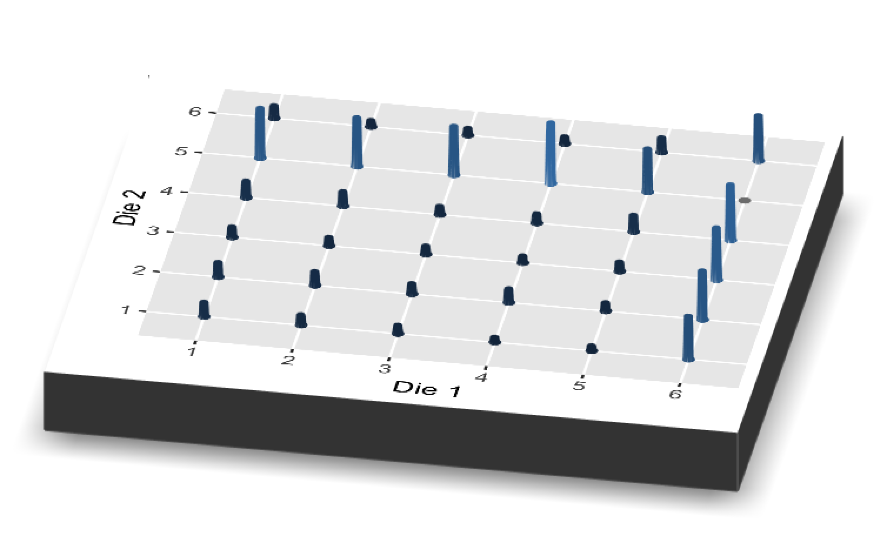
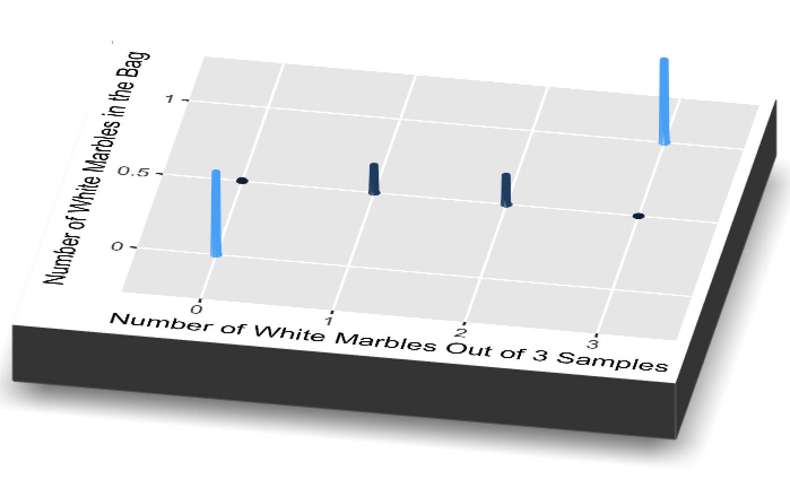

# Probability {#probability}

<!-- Delete the cardinal virtues? -->

<!-- Add a bunch more code? Show how everything is done? -->

<!-- When discussing a parameter $p$ and a probability distribution p() in the absence of a specific context, then those simple terms are OK. But, whenever you are talking about specific parameters or specific probability distributions, you should have either subscripts or items in the parentheses, respectively.  -->

<!-- More animations. Create a movie which swoops into the joint distribution, takes a slice, remove the other slices, and then normalizes. Cool new package ggral (sp?) -->

<!-- We need a single example of a continuous distribution after Electoral Votes. It will also have math. And empirical. And posterior. -->

<!-- Revisit these references and see if there is other stuff we should include:   -->

<!-- Teaching Bayes' Rule: A Data-Oriented Approach by Jim Albert. -->
<!-- Rethinking Chapter 2. Garden of forking data is just excellent stuff. -->
<!-- Bayesian Workshop -->


```{r include=FALSE}
# ggthemes probably belongs in book_start.Rmd. Also, the plots here all use
# theme_classic(). We should make that consistent, or not, across the book. Sort
# of awkward that we need the tidyverse to run the code below but we don't
# explicitly load it up where the students can see us do it.

library(tidyverse)
library(ggthemes)
```

The central tension, and opportunity, in data science is the interplay between the *data* and the *science*, between our empirical observations and the models which we use to understand them. Probability is the language we use to explore that interplay; it connects models to data, and data to models.

## Probability distributions

```{r, echo=FALSE, fig.margin=TRUE, out.width="100%", fig.align='center', fig.cap="Dice and Probability."}
knitr::include_graphics("05-probability/images/probability_dice.jpeg")
```


What does it mean that Trump has a *30% chance* of winning re-election this fall? That there is a *90% probability* of rain today? That the dice at the casino is *unfair*? If I roll that dice 10 times and five of those times I get a three, how likely is it that the dice is *unfair*?

Probability is about quantifying uncertainty. We can think of probability as a proportion. The probability of an event occurring is a number from 0 to 1, where 1 means that the event is 100% certain.

Let's begin with the simplest events: coin flips and dice rolls. If the dice and 
the coins are fair, we can operate under the assumption that all outcomes are 
equally likely. 

This allows us to make the following statements:

* The probability of rolling a 1 or 2 is 2/6, or 1/3.
* The probability of rolling a 1, 2, 3, 4, 5, or 6 is 1.  
* The probability of flipping a coin and getting tails is 1/2.

For the purposes of this course, a *probability distribution* is a mathematical object that covers a set of outcomes, where each distinct outcome has a chance of occurring between 0 and 1 inclusive. The set of possible outcomes --- heads or tails for the coin, 1 through 6 for the dice --- can be either discrete or continuous. This set of outcomes is the *domain* of the probability distribution. There are three types of probability distributions: mathematical, empirical, and posterior. Let's walk through some examples to better understand each type of probability distribution.

Before we continue, we should be familiar with the notation used in this chapter. Whenever we are talking about a specific probability (represented by a single value), we will use $p$ with a *subscript*. For instance, $p_h$ = 0.5 denotes the probability of getting heads on a coin toss when the coin is fair. $p_t$ denotes the probability of getting tails on the coin toss. However, when we are referring to the entire probability distribution over a set of outcomes, we will use $p$ with *parentheses*. For example, the probability distribution of a coin toss is $p(coin)$. That said, $p(coin)$ is composed of all the two specific probabilities mapped from the domain.

### Flipping a coin

A *mathematical distribution* is based on mathematical formulas. Assuming that the dice is perfectly fair, we should get heads as many times as we get tails.

```{r, echo = FALSE}

# Flipping one coin 100 times

mydata <- tibble(results = c(rep(0, 50),
                             rep(1, 50)))

ggplot(mydata, aes(x = results)) +
  geom_histogram(aes(y = after_stat(count/sum(count))), 
                 binwidth = 0.5, 
                 color = "white") +
  labs(title = "Mathematical Probability Distribution",
       subtitle = "Flipping One Coin",
       x = "Outcome\nResult of Coin Flip",
       y = "Probability") +
  scale_x_continuous(breaks = c(0, 1), 
                     labels = c("Heads", "Tails")) +
  theme_classic()

```

An *empirical distribution* is based on data. You can think of this as the probability distribution created by running a simulation. In theory, if we increase the number of coins we flip in our simulation, the empirical distribution will look more and more similar to the mathematical distribution. The probability distribution is the Platonic form. The empirical distribution will often look like the mathematical probability distribution, but it will rarely be exactly the same.

In this simulation, there are 49 heads and 51 tails. The outcome will vary every time we run the simulation, but the proportion of heads to tails should not be too different if this coin is fair.

```{r, echo = FALSE}

# Flipping one coin 100 times

set.seed(2)

coin <- c(0, 1)

sims <- 100

results <- sample(coin, sims, replace=TRUE)

mydata <- tibble(results)

ggplot(mydata, aes(x = results)) +
  geom_histogram(aes(y = after_stat(count/sum(count))), 
                 binwidth = 0.5, 
                 color = "white") +
  labs(title = "Empirical Probability Distribution",
       subtitle = "Flipping One Coin A Hundred Times",
       x = "Outcome\nResult of Coin Flip",
       y = "Probability") +
  scale_x_continuous(breaks = c(0, 1), 
                     labels = c("Heads", "Tails")) +
  theme_classic()

```

An *posterior distribution* is based on beliefs and expectations. It displays your belief about things you can't see right now. You may have posterior distributions for events in the past, present, or future.

In the case of the coin toss, the posterior distribution changes depending on your beliefs. For instance, let's say your friend brought a coin to school and asked to bet you. If the result is heads, you have to pay them $5. 

This makes you suspicious; your posterior distribution would reflect this. You might believe that $p_h$ is 0.95 while $p_t$ is 0.05.

```{r, echo = FALSE}

# Flipping one coin 100 times

mydata <- tibble(results = c(rep(0, 95),
    rep(1, 5)))

ggplot(mydata, aes(x = results)) +
  geom_histogram(aes(y = after_stat(count/sum(count))), 
                 binwidth = 0.5, 
                 color = "white") +
  labs(title = "Posterior Probability Distribution",
       subtitle = "Your Beliefs About Flipping One Coin to Bet Your Friend",
       x = "Outcome\nResult of Coin Flip",
       y = "Probability") +
  scale_x_continuous(breaks = c(0, 1), 
                     labels = c("Heads", "Tails")) +
  theme_classic()

```

### Rolling two dice

Our *mathematical distribution* tells us that, with a fair dice, the probability of getting 1, 2, 3, 4, 5, and 6 are equal: there is a 1/6 chance of each. When we roll two dice at the same time and sum the values, the numbers closest to the middle (ex. 6, 7, 8) are more common sums than numbers at the very edge (ex. 2, 12) because there are more combinations of numbers that add up to the middle values.

```{r, echo = FALSE, out.width = "100%"}

set.seed(1)

dice <- c(1:6)

sims <- 10000000

mydata <- tibble(dice_1 = sample(dice, size = sims, replace = TRUE),
                 dice_2 = sample(dice, size = sims, replace = TRUE))

mydata <- mydata %>%
  mutate(sum = (dice_1 + dice_2))

ggplot(mydata, aes(x = sum)) +
  geom_histogram(aes(y = after_stat(count/sum(count))), 
                 binwidth = 1, 
                 color = "white") +
  labs(title = "Mathematical Probability Distribution",
       subtitle = "Sum from Rolling Two Dice",
       x = "Outcome\nSum of Two Dice",
       y = "Probability") +
  scale_x_continuous(breaks = seq(0, 12, 1), labels = 0:12) +
  theme_classic()

```

We get an *empirical distribution* by running a simulation and rolling two dice a hundred times. The result is not identical to the mathematical distribution because of the inherent randomness of the real world. We can observe that the $p_2$ and $p_12$, which are displayed on the left and right most ends of the distribution, are far lower than the $p_6$, for example.

```{r, echo = FALSE, out.width = "100%"}

# Two dice rolled 100 times

set.seed(1)

dice <- c(1:6)

sims <- 100

mydata <- tibble(dice_1 = sample(dice, size = sims, replace = TRUE),
                 dice_2 = sample(dice, size = sims, replace = TRUE))

mydata <- mydata %>%
  mutate(sum = (dice_1 + dice_2))

ggplot(mydata, aes(x = sum)) +
  geom_histogram(aes(y = after_stat(count/sum(count))), 
                 binwidth = 1, 
                 color = "white") +
  labs(title = "Empirical Probability Distribution",
       subtitle = "Sum from Rolling Two Dice A Hundred Times",
       x = "Outcome\nSum of Two Dice",
       y = "Probability") +
  scale_x_continuous(breaks = seq(0, 12, 1), labels = 0:12) +
  theme_classic()

```

The *posterior distribution* for rolling one dice a hundred depends on your expectations. If you take the dice from your Monopoly set, you have reason to believe that the assumptions underlying the mathematical distribution are true. However, if you walk into a crooked casino and a host asks you to play craps, you might be suspicious. In craps, a come-out roll of 7 and 11 is a "natural" and the you win. You might expect those numbers to occur less often than they would with fair dice. Meanwhile, a come-out roll of 2, 3 is bad for someone betting what's known as the "Pass line." You might also expect values like 2 and 3 to occur more frequently. Your posterior distribution might look like this:

```{r, echo = FALSE, out.width = "100%"}

# Flipping a dice 100 times

mydata <- tibble(results = c(rep(2, 17), rep(3, 17), rep(4, 7), 
                             rep(5, 7), rep(6, 7), rep(7, 5),
                             rep(8, 7), rep(9, 7), rep(10, 7), rep(11, 5),
                             rep(12, 7)))

ggplot(mydata, aes(x = results)) +
  geom_histogram(aes(y = after_stat(count/sum(count))), 
                 binwidth = 1, 
                 color = "white") +
  labs(title = "Posterior Probability Distribution",
       subtitle = "Your Belief About Rolling Two Dice at a Crooked Casino",
       x = "Outcome\nSum of Two Dice",
       y = "Probability") +
  scale_x_continuous(breaks = seq(0, 12, 1), labels = 0:12) +
  theme_classic()

```

Someone less suspcious of the casina would have a posterior distribution which looks more like the mathematical distribution.

### Presidential elections

Now we let's say we are building probability distributions for political events, like a presidential election. We want to know the probability that Democratic candidate wins x electoral votes, where x represents the range of possible outcomes from 0 to 538.

It would be incredibly naive to create the following *mathematical distribution*. We create a distribution by running a simulation 10,000 times, where the chances of the Democratic candidate winning any given electoral college vote is 0.5.

```{r, echo = FALSE, out.width = "100%"}

ev <- c(rep(3, 8), rep(4, 5), rep(5, 3), rep(6, 6), rep(7, 3), rep(8,2),
        rep(9, 3), rep(10, 4), rep(11, 4), 12, 13, 14, 15, rep(16, 2), 18, 20 , 20, 19, 29, 38, 55)

sims <- 10000

result <- tibble(total = (matrix(rbinom(sims*length(ev),
                        size = 1, p = 0.5),
                 ncol = length(ev)) %*% ev)[,1])

ggplot(data = result, aes(total)) +
  geom_histogram(aes(y= after_stat(count/sum(count))), 
                 binwidth = 1) +
  labs(title = "Mathematical Probability Distribution",
       subtitle = "Presidential Elections",
       y = "Probability",
       x = "Outcome\nElectoral Vote Total for Democratic Candidate") +
  theme_classic()

```

We know that campaign platforms, donations, charisma, and many other factors will contribute to a candidate's likeability. Elections are more complicated than coin tosses. 

The *empirical distribution* in this case could involve looking into past elections in the United States and counting the number of electoral votes that the Democrats won in each. For the empirical distribution, we create a tibble with electoral vote results from past elections. Looking at elections since 1964, we can observe that the number of electoral votes that the Democrats received in each one is different. Given that we only have 14 entries, it is difficult to draw conclusions or make predictions based off of this empirical distribution.

However, this model is enough to suggest that the assumptions of the mathematical probability distribution above do not work for electoral votes. The model assumes that the Democrats have a 50% chance of receiving each of the 538 votes. Just looking at the mathematical probability distribution, we can observe that receiving 13 or 17 or 486 votes out of 538 would be extreme and almost impossible under this mathematical model. However, our empirical distribution tells us that those were real election results.

```{r, echo = FALSE, out.width = "100%"}

mydata <- tibble(electoral_votes = c(486,191,17,297,49,13,111,370,379,
                      271,286,365,332,304))

ggplot(mydata, aes(x = electoral_votes)) +
  geom_histogram(aes(y = after_stat(count/sum(count))), 
                 bins = 100, 
                 color = "white") +
  labs(title = "Empirical Probability Distribution",
       subtitle = "Electoral Votes from Previous Elections",
       x = "Outcome\nElectoral Vote Total for Democratic Candidate",
       y = "Probability") +
  theme_classic()

```

The *posterior distribution* in the election case is something data scientists devote a lot of time to. The analysts develop algorithms that consider their expectations for each outcome. Consider this generated using data from *FiveThirtyEight*.

```{r, echo = FALSE, out.width = "100%"}
# DK: Some comments about this. Where did you get this data from? Why those
# columns? 


read_csv("./05-probability/data/election-forecasts-2020/prez_1.csv") %>%
  select(evprob_chal, total_ev)  %>% 
  rename(prob = evprob_chal, electoral_votes = total_ev) %>% 
  ggplot(aes(electoral_votes, prob)) +
    geom_bar(stat = 'identity') +
    labs(title = "Posterior Probability Distribution Based on FiveThirtyEight Forecast",
         subtitle = "Presidential Elections",
         y = "Probability",
         x = "Outcome\nElectoral Vote Total for Democratic Candidate",
         caption = "Data from August 13, 2020") +
  theme_classic()

```


Here is a posterior from the FiveThirtyEight website from August 13, 2020. This was created using the same data as the above distribution, but simply displayed differently. For each electoral result, the height of the bar represents the probability that a given event will occur. However, there is no numbered y-axis telling us what the specific probability of each outcome is.

```{r, echo=FALSE, out.width="100%", caption = "FiveThirtyEight Posterior from August 13, 2020"}

knitr::include_graphics("05-probability/images/fivethirtyeight.png")

```

Here is the posterior from *The Economist*, also from August 13, 2020. This looks confusing at first because the data analysts have chosen to merge the axes for Republican and Democratic electoral votes. We can tell that the Economist is more optimistic about Biden's odds in the election compared to Trump's, relative to *FiveThirtyEight*.

```{r, echo=FALSE, out.width="100%", caption = "Economist Posterior from August 13, 2020"}

knitr::include_graphics("05-probability/images/economist_aug13.png")

```

These two models, built by smart people using the similar data sources, have reached fairly different conclusions. Data science is difficult! There is not one "right" answer. Real life is not a problem set. 

```{r, echo=FALSE,  out.width="100%", fig.cap="Watch the makers of these two models throw shade at each other on Twitter! Eliot Morris is one of the primary authors of the Economist model. Nate Silver is in charge of 538. They don't seem to be too impressed with each other's work! More smack talk [here](https://statmodeling.stat.columbia.edu/2020/08/31/more-on-that-fivethirtyeight-prediction-that-biden-might-only-get-42-of-the-vote-in-florida/) and [here](https://statmodeling.stat.columbia.edu/2020/08/31/problem-of-the-between-state-correlations-in-the-fivethirtyeight-election-forecast/)."}
knitr::include_graphics("05-probability/images/538_versus_Economist.png")
```

There are many political science questions you could explore with posterior distributions and they can relate to the past, present, and future.

* Past: How many electoral votes would Hilary Clinton have won if she picked a different VP?
* Present: What is the median height of Harvard students?
* Future: How many electoral votes will a presidential candidate win?

### Working with probability distributions

A probability distribution is not always easy to work with. It is a complex object. And, in many contexts, we don't really care about all that complexity. So, instead of providing the full probability distribution, we often just use a summary measure, a number or two or three which captures the aspect of the entire distribution which is relevant to the matter at hand. Let's explore these issues using the 538 posterior probability distribution, as of August 13, 2020, for the number of electoral votes which will be won by Joe Biden. Here is a tibble with 1,000,000 draws from that distribution:


```{r, message = FALSE, echo = FALSE}
# DK: This code is a mess! Please fix!

z <- read_csv("https://raw.githubusercontent.com/PPBDS/primer/master/05-probability/data/election-forecasts-2020/prez_1.csv") %>%
       select(evprob_chal, total_ev)  %>% 
       rename(prob = evprob_chal, electoral_votes = total_ev) %>% 
       mutate(obs = round(prob * 1000000))  %>% 
       select(-prob) %>% 
       uncount(weights = obs) %>% 
       pull(electoral_votes)


draws <- tibble(ID = 1:1000000,
                electoral_votes = as.integer(sample(z)))                     
                          
```

```{r}
draws
```

Recall the discussion from Section \@ref(distributions). A distribution and a sample of draws from that distribution are different things. But, if you squint, there are sort of the same thing, at least for our purposes. For example, if you want to know the mean of the distribution, then the mean of the draws will be a fairly good estimate, especially if the number of draws is large enough.

The second way to represent a probability distribution in the computer is as a "draws" object. Recall from Chapter \@ref(wrangling) how we can draw randomly from specified probability distributions as so:

```{r}
rnorm(10)
```

```{r}
runif(10)
```

These elements of these vectors are all "draws" from the specified probability distributions. In most appplied situations, our tools will produce draws rather than summary objects. We can translate a summary object into a draws object like this:


```{r}

```


Again, in practice, we almost never have to perform this transformation. We will just be given the draws object automatically. Fortunately, draws objects are very easy to work with:


### Unnormalized distributions

Remember that probability distributions are mathematical objects that cover a set of outcomes, where each outcome in the domain is mapped to a probability value between 0 and 1 inclusive and the sum of all mappings is 1. Sometimes, you may see distributions similar to probability distributions, only the y-axis displays raw counts instead of proportions. Unnormalized distributions are not probability distributions, but it is easy to convert between the two. You simply divide all the outcome counts on the y-axis by the sum of all outcome counts to "normalize" and unnormalized distribution. Unnormalized distributions are often an intermediary step; it is often handy to work with counts until the very end.

For instance, we can generate the following unnormalized distribution for the sum of rolling two dice (empirical distribution from running this simulation 100 times). You may notice that the shape of the distribution is the same as the empirical probability distribution we generated earlier, only the y-axis is labeled differently.

```{r, echo = FALSE, out.width = "100%"}

set.seed(1)

dice <- c(1:6)

sims <- 100

mydata <- tibble(dice_1 = sample(dice, size = sims, replace = TRUE),
                 dice_2 = sample(dice, size = sims, replace = TRUE))

mydata <- mydata %>%
  mutate(sum = (dice_1 + dice_2))

ggplot(mydata, aes(x = sum)) +
  geom_histogram(binwidth = 1, color = "white") +
  labs(title = "Empirical Unnormalized Distribution",
       subtitle = "Sum from Rolling Two Dice A Hundred Times",
       x = "Outcome\nSum of Two Dice",
       y = "Count") +
  scale_x_continuous(breaks = seq(0, 12, 1), labels = 0:12) +
  theme_classic()

```

<!-- DK: Add normalized density plot. Comment that they look identical, just scaled. -->

<!-- after_stat("density") -->


### Joint distributions

<!-- DK: Should be p(A). Discuss p(A, B) -->

Now we understand that $p_A$ can represent the probability distribution of outcomes for event A. Let's talk about joint distributions, which can be represented by $p_{A, B}$. Joint distributions are also mathematical objects that cover a set of outcomes, where each distinct outcome has a chance of occurring between 0 and 1 and the sum of all chances equals to 1. The key to a joint distribution is it measures the chance that both events A and B will occur simultaneously.

Let's say that you are rolling two six-sided dice simultaneously. One is weighted so that there is a 50% chance of rolling a 6 and a 10% chance of each of the other values. The other is weighted so there is a 50% chance of rolling a 5 and a 10% chance of rolling each of the other values. Let's roll both dice 1000 times. In previous examples involving two dice, we cared about the sum of results and not the outcomes of the first versus the second rolls of each simulation. With a joint distributions, the order matters so instead of 11 possible outcomes on the x-axis of our distribution graph (ranging from 2 to 12), we have 36. Furthermore, a 2D probability distribution is not sufficient to represent all of the variables involved, so the joint distribution for this example is displayed using a 3D plot.

```{r, echo = FALSE, out.width = "100%"}

```

## Tree diagrams

### Independence

So far, you have learned how to calculate $p_A$, which is the fancy, statistical way of saying the probability of an event known as A. When flipping a coin, the probability of getting heads was 1/2. You have also learned how to compute the $p_{A or B}$. This means the probability of either A or B happening. When rolling a dice, $p_{1 or 2}$--the probability of getting a 1 or a 2--was 1/3.

What if you flipped 2 coins? You know that the probability of getting heads once is 1/2, but what are the odds of getting heads 2 times in a row? Let's take a look at this tree diagram. We read this diagram from left to right. On the left, the probability of getting heads is 0.5. Now the tree branches out.

* *If* we got heads the first time, then we go up the top branch. The probability of getting heads again is 0.5.
* *If* we got tails the first time, then we go down the bottom branch. The probability of getting heads is 0.5.

Notice how regardless of what we get the first time we flip the coin, the probability of getting heads is 0.5 throughout. This suggests that the coin flips are **independent**. The result of one coin flip does not impact the likelihood of getting the same result next time. Take a look at the tree diagram. $p_{H given H}$ represents the probability of getting heads *given* that we got heads the first time. $p_{H given T}$ represents the probability of getting heads *given* that we got tails the first time. $p_{H given H}$ = $p_{H given T}$.

```{r, echo = FALSE, out.width = "100%"}
knitr::include_graphics("05-probability/images/tree-1.png")
```

### Conditional probability

Now imagine that 60% of people in a community have a disease. A doctor develops a test to determine if a random person has the disease. However, this test isn't 100% accurate. This test is 80% sure of correctly returning positive **if the person has the disease** and 90% sure of correctly returning negative **if the person does not have the disease**.

This tree diagram illustrates exactly this. Starting from the left, we see that the probability of a random person having the disease is 0.6. Since they either have the disease or don't (those are the only two possibilities), the probability that they don't have the disease is 1 - 0.4.

Now the tree branches out.

* *If* the random person has the disease, then we go down the top branch. The probability of the person testing positive is 0.8 because the test is 80% sure of correctly returning positive when the person has the disease.
* By the same logic, *if* the random person does not have the disease, we go down the bottom branch. The probability of the person incorrectly testing positive is 0.1.

We decide to go down the top branch *if* our random person has the disease. We go down the bottom branch *if* they do not. This is called **conditional probability**. The probability of testing positive is **dependent** on whether the person has the disease.

How would you express this in statistical notation? $p(A|B)$ is the same thing as the probability of A *given* B. $p(A|B)$ essentially means the probability of A *if* we know for sure the value of B. You should also remember that $p(A|B)$ is not the same thing as $p(B|A)$.


```{r, echo = FALSE, out.width = "100%"}
knitr::include_graphics("05-probability/images/tree-2.png")
```

<!--TW: Need to find another up-to-date example for conditional probabality.

This concept of conditional probability is relevant in our everyday lives. For example, the probability of Trump’s re-election might be different than the probability of Trump’s re-election given that we are in a recession. The probability of you reading a textbook might vary, depending on the likelihood of your instructor cold-calling you in class. Whenever you encounter a question involving conditional probability, drawing a tree diagram is a very useful approach to visualization. -->


<!-- TW: Do we need this section? 


### Two diagrams for one set of coin flips

In our histogram probability distribution, we didn’t care what combinations of numbers made each sum. We only cared about the outcome. There are two ways of thinking about a coin toss as well. Your tree diagram should look different depending on whether the order of the results matters.

To understand tree diagrams a little better, imagine you’re flipping 2 coins. Your tree diagram may look different depending what you’re interested in measuring. In the following figure, the order of your coin toss results does not matter. We can imagine that you are rolling two coins together, or that you only care about the sum of the two dice values.

```{r out.width="100%", echo=FALSE}
knitr::include_graphics("05-probability/images/tree-3.png")
```

In the next figure figure below, the order of your coin toss results does matter. Depending on your first result, you go down a different branch.

```{r out.width="100%", echo=FALSE}
knitr::include_graphics("05-probability/images/tree-4.png")
```

-->


<!-- 2 b) Another coding session, but this time with list-columns and map_functions. These do not have to be long. We just want to re-iterate the points we made in words. Maybe we don't need list-columns. Maybe just show map functions here. Again, the point of this section is ONLY to understand the key probabity concepts: joint, total, conditional and marginal. -->


## Two models

<!-- DK: Change this example so that 1% is not used twice, both for the prevalence of the disease and the accuracy of the test. -->

You are in a city of 100,000 people. It is true that exactly 1% of the population has a disease, but we don't know which people have it and which do not. In terms of a count, that means 1,000 people have this disease of the 100,000 in the population.  We have a test which is 99% accurate. That is, if you have the disease there is a 99% chance that the test reports that you do, and the same if you don't have the disease. 

So, of the 1,000 people who truly do have the disease --- where 1,000 is 1% of the 100,000 people in the city ---  990 would correctly test positive and 10 would incorrectly test negative. This city also has 99,000 people who do not have the disease, 990 of which incorrectly test positive and 98,010 of which correctly test negative. That means that the number of people who would test positive for the disease is 1,980 but *only 990 of them have the disease*. So, in simple terms, the probability of you having the disease given a positive test is $990\div1980$!

Here is the joint empirical distribution of the test result and disease status. Note that this is an unnormalized distribution because each dot represents a person in this city.

```{r, echo = FALSE, out.width = "100%"}

pop <- tibble(patient_id = 1:100000, 
              positive_test = c(rep(1, 990),
                               rep(0, 98010),
                               rep(0, 10),
                               rep(1, 990)),
              have_disease = c(rep(0, 990),
                               rep(0, 98010),
                               rep(1, 10),
                               rep(1, 990)))

ggplot(pop, aes(x = as.factor(positive_test), y = as.factor(have_disease))) +
  geom_point() +
  geom_jitter(alpha = .4) +
  theme_classic() +
  labs(title = "Joint Unnormalized Empirical Distribution \n of Test Results and Disease Status",
    x = "Test Result",
    y = "Disease Status") +
  scale_x_discrete(breaks = c(0, 1), 
                   labels = c("Negative", "Positive")) +
  scale_y_discrete(breaks = c(0, 1), 
                   labels = c("Negative", "Positive"))

```

Here is a joint distribution displayed in 3D. Instead of using the "jitter" feature in R to unstack the dots, we are using a 3D plot to visualize the number of dots in each box. The number of people who correctly test negative in this city is 98,010, far outweighing any of the other categories. There are 990 false positives, 990 true positives, and only 10 false negatives. This is why we can barely see the 3D bar coming from those sections.

```{r, echo = FALSE, out.width = "100%"}
knitr::include_graphics("05-probability/images/rayshader_disease.png")
```

This section is called "Two Models" because, for each person, there are two possible states of the world: have the disease and not have the disease. By assumption, there are no other possibilities. We call these two possible states of the world "models," even though they are very simple models.

In addition to the two models, we have two possible results of our experiment on a given person: test positive or test negative. Again, this is an assumption. We do not allow for any other outcome. In later sections, we will look at more complex situations where we consider more than two models and more than two possible results of the experiment. In the meantime, we have built the *unnormalized joint distribution for models and results*. This is a key point! Look back earlier in this chapter where we discussed both unnormalized distributions and joint distributions. 

Getting back to the figure, what is the difference between these distributions? How can they be useful in data analysis?

We want to analyze these plots by looking at different slices. For instance, let's say that you have tested positive for the disease. Since the test is not always accurate, you cannot be 100% certain that you have it. We would isolate the slice where the test result equals 1 (meaning positive). If we zoom in on the plot, 990 people who tested positive have the disease and 990 who tested positive do not have the disease. In this case, we are focusing on one slice of the probability distribution where the test result was positive. There are two disease outcomes: positive or negative. By isolating a section, we are looking at a conditional distribution. Conditional on a positive test, you can visualize the likelihood of actually having the disease versus not.

This is what looks like when we take the slice where the test result is positive and zoom in. Taking a slice is the same thing as creating the conditional probability distribution.

```{r, echo = FALSE, out.width = "100%"}
knitr::include_graphics("05-probability/images/rayshader_disease_zoom.png")
```

We should rotate this slice and look at it from a 2D perspective. This looks very similar to what we saw at the beginning of the chapter when we flipped coins to create a probability distribution.

```{r, echo = FALSE, out.width = "100%"}

mydata <- tibble(results = c(rep(0, 5),
                             rep(1, 5)))

ggplot(mydata, aes(x = results)) +
  geom_histogram(aes(y = after_stat(count/sum(count))), 
                 binwidth = 0.5, 
                 color = "white") +
  labs(title = "Conditional Probability Distribution",
       subtitle = "Probability of Having the Disease Given a Positive Test Result",
       x = "Disease Status",
       y = "Probability") +
  scale_x_continuous(breaks = c(0, 1), 
                     labels = c("Positive", "Negative")) +
  theme_classic()

```

This Stat 110 Animations video does a really good job of explaining a similar concept.

```{r, echo=FALSE}
knitr::include_app("https://www.youtube.com/embed/by3_weGwnMg")
```

## Three models

```{r, echo = FALSE, out.width = "100%"}
knitr::include_graphics("05-probability/images/marble.jpg")
```

Now, imagine that your friend gives you a bag with two marbles. There could either be two white marbles, two black marbles, or one of each color. Thus, the bag could contain 0% white marbles, 50% white marbles, or 100% white marbles. $p$ of white marbles could be 0, 0.5, or 1.

Let's say you take a marble out of the bag, record whether it's black or white, then return it to the bag. You repeat this three times, observing the number of white marbles you see out of three trials. You could get three whites, two whites, one white, or zero whites as a result of this trial. Let's make what we call a Bayes scatterplot out of this. We have three models (three different proportions of white marbles in the bag) and four possible experimental results.

Here is the scatterplot visualization of the scenario:

```{r, echo = FALSE, out.width = "100%"}

x <- tibble(p = rep(seq(0, 1, 0.5), 1000)) %>%
  mutate(white_marbles = map_int(p, ~ rbinom(n = 1, size = 3, p = .)))

x %>%
  ggplot(aes(x = white_marbles, y = p)) +
    geom_jitter(alpha = 0.5) +
    labs(title = "Number of White Marbles and Probability of White Marbles",
         x = "Number of White Marbles Out of 3 Samples",
         y = "Number of White Marbles in the Bag") +
  theme_classic()

```

Here is the 3D visualization:

```{r, echo = FALSE, out.width = "100%"}

```


The y-axes of both the scatterplot and the 3D visualization are labeled "Number of White Marbles in the Bag." This is a model, a belief about the world you are not sure of. For instance. When the model is 0, we have no white marbles in the bag, meaning that none of the marbles we pull out in the sample will be white.

Let's say you've got zero white marbles. We would isolate the slice where the result of the simulation involves three black marbles and zero white ones. Here is the unnormalized probability distribution.

```{r, echo = FALSE, out.width = "100%"}

x <- tibble(results = c(rep(0, 1000), rep(0.5, 130), rep(1, 0.1)))

ggplot(x, aes(results)) +
  geom_histogram(binwidth = 0.25, color = "white") +
  labs(title = "Unnormalized Conditional Probability Distribution",
       subtitle = "Number of White Marbles Given a Three White Marbles Selected in the Sample",
       x = "Number of White Marbles in the Bag",
       y = "Count") +
  scale_x_continuous(breaks = seq(0,1,0.5), labels = c("0", "1", "2")) +
  theme_classic()

```

Next, let's normalize the distribution.

```{r, echo = FALSE, out.width = "100%"}

ggplot(x, aes(results)) +
  geom_histogram(aes(y = after_stat(count/sum(count))), 
                 binwidth = 0.25, 
                 color = "white") +
  labs(title = "Conditional Probability Distribution",
       subtitle = "Number of White Marbles Given a Three White Marbles Selected in the Sample",
       x = "Number of White Marbles in the Bag",
       y = "Count") +
  scale_x_continuous(breaks = seq(0,1,0.5), 
                     labels = c("0", "1", "2")) +
  theme_classic()

```

This plot makes sense because when all three marbles you draw out of the bag are NOT white, there is a pretty good chance that there are no white marbles in the bag. There is a smaller chance that the bag contains one black marble and one white marble. However, there is no chance that the bag only contains white marbles.

<!-- # Section 5: 11 and the 1001 models. Same as coin example with unknown p as used in Albert example. First, p is 0, 0.1, 0.2, ... 0.9, 1.0. Make Bayes Scatterplot. Show marginals. Then, extend it so p takes on 1,001 values. This is how we go from discrete to continuous. All the same tricks apply. -->


## N models

<!-- 5 a) Now go on to Rethinking approach. I think that chapter 2 is just genius. Bayesian is really just counting. Maybe we do a very similar example to what he does? Maybe different? I am still pondering this myself. I think that there is a deep relationship here. In the simple Bayes rule decision trees, we know all the probabilities. But what if we don't? Instead, we get to observe lots of data (which are counts!) and then, from that data, figure out the probabilities. (Note that Rethinking does not talk like this --- after all, we know all the probabilities since each marble has a 20% chance of being drawn --- but I think it is implicit in his approach.) Key issue: Can we connect this in a sensible way to Bayesian scatterplot. There is always the data and the model and the relationship between the two. (And "the model" means, mainly, the parameter estimates thereof.) Tell me the data, and I will tell you the model. Tell me the model, and I will tell you the model. -->

<!-- Note the connection between the marbles from Rethinking and the Bayesian scatterplot. In figure 2.2 in Rethinking represents the model where p = 0.25, where p is the proportion of blue marbles in the total collection. The y-axis models would be labeled with p = 0, 0.25, 0.5, 0.75, and 1. With the tree marble diagram in figure 2.2, we would be taking random samples with 3 marbles. The number of blue marbles we get each time would be plotted along p = 0.25. This is another example of model on the y-axis and data on the x-axis. -->

<!-- DK: Should we cut out p = 0 and p = 1 as too annoying to deal with? -->

```{r, echo = FALSE, out.width = "100%"}
knitr::include_graphics("05-probability/images/heads.jpg")
```

Assume that there is a coin with $p_h$. I guarantee that there are only 11 possible values of $p_h$: $0, 0.1, 0.2, ..., 0.9, 1$. In other words, there are 11 possible models, 11 things which might be true about the world. This is just like situations we have previously discussed, except that there are more models to consider.

We are going to run an experiment in which you flip the coin 20 times and record the number of heads. What does this result tell you about the value of $p_h$? Ultimately, we will want to calculate a posterior distribution of $p_h$, which is written as p($p_h$). 

To start, it is useful to consider all the things which might happen if, for example, $p_h = 0.4$. Fortunately, the R functions for simulating random variables makes this easy.

```{r, echo = FALSE, out.width = "100%"}

set.seed(9)

x <- tibble(heads = rbinom(n = 1000, size = 20, p = 0.4))

x %>%
  group_by(heads) %>%
  summarize(total = n(), .groups = "drop") %>%
  mutate(prob = total/sum(total)) %>%
  ggplot(aes(heads, prob)) +
    geom_col() + 
    labs(title = "Empirical Distribution of Number of Heads",
         subtitle = "Based on 1,000 simulations with p = 0.4",
         x = "Number of Heads out of 20 Tosses",
         y = "Probability of Heads") +
  theme_classic()

```

First, notice that many different things can happen! Even if we *know*, for certain, that $p_h = 0.4$, many outcomes are possible. Life is remarkably random. Second, the most likely result of the experiment is 8 heads, as we would expect. Third, we have transformed the raw counts of how many times each total appeared into a probability distribution. Sometimes, however, it is convenient to just keep track of the raw counts. The shape of the figure is the same in both cases.

```{r, echo = FALSE, out.width = "100%"}

x %>%
  group_by(heads) %>%
  summarize(total = n(), .groups = "drop") %>%
  ggplot(aes(heads, total)) +
    geom_col() + 
    labs(title = "Total Count of the Number of Heads Out of 20 Tosses",
         subtitle = "Based on 1,000 simulations with p = 0.4",
         x = "Number of Heads out of 20 Tosses",
         y = "Count") +
  theme_classic()

```

Either way, the figures show what would have happened if that model --- that $p_h = 0.4$ --- were true.

We can do the same thing for all 11 possible models, calculating what would happen if each of them were true. This is somewhat counterfactual since only one of them can be true. Yet this assumption does allow us to create the *joint distribution* of *models which might be true* and of *data which our experiment might generate*. Let's simplify this is p(models, data), although you should keep the precise meaning in mind.

```{r, echo = FALSE, out.width = "100%"}

set.seed(10)

x <- tibble(p = rep(seq(0, 1, 0.1), 1000)) %>%
  mutate(heads = map_int(p, ~ rbinom(n = 1, size = 20, p = .)))

x %>%
  ggplot(aes(y = p, x = heads)) +
    geom_jitter(alpha = 0.1) +
    labs(title = "Empirical Distribution of Number of Heads",
         subtitle = expression(paste("Based on simulations with various values of p"[h])),
         x = "Number of Heads out of 20 Tosses",
         y = expression(paste("p"[h]))) +
  theme_classic()

```

Here is the 3D version of the same plot.

```{r, echo = FALSE, out.width = "100%"}
knitr::include_graphics("05-probability/images/n_models.png")
```

In both of these idagrams, we see 11 models and 21 outcomes. We don't really care about the p($models$, $data$), the joint distribution of the models-which-might-be-true and the data-which-our-experiment-might-generate. Instead, we want to estimate $p$, the unknown parameter which determines the probability that this coin will come up heads when tossed. The joint distribution alone can't tell us that. We *created* the joint distribution before we had even conducted the experiment. It is our creation, a tool which we use to make inferences. Instead, we want the conditional distribution, p($models$ | $data = 8$). We have the results of the experiment. What do those results tell us about the probability distribution of $p$? 

To answer this question, we simply take a vertical *slice* from the joint distribution at the point of the x-axis corresponding to the results of the experiment.


This animation shows what we want to do with joint distributions. We take a slice (the red one), isolate it, rotate it to look at the conditional distribution, normalize it (change the values along the current z-axis from counts to probabilities), then observe the resulting posterior.


This is the only part of the joint distribution that we care about. We aren't interested in what the object looks like where, for example, the number of heads is 11. That portion is irrelevant because we observed 8 heads, not 11. By using the filter function on the simulation tibble we created, we can conclude that there are a total of 465 times in our simulation in which 8 heads were observed.

As we would expect, most of the time when 8 coin tosses came up heads, the value of $p$ was 0.4. But, on numerous occasions, it was not. It is quite common for a value of $p$ like 0.3 or 0.5 to generate 8 heads. Consider:

```{r, echo = FALSE, out.width = "100%"}

x %>% 
  filter(heads == 8) %>% 
  ggplot(aes(p)) +
    geom_bar() +
    labs(title = expression(paste("Values of p"[h]," Associated with 8 Heads")),
         x = expression(paste("Assumed value of p"[h], " in simulation")),
         y = "Count") +
  theme_classic()

```

Yet this is a distribution of raw counts. It is an unnormalized density. To turn it into a proper probability density (i.e., one in which the sum of the probabilities across possible outcomes sums to one) we just divide everything by the total number of observations.

```{r, echo = FALSE, out.width = "100%"}

p_posterior <- x %>% 
  filter(heads == 8) %>% 
  group_by(p) %>% 
  summarize(total = n(), .groups = "drop") %>%
  mutate(probs = total/sum(total))

p_posterior %>% 
  ggplot(aes(x = p, y = probs)) +
    geom_col() +
    labs(title = expression(paste("Posterior Probability Distribution of p"[h])),
         x = expression(paste("Possible values of p"[h])),
         y = "Probability") +
  theme_classic()

```

The most likely value of $p_h$ is still 0.4, as before. But, it is much more likely that $p$ is either 0.3 or 0.5. And there is about an 8% chance that $p_h \ge 0.6$.

You might be wondering: what is the use of a model? Well, let's say we toss the coin 20 times and get 8 heads again. Given this result, what is the probability that future samples of 20 flips will result in 10 or more heads?

There are three main ways you could go about solving this problem with simulations.

The first *wrong* way to do this is assuming that $p_h$ is certain because we observed 8 heads after 20 tosses. We would conclude that 8/20 gives us 0.4. The big problem with this is that you are ignoring your uncertainty when estimating $p_h$. This would lead us to the following code.

```{r, cache = TRUE}

sims <- 10000000

odds <- tibble(sim_ID = 1:sims) %>%
  mutate(heads = map_int(sim_ID, ~ rbinom(n = 1, size = 20, p = .4))) %>% 
  mutate(result = ifelse(heads >= 10, TRUE, FALSE)) %>% 
  summarize(success = sum(result)/sims)

odds

```

The second method involves sampling the whole posterior distribution vector we previously created. This would lead to the following correct code.

```{r}

p_draws <- tibble(p = rep(seq(0, 1, 0.1), 1000)) %>%
  mutate(heads = map_int(p, ~ rbinom(n = 1, size = 20, p = .))) %>%
  filter(heads == 8)
  
odds <- tibble(p = sample(p_draws$p, size = sims, replace = TRUE)) %>%
  mutate(heads = map_int(p, ~ rbinom(n = 1, size = 20, p = .))) %>% 
  mutate(result = ifelse(heads >= 10, TRUE, FALSE)) %>% 
  summarize(success = sum(result)/sims)

odds

```

Third way is to sample from the actual distribution, which is a small dataset with just a few rows, but it includes both $p_h$ and the probability of each $p_h$. This also gives the correct answer.

```{r}

p_posterior <- x %>% 
  filter(heads == 8) %>% 
  group_by(p) %>% 
  summarize(total = n(), .groups = "drop") %>%
  mutate(probs = total/sum(total))

odds <- tibble(p = sample(p_posterior$p, 
                  size = sims, prob = p_posterior$probs, replace = TRUE)) %>%
  mutate(heads = map_int(p, ~ rbinom(n = 1, size = 20, p = .))) %>% 
  mutate(result = ifelse(heads >= 10, TRUE, FALSE)) %>% 
  summarize(success = sum(result)/sims)

odds

```

As you may have noticed, if you calculated the value using the first method, you would believe that getting 10 or more heads is less likely than it really is. If you were to run a casino based on these assumptions, you will lose all your money. It is very important to be careful about the assumptions you are making. We tossed a coin 20 times and got 8 heads. However, you would be wrong to assume that $p_h$ = 0.4 just based on this result.

<!-- ## Testing is evil -->

<!-- Introduce concepts like the null model, testing, and p-values. Connect to permutation tests from chapter 3.  Side note quotation: "Amatuers test. Professionals summarize." Maybe we should pick an example in which the number of heads is low enough to provide some reasonable evidence against p = 0.5. -->

<!-- In some fields, it is common to want to test a specific hypothesis. Consider the hypothesis that the coin is fair, i.e., that $p = 0.5$. Does the data we have support or reject that hypothesis? (Be wary that $p$ is both used for the probability of a head and the $p$-value of a hypothesis test.) -->

<!-- Not really interested in that exact test except in toy scenarios. -->

<!-- Difference between 0.04 and 0.06 is rarely significant. And is hardly ever a good reason to decide X over Y. -->

## Wisdom

This *Primer* contains four important themes that are relevant in all chapters: Wisdom, Temperance, Courage, and Justice. As you move through the textbook, you will be building on and refining these concepts.

```{r, echo=FALSE, fig.margin=TRUE, out.width="100%", fig.cap="Wisdom."}

knitr::include_graphics("other/images/Wisdom.jpg")

```

The first theme of Wisdom is about whether the numbers we have capture the concepts we care about. We should be concerned about whether our data and models are representative of the problem.

Parameter uncertainty is a reason to exercise Wisdom. Suppose your friend sets up a pseudo-casino in the playground of the neighborhood school. She's offering everyone the opportunity to play probability games and bet money. The first game is simple: coin tosses. If the coin lands on heads, you get five dollars. If it lands on tails, you pay three dollars.

You have a sneaking suspicion that the coin isn't fair and you ask your friend to flip it 10 times to test your theory. However, you must not be overconfident. 10 observations might be too few to judge the fairness of the coin. Perhaps your friend secretly switches coins when it comes time for the actual betting and your sample in the initial simulation is not representative. You might be nervous about losing your money and even miscount the number of heads and tails. These are all examples of *parameter uncertainty*. Sometimes, a model has the correct form, but it's not practical to run the simulation millions of times to be certain of the outcome. It's not possible to be absolutely certain that your friend isn't switching coins. A perfect world does not exist, so we must have reservations when drawing likely conclusions.

We need to be aware that sometimes it is not possible to capture all the variables we care about. However, as long as we are prudent, we can still interpret the data.

## Justice

```{r, echo=FALSE, fig.margin=TRUE, out.width="100%", fig.cap="Justice."}

knitr::include_graphics("other/images/Justice.jpg")

```

Justice in data science is all about making sure that are models are as "fair" and unbiased as possible. Model structure is one of the most important ideas under the theme of Justice.

In the section about N models, we talked about the number of heads we would get from flipping a coin 20 times. One of the important parts of model structure is compressing ideas like the coin toss experiment into mathematical expressions.

For instance, a Bernouli distribution is where $n = 1$. In the following expression, we are assuming the default value of n = 1, where we flip a coin one time. H represents the observation (i.e. is the result heads of tails). The tilda tells us we are making observations from an experiment. The B() represents a binomial distribution because the result of the experiment is either 0 or 1, tails or heads. $p$ in the expression represents the probability of heads.

$$ H \sim B(p) $$
The following is a slightly more comprehensive expression, which takes different values of n into account. We might flip the coin 1 time, 2 times, etc.

$$ H \sim B(p, n)$$

This is the experiment we simulated in the section about N models. We flipped a coin 20 times and observed the number of heads we got. We worked with different values of $p$ to create the scatterplot and 3D visualization earlier in this chapter.

$$ H \sim B(p, n = 20)$$
Another question to consider is whether the models we generate while calculating probabilities are predictive or causal. Knowing the difference helps us fairly interpret the data. Every model is predictive in the sense that, if you give me new data drawn from a stable distribution, I can give you a predictive forecast. But only a subset of those models are causal, meaning that, for a given individual, you can change the value of one input and figure out what the new output would be and then, from that, calculate the causal effect.

For the purposes of this chapter, everything we worked with was predictive. We did not attempt to make causal claims. If we wanted to make a causal claim, we would need to feature at least two different ways of doing an experiment. For instance, we could look at how the way in which you flip a coin affects the outcome. We could compare the number of heads we get from catching a coin in the air versus letting it fall to the ground. An important part of Justice is understanding the distinction between predictive and causal models.

## Courage

```{r, echo=FALSE, fig.margin=TRUE, out.width="100%", fig.cap="Courage."}

knitr::include_graphics("other/images/Courage.jpg")

```
Data science involves words, math, and code. Code is the most important element. Turning an idea into code requires *Courage*.

Courage helps us account for unmodeled variation. Recall the following equation.

$$outcome = model + what \ is \ not \ in \ the \ model$$

A residual is the variation that is not contained in the model. This is explains why the result is equal to the fitted (also known as expected) value plus the residual (what is not in the model). However, no matter how nuanced our model becomes, we will not be able to make perfect predictions. Some randomness is intrinsic. For instance, the behavior of one individual can change and can't be perfectly predicted even if a model accounts for what a group does on average.

```{r, echo=FALSE, fig.margin=TRUE, fig.align='center', fig.cap='Bruno de Finetti, an Italian statistician who wrote a famous treatise on the theory of probability that began with the statement "PROBABILITY DOES NOT EXIST." This is because probability only exists subjectively in our minds. It is a tool people made up and use for broad-stroke estimates.'}

knitr::include_graphics("05-probability/images/de_finetti.jpg")

```

*Prediction uncertainty* highlights our ability, or lack thereof, to predict the future. This can be conceptualized as either an attempt to forecast the literal future or as an attempt to model data points which have been left out of the original analysis in some way. Prediction uncertainty has two primary sources that we previously discussed: *parameter uncertainty* and *unmodeled variation*.


## Temperance

```{r, echo=FALSE, fig.margin=TRUE, out.width="100%", fig.align='center', fig.cap="Temperance."}

knitr::include_graphics("other/images/Temperance.jpg")

```

Models are often not as good as they appear. It's important to be patient and understand the pitfalls of the data you have created.

```{r, echo=FALSE, fig.margin=TRUE, out.width="50%", fig.align='center', fig.cap="Donald Rumsfeld."}

knitr::include_graphics("05-probability/images/donald_rumsfeld.jpg")

```

Donald Rumsfeld, the former US Secretary of Defense, once said the following tongue-twisting quote:

  "There are known knowns. There are things we know we know. We also know there are known unknowns. That is to say, we know there are some things we do not know. But there are also unknown unknowns, the ones we do not know we do not know."
  
```{r, echo=FALSE, out.width="100%", fig.cap="Three Card Monte."}

knitr::include_graphics("05-probability/images/Three_Card_Monte.jpg")

```

What does this mean? Well imagine a crowd playing Three Card Monte in the streets of New York. The guy running the game runs a demo and shows you all the cards to make you confident. They earn money by making you overconfident and persuading you to bet. Your odds may seem good during the demo round, but that doesn't actually say anything about what will likely happen when the real, high stakes game begins. The person running the game does many simulations, making the "victim" forget that they cannot actually make any conclusions about the odds of winning. There are some variables that we simply do not know even if we put a lot of effort into making posterior probability distributions. People can be using slight of hand, for instance.

We need patience in order to study and understand the unknown unknowns in our data. Patience is also important when we analyze the "realism" of our models. When we created the mathematical probability distribution for presidential elections, for instance, we assumed that the Democratic candidate would have a 50% chance of winning each vote in the electoral college. By comparing the mathematical model to our empirical cases, however, we recognize that the mathematical model is unlikely to be true. The mathematical model suggested that getting fewer than 100 votes is next to impossible, but many past Democratic candidates in the empirical distribution received less than 100 electoral votes.

## Conclusion

Throughout this chapter, we spent time going through examples of conditional distributions. However, it's worth noting that all probability distributions are conditional on something. Even in the most simple examples, when we were flipping a coin multiple times, we were assuming that the probability of getting heads versus tails did not change between tosses.

We also discussed the difference between empirical, mathematical, and posterior probability distributions. Even though we developed these heuristics to better understand distributions, every time we make a claim about the world, it is based on our beliefs - what we think about the world. We could be wrong. Our beliefs can differ. Two reasonable people can have conflicting beliefs about the fairness of a dice.

It is useful to understand the three types of distributions and the concept of conditional distributions, but almost every probability distribution is conditional and posterior. We can leave out both words in future discussions, as we generally will in this book. They are implicit.

If you are keen to learn more about probability, here is a video featuring Professor Gary King. This is a great way to review some of the concepts we covered in this chapter.

```{r, echo=FALSE}
knitr::include_app("https://www.youtube.com/embed/6C7yRBfh2ok")
```

