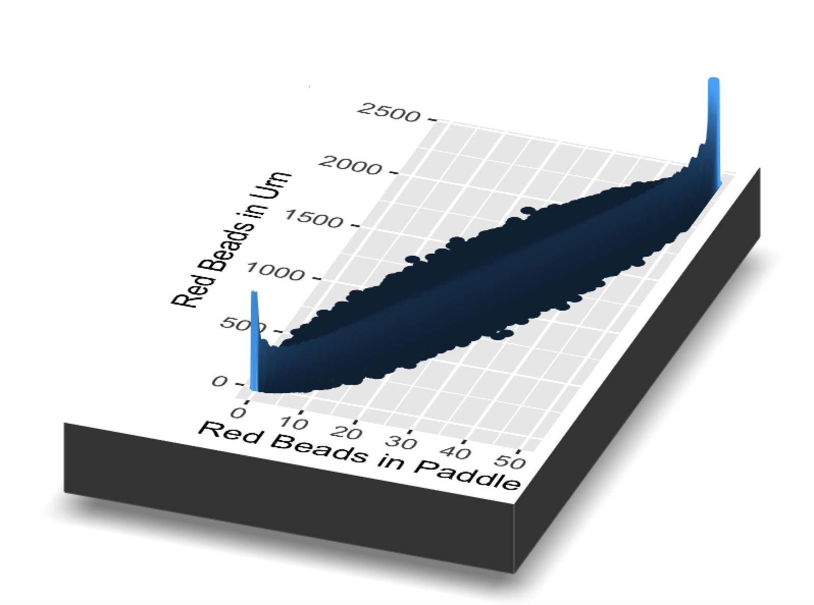

# One Parameter {#one-parameter}

<!-- Priorities:  --> 

<!-- Square away the issue of standard error. Maybe we don't discuss it at all! It is hardly Bayesian. If we are going to discuss it, we need to do a better job.  -->

<!-- Get rid of the Obama stuff completely? -->

<!-- Cut half the words from the last 1/3. -->

<!-- Get rid of sampling distribution? Too confusing and unnecessary. -->


<!-- Explain in a comment the reason for  fun = function(.x) 1/(2 * sqrt(.x)) in the plot. I don't know why we need the 2. Deleted. -->

<!-- us this quote: "May the odds be ever in your favor!" -->


<!-- 1) Make a 15 second video, put it on YouTube. "We don't estimate parameters because we care about parameters. Parameters are imaginary! Like unicorns! [Put finger on forehead and imitate unicorn.] We estimate parameters to build Data Generating Mechanisms. And with a DGM, you can move the world!" NOTE: will do when I can get access to better internet. -->

<!-- Working on getting rid of the axis labels in the slice rayshader (even though I took them out in ggplot, they are staying). -->

<!-- Add forecast/betting example, like in chapter 5. Maybe, what are the odds that a paddle of size 25 will pull out at least 20 reds? IN PROGRESS. -->

<!-- 3) What is the posterior for the number of red beads? **What is your posterior distribution for p, which is the same thing as number of red beads divided by 2400?** Everything has been frequentist so far. Nothing has been Bayesian yet.  Connect to joint distribution, marginal distribution, posterior distribution. One new complexity with the notion of the "model" is that we can "parameterize" the same thing in different ways. We want to show that. First, we parameterize it in the same way as chapter 5. There is a p, which can have certain values, but we restrict the set of possible values. Although perhaps making it different from previously. Maybe 0 to 1 by 0.05, so 21 values. Then we do the same thing as before, look at one sample from the urn, look at the marginal distribution, posterior predict the outcomes of the next draw, and so on. Just like before. We might make the transition from this case to the next by noting two things:  First, even though we often assume that p is continuous, it never really is. In this case, since we are told that there are 2400 beads, p can only take on 2401 possible values. Second, we can (sort of!) use some prior knowledge by noting that values near p = 0 and p = 1 are impossible. Just look at the urn! It is wasteful to even consider those possibilities in doing our analysis. Better to consider more values of p in a more plausible range. Our second parameterization might, instead of looking at p, look at specific values of the number of red beans (out of 2400), chosen from near where we thing the truth might be. These are now the numbers of the y-axis. Note how this elides the distinction between a "model" and the "data". (Keep in mind that the data in the x-axis the data we gathered in our experiment.) The data of the number of red beads in the urn is an empirical reality of the world, something independent of us and our experiment. "Model" just means "Assumption about the world." Same steps afterward as above, although maybe more precise, since we have narrowed our search.  -->

<!-- Discuss hypothesis tests and why we hate them. See misc/themes.Rmd for details. -->

<!-- In Justice section, also interesting to think about Preceptor Tables which we know are finite but we don't ever know how many rows, like number of living people in US right now (i.e., includes planes landing? someone whose heart has stopped beating but has not been "pronounced" dead?)  -->


<!-- For later: -->

<!-- Does the map_ function stuff go too fast? Go through the interim steps more slowly, examining each of the new columns? -->

<!-- Within what range would you offer 50/50 odds that the true percentage lies? -->


<!-- How about an urn with more than two colors? An urn with an income is written on the bead? These would be good problem set questions.  -->

<!-- Might also use Topic 16 from the Workshop here, or save it for the next chapter. -->


```{r, echo=FALSE}
knitr::include_app("https://www.youtube.com/embed/e3PJ3Du_zDc")
```

<!--
```{r, echo = FALSE, out.width="100%"}
knitr::include_graphics("06-one-parameter/images/Reaping_ball.webp")
```
-->
<!-- DK: Get the video to work. Cut half these words. -->


This scene is from  *The Hunger Games*, a dystopian novel in which children are selected via lottery to fight to the death. The basic elements of this event, called the "Reaping", are:

- All children ages 12 and above are entered into the lottery. 

- Children aged 12 are entered once, children aged 13 entered twice, children aged 14 entered three times, etc. 

- Families may enter names of children more than required in exchange for food. 

- One boy and one girl are selected each year as tributes to represent their district in a battle to the death.

- Children not selected from the urn may volunteer as tribute.

In the scene above, Primrose Everdeen is selected from the urn. As a twelve year old, her name is entered only once. Though we do not know the total number of names, we do know that poor families (which make up the majority of Everdeen's district) are able to enter more times in exchange for food. Therefore, we can reasonably assume that *most* children, including Primrose's sister, are entered many more times than required. Why, then, does Primrose have the misfortune of being selected? Or, as we will refer to it henceforth, sampled?

As we explore sampling, we will come to understand that, while very unlikely, anomalies like Primrose Everdeen are certainly possible. Let's get started!


```{r, echo=FALSE, fig.cap="Mr. DeVito is correct: sampling *is* badass.", out.width="80%", fig.align='center'}
knitr::include_graphics("06-one-parameter/images/danny_sampling.png")
```


<!-- DK: Clean up this text. Give a better sense of the whole chapter. -->

Last chapter, we learned about probability, the act of quantifying uncertainty. This chapter, we will learn about *sampling*, the beginning of our journey toward inference. When we sample, we take a *portion* of a total population and attempt to draw a conclusion about the portion, a conclusion which we can then *generalize* to the entire population. 

When we see a headline of the approval rating of a politician, we are **not** being given a number that represents the approval rating from every citizen in the total population. We are looking at an inference based on a much smaller sample of people. If the source is reputable, this sample mirrors the real world as closely as possible. That being said, there will be variation in the reported approval rating depending on the specific sample taken that day. This one reason why we see different approval ratings from different news sources.

Despite this variation, we *normally* see estimates that are in the same ballpark. It would be surprising to see two approval ratings that are more than 10% apart on any given day. It is possible, however! There could be a number of reasons for such a large gap, many of which result from errors in the sampling itself. It could also just be a consequence of **sampling variation**. 
<!-- DK: Replace 6.1 (and other hard-coded numbers) below with reference/label. See bookdown book. -->

Because we cannot conduct polling, let's look instead at an easier scenario. Observe the urn in Figure 6.2. It has a certain number of red and a certain number of white beads all of equal size. It appears the urn has been mixed beforehand, as there does not seem to be any coherent pattern to the spatial distribution of the red and white beads.

Let's now ask ourselves, what proportion of this urn's beads are red? 

```{r, echo=FALSE, out.width="100%", fig.cap="An urn with red and white beads."}
knitr::include_graphics("06-one-parameter/images/sampling_bowl_1.jpg")
```

One way to answer this question would be to perform an exhaustive count: remove each bead individually, count the number of red beads and the number of white beads, and divide the number of red beads by the total number of beads. However, this would be a long and tedious process. Therefore, we will use sampling! Consider two questions:

*If we get 16 red beads in a random sample of size 50 taken from an urn with 2,400 (white or red) beads, how many red beads are in the urn?*

*What is the probability, using the same earn, that we will draw more than 8 red beads if we use a shovel of size 20?*

As always, we will need the **tidyverse** package. 

```{r, message=FALSE}
library(tidyverse)
```


## Real sampling activity {#sampling-activity}

```{r, echo=FALSE, out.width="100%", fig.cap="An urn with red and white beads."}
knitr::include_graphics("06-one-parameter/images/sampling_bowl_1.jpg")
```

### Using the shovel method once 

Instead of performing an exhaustive count, let's insert a shovel into the urn as seen in Figure 6.2. Using the shovel, let's remove $5 \cdot 10 = 50$ beads, as seen in Figure 6.3. Here, we are taking a *sample* of the total population of beads. 

```{r, echo=FALSE, out.width="100%", fig.cap="Inserting a shovel into the urn."}
knitr::include_graphics("06-one-parameter/images/sampling_bowl_2.jpg")
```


```{r, echo=FALSE, out.width="100%", fig.cap="Removing 50 beads from the urn."}
knitr::include_graphics("06-one-parameter/images/sampling_bowl_3_cropped.jpg")
```

Observe that 17 of the 50 sampled beads are red and thus 17/50 = 0.34 = 34% of the shovel's beads are red. We can view the proportion of beads that are red in this shovel as a guess of the proportion of beads that are red in the entire urn. While not as exact as doing an exhaustive count of all the beads in the urn, our guess of 34% took much less time and energy to make. 

Imagine that we started this activity over from the beginning, replacing the 50 beads back into the urn and starting over. Would we remove exactly 17 red beads? Maybe? 

What if we repeated this activity *many* times? Would our guess at the proportion of the urn's beads that are red be exactly 34% every time? Surely not. 

Let's repeat this exercise with the help of 33 groups of friends to understand how the value varies across 33 independent trials. 

### Using the shovel 33 times {#student-shovels}

Each of our 33 groups of friends will do the following: 

- Use the shovel to remove 50 beads each. 
- Count the number of red beads and compute the proportion of the 50 beads that are red.
- Return the beads into the urn.
- Mix the contents of the urn to not let a previous group's results influence the next group's. 

<!-- 

TW: Commented this out, the picture looks way too long when using bs4_book.

```{r, echo=FALSE, fig.show='hold', out.width="80%", fig.align='center', fig.cap="Repeating sampling activity 33 times."}
# Need new picture
knitr::include_graphics(c("06-one-parameter/images/tactile_2_a.jpg", "06-one-parameter/images/tactile_2_b.jpg"))
```

--> 

Each of our 33 groups of friends make note of their proportion of red beads from their sample collected. Each group then marks their proportion of their 50 beads that were red in the appropriate bin in a hand-drawn histogram as seen below.

```{r, echo=FALSE, out.width="100%", fig.cap="Constructing a histogram of proportions."}
knitr::include_graphics("06-one-parameter/images/tactile_3_a.jpg")
```

Histograms allow us to visualize the *distribution* of a numerical variable. In particular, where the center of the values falls and how the values vary. A partially completed histogram of the first 10 out of 33 groups of friends' results can be seen in the figure below.

```{r, echo=FALSE, out.width="100%", fig.cap="Hand-drawn histogram of first 10 out of 33 proportions."}
knitr::include_graphics("06-one-parameter/images/tactile_3_c.jpg")
```

Observe the following details in the histogram:

* At the low end, one group removed 50 beads from the urn with proportion red between 0.20 and 0.25.
* At the high end, another group removed 50 beads from the urn with proportion between 0.45 and 0.5 red.
* However, the most frequently occurring proportions were between 0.30 and 0.35 red, right in the middle of the distribution.
* The distribution is somewhat bell-shaped. 

`tactile_sample_urn` saves the results from our 33 groups of friends. 


```{r, echo=FALSE}
tactile_sample_urn <- tibble(group = c("Ilyas, Yohan", "Ellie, Terrance", "Mark, Ramses", 
                                      "Sophie, Brian", "Maeve, Josh", "Sanjana, Yuko", 
                                      "Nam, Joshua", "Siobhan, Jane", "Caroline, Edna",
                                      "Mal, Francis", "Vignesh, Eliot", "Griffin, Mary",
                                      "Mak, Sophie", "Mark, Jane", "Ishan, Cass",
                                      "Katie, Anthony", "Aaron, Mike", "Yuki, Harry",
                                      "Damani, Melissa", "Conrad, Vlad", "Yao, Kate",
                                      "Aayush, Karen", "Ace, Chris", "Claire, Cloud",
                                      "Dania, Derek", "Dohyun, Estel", "Esther, Henry",
                                      "Ian, Iman", "Mia, James", "Morgan, Emily",
                                      "Frank, Clara", "Paddy, Matt", "Maddie, Brent"),
                            red_beads = c("21", "17", "21", "21", "18", "19", "19",
                                          "11", "15", "17", "16", "18", "17", "21",
                                          "15", "20", "11", "21", "15", "16", "23",
                                          "15", "18", "16", "21", "18", "17", "18",
                                          "15", "21", "21", "16", "19")) %>% 
  sample_frac() %>% 
  mutate(red_beads = as.numeric(red_beads)) %>% 
  mutate(prop_red = red_beads/50) %>% 
  mutate(ID = 1:33)

tactile_sample_urn
```

Observe for each `group` that we have their names, the number of `red_beads` they obtained, and the corresponding proportion out of 50 beads that were red, called `prop_red`. We also have an `ID` variable whoch gives each of the 33 groups a unique identifier. Each row can be viewed as one instance of a replicated activity: using the shovel to remove 50 beads and computing the proportion of those beads that are red. 

Let's visualize the distribution of these 33 proportions using `geom_histogram()` with `binwidth = 0.05`. This is a computerized and complete version of the partially completed hand-drawn histogram you saw earlier. Setting boundary = 0.4 indicates that we want a binning scheme such that one of the bins' boundary is at 0.4. `color = "white"` modifies the color of the boundary for visual clarity. 

```{r}
tactile_sample_urn %>%
  ggplot(aes(x = prop_red)) +
  geom_histogram(binwidth = 0.05, 
                 boundary = 0.4, 
                 color = "white") +
  labs(x = "Proportion of 50 beads that were red",
       y = "Count",
       title = "Proportions Red in 33 Samples") 
```


### What did we just do?

What we just demonstrated in this activity is the statistical concept of **sampling**. We want to know the proportion of the urn's beads that are red. Performing an exhaustive count of the red and white beads would be time-consuming. Therefore, we extracted a *sample* of 50 beads using the shovel. Using this sample of 50 beads, we estimated the proportion of the urn's beads that are red to be 34%.

Moreover, because we mixed the beads before each use of the shovel, the samples were randomly drawn. Because each sample was drawn at random, the samples were different from each other. Because the samples were different from each other, we obtained the different proportions red observed in the previous histogram. This is known as the concept of *sampling variation*. 

The purpose of this sampling activity is to develop an understanding of two key concepts relating to sampling: 

1. Understanding the effect of sampling variation.
1. Understanding the effect of sample size on sampling variation. 

In Section \@ref(virtual-sampling), we'll mimic the hands-on sampling activity we just performed on a computer. This will allow us not only to repeat the sampling exercise much more than 33 times, but it will also allow us to use shovels with different numbers of slots than just 50. 

Afterwards, we'll present you with definitions, terminology, and notation related to sampling in Section \@ref(standard-errors). As in many disciplines, such necessary background knowledge may seem confusing at first. However, as with many difficult topics, if you truly understand the underlying concepts and practice, you'll be able to master them.

To tie the contents of this chapter to the real world, we'll present an example of one of the most common uses of sampling: polls. In Section \@ref(sampling-case-study) we'll look at a particular case study: a 2013 poll on then U.S. President Barack Obama's popularity among young Americans, conducted by Kennedy School's Institute of Politics at Harvard University. To close this chapter, we'll generalize the "sampling from a urn" exercise to other sampling scenarios.


## Virtual sampling {#virtual-sampling}

In the previous Section \@ref(sampling-activity), we performed a *tactile* sampling activity. In other words, we used a physical urn of beads and a physical shovel. We performed this sampling activity by hand so that we could develop a firm understanding of the root ideas behind sampling. In this section, we mimic this tactile sampling activity with a *virtual* sampling activity using a computer. We have a virtual urn and a virtual shovel. 

### Using the virtual shovel once

Let's start by performing the virtual analog of the tactile sampling exercise we performed in Section \@ref(sampling-activity). We first need a virtual analog of the urn seen in the beginning of our chapter. To this end, we create a tibble named `urn`. The rows of `urn` correspond exactly with the contents of the actual urn. 

For reference, `sample_frac()` merely re-arranges the rows of the tibble. We use `set.seed()` to ensure that the beads in our virtual urn are always in the same order. This ensures that the figures in the book match their written descriptions.

```{r, echo=TRUE}
set.seed(10)
urn <- tibble(color = c(rep("red", 900), rep("white", 1500))) %>%
  sample_frac() %>% 
  mutate(ID = 1:2400) %>% 
  select(ID, color)

urn  
```

Observe that `urn` has `r scales::comma(nrow(urn))` rows, meaning that the urn contains 
`r scales::comma(nrow(urn))` equally-sized beads. The first variable `ID` is used as an *identification variable*; none of the beads in the actual urn are marked with numbers. The second variable `color` indicates whether a particular virtual bead is red or white. View the contents of the urn in RStudio's data viewer and scroll through the contents to convince yourself that `urn` is indeed a virtual analog of the actual urn.

Note that, in this Chapter, we have used the variable `ID` in two different ways: first, to keep track of the samples drawn by the 33 individual teams and, second, to keep track of the 
`r scales::comma(nrow(urn))` beads in our virtual urn. And that is OK! `ID` means the same concept in both cases. We will neeed to be careful, however, when working with more than one table which has an `ID` column. In that case, we will often rename one of the columns in order to avoid any conflicts.   

Now that we have a virtual analog of our urn, we need a virtual analog of the shovel seen in Figure 6.2 to generate virtual samples of 50 beads. We're going to use `sample_n()` and list-columns. 

Let's take a sample of 50 beads from our virtual urn.


```{r}
tibble(ID = 1) %>% 
  mutate(shovel = map(ID, ~ sample_n(urn, size = 50)))
```

As usual, map functions and list-columns are powerful but confusing.

<!-- DK: Walk through that code slowly. And through the output object at the end. Show that the tibble lives inside. -->


Let's compute the proportion of beads in our virtual sample that are red. First, add a column which indicates the number of red beads.


```{r}
tibble(ID = 1) %>% 
  mutate(shovel = map(ID, ~ sample_n(urn, size = 50))) %>% 
  mutate(numb_red = map_int(shovel, ~ sum(.$color == "red")))
```

<!-- DK: Explain `.$color == "red"`.  -->

Why does this work? Because R treats `TRUE` like the number `1` and `FALSE` like the number `0`. So summing the number of `TRUE`s and `FALSE`s is equivalent to summing `1`'s and `0`'s. In the end, this operation counts the number of beads where `color` is `red`.

Second, add a column for the total number of beads. (We already "know" that this is 50, but it never hurts to make our code more general.)

```{r}
tibble(ID = 1) %>% 
  mutate(shovel = map(ID, ~ sample_n(urn, size = 50))) %>% 
  mutate(numb_red = map_int(shovel, ~ sum(.$color == "red"))) %>% 
  mutate(numb_beads = map_int(shovel, ~ length(.$color)))
```

Third, calculate the proportion red:

```{r}
tibble(ID = 1) %>% 
  mutate(shovel = map(ID, ~ sample_n(urn, size = 50))) %>% 
  mutate(numb_red = map_int(shovel, ~ sum(.$color == "red"))) %>% 
  mutate(numb_beads = map_int(shovel, ~ length(.$color))) %>% 
  mutate(prop_red = numb_red / numb_beads)
```

Careful readers will note that the `numb_red` is changing in each example above. The reason, of course, is that each block re-runs the shovel exercise, getting a (potentially) different number of red beads each time. If we wanted the same number in each block, we would need to use `set.seed()` each time, always providing the same `seed` each time.

Let's now perform the virtual analog of having 33 groups of students use the sampling shovel!

### Using the virtual shovel 33 times

In our tactile sampling exercise in Section \@ref(sampling-activity), we had 33 groups of students use the shovel, yielding 33 samples of size 50 beads. We then used these 33 samples to compute 33 proportions. We can perform this repeated/replicated sampling virtually by just doing the same thing 33 times. 

We'll save these results in a data frame called `virtual_samples`. 

```{r}
set.seed(9)
virtual_samples <- tibble(ID = 1:33) %>% 
  mutate(shovel = map(ID, ~ sample_n(urn, size = 50))) %>% 
  mutate(numb_red = map_int(shovel, ~ sum(.$color == "red"))) %>% 
  mutate(numb_beads = map_int(shovel, ~ length(.$color))) %>% 
  mutate(prop_red = numb_red / numb_beads)

virtual_samples
```


Let's visualize this variation in a histogram in Figure 6.8.

Note that we add 'binwidth = 0.05' and 'boundary = 0.4' arguments as well. Recall that setting 'boundary = 0.4' ensures a binning scheme with one of the bins' boundaries at 0.4. Since the 'binwidth = 0.05' is also set, this will create bins with boundaries at 0.30, 0.35, 0.45, 0.5, etc. as well.

```{r}
virtual_samples %>% 
ggplot(aes(x = prop_red)) +
  geom_histogram(binwidth = 0.05, boundary = 0.4, color = "white") +
  labs(x = "Proportion of 50 beads that were red",
       y = "Count",
       title = "Distribution of 33 proportions red") 
```


Observe that we occasionally obtained proportions red that are less than 30%. On the other hand, we occasionally obtained proportions that are greater than 45%. However, the most frequently occurring proportions were between 35% and 40%. Why do we have these differences in proportions red? Because of *sampling variation*. 

Compare our virtual results with our tactile results from the previous section. Observe that both histograms are somewhat similar in their center and variation, although not identical. These slight differences are again due to random sampling variation. Furthermore, observe that both distributions are somewhat bell-shaped.

<!-- DK: Clean up this code. Discuss more? -->

```{r, echo=FALSE, fig.cap="Comparing 33 virtual and 33 tactile proportions red."}
facet_compare <- bind_rows(virtual_samples %>% 
                              mutate(type = "Virtual sampling"), 
                           tactile_sample_urn %>% 
                              select(ID, red = red_beads, prop_red) %>% 
                              mutate(type = "Tactile sampling")) %>% 
  mutate(type = factor(type, 
                       levels = c("Virtual sampling", "Tactile sampling"))) %>% 
  ggplot(aes(x = prop_red)) +
    geom_histogram(binwidth = 0.05, boundary = 0.4, color = "white") +
    facet_wrap(~ type) +
    labs(x = "Proportion of 50 beads that were red", 
         title = "Comparing distributions") 

facet_compare
```


### Using the virtual shovel 1,000 times {#shovel-1000-times}

```{r, echo=FALSE, out.width="60%", fig.align='center', fig.cap="So much sampling, so little time."}
knitr::include_graphics("06-one-parameter/images/sample_bernie.png")
```

Now say we want to study the effects of sampling variation not for 33 samples, but for a larger number of samples (1000). We have two choices at this point. We could have our groups of friends manually take 1,000 samples of 50 beads and compute the corresponding 1,000 proportions. However, this would be time-consuming. This is where computers excel: automating long and repetitive tasks while performing them quickly. At this point, we will abandon tactile sampling in favor of virtual sampling.  

```{r}
set.seed(9)
virtual_samples <- tibble(ID = 1:1000) %>% 
  mutate(shovel = map(ID, ~ sample_n(urn, size = 50))) %>% 
  mutate(numb_red = map_int(shovel, ~ sum(.$color == "red"))) %>% 
  mutate(numb_beads = map_int(shovel, ~ length(.$color))) %>% 
  mutate(prop_red = numb_red / numb_beads)

virtual_samples
```

Observe that we now have 1,000 replicates of `prop_red`, the proportion of 50 beads that are red. Using the same code as earlier, let's now visualize the distribution of these 1,000 replicates of `prop_red` in a histogram in Figure 6.10.

```{r}
virtual_samples %>% 
  ggplot(aes(x = prop_red)) +
    geom_histogram(binwidth = 0.01, 
                   boundary = 0.4, 
                   color = "white") +
    labs(x = "Proportion of 50 beads that were red", 
         y = "Count",
         title = "Distribution of 1,000 proportions red") 
```

Once again, the most frequently occurring proportions of red beads occur between 35% and 40%. Every now and then, we obtain proportions as low as between 20% and 25%, and others as high as between 55% and 60%. These are rare, however. Furthermore, observe that we now have a much more symmetric and smoother bell-shaped distribution. This distribution is, in fact, approximated well by a normal distribution. 

<!-- DK: Discuss why we have missing buckets. -->


### The effect of different shovel sizes {#different-shovels}

Instead of just one shovel, imagine we have three choices of shovels to extract a sample of beads with: shovels of size 25, 50, and 100.

If our goal is to estimate the proportion of the urn's beads that are red, which shovel would we choose? 

Using our newly developed tools for virtual sampling, let's unpack the effect of having different sample sizes! 

1. Virtually use the appropriate shovel to generate 1,000 samples with `size` beads.
1. Compute the resulting 1,000 replicates of the proportion of the shovel's beads that are red.
1. Visualize the distribution of these 1,000 proportions red using a histogram.

Start by virtually using the shovel 1000 times. Then, compute the resulting 1000 replicates of proportion red. Finally, plot the distribution using a histogram. 

```{r}
virtual_samples_25 <- tibble(ID = 1:1000) %>% 
  mutate(shovel = map(ID, ~ sample_n(urn, size = 25))) %>% 
  mutate(numb_red = map_int(shovel, ~ sum(.$color == "red"))) %>% 
  mutate(numb_beads = map_int(shovel, ~ length(.$color))) %>% 
  mutate(prop_red = numb_red / numb_beads)


virtual_samples_25 %>%
  ggplot(aes(x = prop_red)) +
  geom_histogram(binwidth = 0.05, boundary = 0.4, color = "white") +
  labs(x = "Proportion of 25 beads that were red", title = "25") 
```

We will repeat this process with a shovel size of **50**. 

```{r}
virtual_samples_50 <- tibble(ID = 1:1000) %>% 
  mutate(shovel = map(ID, ~ sample_n(urn, size = 50))) %>% 
  mutate(numb_red = map_int(shovel, ~ sum(.$color == "red"))) %>% 
  mutate(numb_beads = map_int(shovel, ~ length(.$color))) %>% 
  mutate(prop_red = numb_red / numb_beads)


virtual_samples_50  %>%
  ggplot(aes(x = prop_red)) +
  geom_histogram(binwidth = 0.05, boundary = 0.4, color = "white") +
  labs(x = "Proportion of 50 beads that were red", title = "50")  
```

Finally, we will perform the same process with 1000 replicates to map the histogram using a shovel size of **100**.

```{r}
virtual_samples_100 <- tibble(ID = 1:1000) %>% 
  mutate(shovel = map(ID, ~ sample_n(urn, size = 100))) %>% 
  mutate(numb_red = map_int(shovel, ~ sum(.$color == "red"))) %>% 
  mutate(numb_beads = map_int(shovel, ~ length(.$color))) %>% 
  mutate(prop_red = numb_red / numb_beads)


virtual_samples_100 %>%
  ggplot(aes(x = prop_red)) +
  geom_histogram(binwidth = 0.05, boundary = 0.4, color = "white") +
  labs(x = "Proportion of 100 beads that were red", title = "100") 
```

For easy comparison, we present the three resulting histograms in a single row with matching x and y axes in Figure 6.12.

<!-- DK: Clean up, make public and explain this code. -->

```{r, echo=FALSE, fig.cap="Comparing the distributions of proportion red for different sample sizes."}

virtual_prop <- bind_rows(virtual_samples_25 %>% 
                            mutate(n = 25), 
                          virtual_samples_50 %>% 
                            mutate(n = 50), 
                          virtual_samples_100 %>% 
                            mutate(n = 100))

comparing_sampling_distributions <- ggplot(virtual_prop, aes(x = prop_red)) +
  geom_histogram(binwidth = 0.05, boundary = 0.4, color = "white") +
  labs(x = "Proportion of shovel's beads that are red", 
       title = "Comparing distributions of proportions red for three different shovel sizes.") +
  facet_wrap(~ n) 

comparing_sampling_distributions
```

Observe that as the sample size increases, the variation of the 1,000 replicates of the proportion of red decreases. In other words, as the sample size increases, there are fewer differences due to sampling variation and the distribution centers more tightly around the same value. Eyeballing Figure 6.12, all three histograms appear to center around roughly 40%.

We can be numerically explicit about the amount of variation in our three sets of 1,000 values of `prop_red` using the *standard deviation*. A standard deviation is a summary statistic that measures the amount of variation within a numerical variable. For all three sample sizes, let's compute the standard deviation of the 1,000 proportions red by running the following data wrangling code that uses the `sd()` summary function.

```{r}
virtual_samples_25 %>% 
  summarize(sd = sd(prop_red), .groups = 'drop_last')

virtual_samples_50 %>% 
  summarize(sd = sd(prop_red), .groups = 'drop_last')

virtual_samples_100 %>% 
  summarize(sd = sd(prop_red), .groups = 'drop_last')
```


```{r, echo=FALSE, fig.cap="Comparing the number of slots in the shovel with the standard deviation of proportions red."}
comparing_n_table <- virtual_prop %>% 
  group_by(n) %>% 
  summarize(sd = sd(prop_red), .groups = 'drop_last') %>% 
  rename(`Number of slots in shovel` = n, `Standard deviation of proportions red` = sd) 

comparing_n_table  %>% 
  gt() %>% 
  tab_header(
    title = "Comparing standard deviations of proportions red for three different shovels"
  ) %>% 
  fmt_number(
    columns = "Standard deviation of proportions red",
    decimals = 3
  )
```

&nbsp;

As we observed earlier, as the sample size increases, the variation decreases. In other words, there is less variation in the 1,000 values of the proportion red. So as the sample size increases, our guesses at the true proportion of the urn's beads that are red get more precise. Therefore, the larger the shovel, the more precise the result! 

### Functions are your friend!

Note that in the last section, we ran more or less the same code three times, but with different sizes for our shovel (25, 50, and 100).  Whenever you find yourself writing the same code three or more times, you should write a *function* that does the same thing.  Let's look at the code that used a shovel of size 25 and calculated the proportion of beads that were red one more time:

```{r}
tibble(ID = 1:1000) %>% 
  mutate(shovel = map(ID, ~ sample_n(urn, size = 25))) %>% 
  mutate(numb_red = map_int(shovel, ~ sum(.$color == "red"))) %>% 
  mutate(numb_beads = map_int(shovel, ~ length(.$color))) %>% 
  mutate(prop_red = numb_red / numb_beads)
```

Once you have a pipe which does what you want, creating a function is relatively easy. Just place the code within a function definition and "pull out" specific variables as arguments.

```{r}
prop_red <- function(x, shovel_size, reps){
  tibble(ID = 1:reps) %>% 
    mutate(shovel = map(ID, ~ sample_n(x, size = shovel_size))) %>% 
    mutate(numb_red = map_int(shovel, ~ sum(.$color == "red"))) %>% 
    mutate(numb_beads = map_int(shovel, ~ length(.$color))) %>% 
    mutate(prop_red = numb_red / numb_beads)
}
```


See how this just uses the code we had before to create `virtual_prop_red_25`, but generalizes it.  Now we can create the same tibbles we did before, ready to plot the histograms, with only three lines of code:

```{r}
virtual_prop_red_25  <- prop_red(x = urn, shovel_size = 25,  reps = 1000)
virtual_prop_red_50  <- prop_red(x = urn, shovel_size = 50,  reps = 1000)
virtual_prop_red_100 <- prop_red(x = urn, shovel_size = 100, reps = 1000)
```

But this still isn't the best way.  Note that we have three objects we need to deal with, `virtual_prop_red_25`, `virtual_prop_red_50`, and `virtual_prop_red_100`. Instead, let's store our results in a single tibble.  How can we do this?  By using `map()` to create a list column!

First, we'll create a tibble that has a variable named `shovel_size` with our values (25, 50, 100):

<!-- DK: Not sure I like these argument names. -->

```{r}
tibble(shovel_size = c(25, 50, 100))
```

Next, we'll create list column called `prop_red_results` that is the output of `prop_red()`.

```{r}
tibble(shovel_size = c(25, 50, 100)) %>%
  mutate(prop_red_results = map(shovel_size,
                                ~ prop_red(x = urn, 
                                           shovel_size = .x, 
                                           reps = 1000)))

```

Adding another `map_*` function will let us get the standard deviations of our estimated proportions:

```{r}
shovels <- tibble(shovel_size = c(25, 50, 100)) %>%
  mutate(prop_red_results = map(shovel_size,
                                ~ prop_red(x = urn, 
                                           shovel_size = .x, 
                                           reps = 1000))) %>% 
  mutate(prop_red_sd = map_dbl(prop_red_results, ~ pull(., prop_red) %>% sd()))

glimpse(shovels)
```

Now that we have this framework, there's no need to limit ourselves to the sizes 25, 50, and 100.  Why not try all integers from 1 to 100? We can use the same code, except we'll now set `shovel_size = 1:100` when initializing the tibble.

```{r, cache=TRUE}
shovels_100 <- tibble(shovel_size = 1:100) %>%
  mutate(prop_red_results = map(shovel_size,
                                ~ prop_red(x = urn, 
                                           shovel_size = .x, 
                                           reps = 1000))) %>% 
  mutate(prop_red_sd = map_dbl(prop_red_results, ~ pull(., prop_red) %>% sd()))

glimpse(shovels_100)
```

Now, we have the standard deviation of `prop_red` for all shovel sizes from 1 to 100.  Let's plot that value to see how it changes as the shovel gets larger:

<!-- DK: Explain function(.x) 1/(2 * sqrt(.x)) -->


```{r, echo=FALSE, fig.cap = "Comparing standard deviations of proportions red for 100 different shovels. The standard deviation decreases as the square root of shovel size."}
shovels_100 %>%
 ggplot(aes(x = shovel_size, y = prop_red_sd)) +
 geom_point() +
 stat_function(aes(x = 1:100, colour = "red"), 
               fun = function(.x) 1/(2 * sqrt(.x)), 
               show.legend = FALSE) +
 labs(x = "Shovel size",
      y = "Standard deviation of the proportion red")
```

```{r, echo=FALSE, out.width="80%", fig.align='center', fig.cap="To any poets and philosophers confused about this: don't worry! It won't be on a problem set."}
knitr::include_graphics("06-one-parameter/images/meme_math.png")
```

This is the power of running many analyses at once using `map_*` functions and list columns: before, we could tell that the standard deviation was decreasing as the shovel size increased, but when only looking at shovel sizes of 25, 50, and 100, it wasn't clear *how quickly* it was decreasing.

## Standard error {#standard-errors}

<!-- DK: The point of this section is to make the concept of a standard error crystal clear. Also, explain that the standard error is just one possible measure of how close we are to the truth. It isn't magic! There are other reasonable measures, like average absolute error. Connect this to MAD SD so that students are no surprised. Title of this section should be -->

<!-- When we sample, how close is our guess to the truth? How close is our guess if we do it 100 times? Lots of different ways to measure that! -->

In both our tactile and our virtual sampling activities, we used sampling for the purpose of estimation. We extracted samples in order to *estimate* the proportion of the urn's beads that are red. Our virtual sampling activity built up to the results comparing 1,000 proportions red based on samples of size 25, 50, and 100, and finally expanding that to all the sizes between 1 and 100. This was our first attempt at understanding two key concepts relating to sampling for estimation:

1. The effect of *sampling variation* on our estimates.
1. The effect of sample size on *sampling variation*.

Let's now introduce some terminology and notation as well as statistical definitions related to sampling. You will likely want to read this section a few times. Keep in mind, however, that all of the concepts underlying these terminology, notation, and definitions tie directly to the concepts underlying our tactile and virtual sampling activities. It will simply take time and practice to master them. 


### Terminology and notation {#terminology-and-notation}

```{r, echo=FALSE, out.width="70%", fig.align='center', fig.cap="Let Yoda's wisdom dull the pain of this terminology section."}
knitr::include_graphics("06-one-parameter/images/yoda.png")
```

Here is a list of terminology and mathematical notation relating to sampling.

First, a **population** is a collection of individuals or observations we are interested in. This is also commonly denoted as a **study population**. We mathematically denote the population's size using upper-case $N$.  In our sampling activities, the (study) population is the collection of $N$ = 2400 identically sized red and white beads contained in the urn.

Second, a **population parameter** is a numerical summary quantity about the population that is unknown, but you wish you knew. For example, when this quantity is a mean, the population parameter of interest is the *population mean*. This is mathematically denoted with the Greek letter $\mu$ pronounced "mu" (we'll see a sampling activity involving means in the upcoming Section \@ref(resampling-tactile)). In our earlier sampling from the urn activity, however, since we were interested in the *proportion* of the urn's beads that were red, the population parameter is the *population proportion*. This is mathematically denoted with the letter $p$. 

Third, a **census** is an exhaustive enumeration or counting of all $N$ individuals or observations in the population in order to compute the population parameter's value *exactly*. In our sampling activity, this would correspond to counting the number of beads out of $N$ = 2400 that are red and computing the *population proportion* $p$ that are red *exactly*. When the number $N$ of individuals or observations in our population is large as was the case with our urn, a census can be quite expensive in terms of time, energy, and money. 

Fourth, **sampling** is the act of collecting a sample from the population when we don't have the means to perform a census. We mathematically denote the sample's size using lower case $n$, as opposed to upper case $N$ which denotes the population's size. Typically the sample size $n$ is much smaller than the population size $N$. Thus sampling is a cheaper alternative to performing a census. In our sampling activities, we used shovels with varying slots to extract samples of size $n$ = 1 through $n$ = 100. 

Fifth, a **point estimate (AKA sample statistic)** is a summary statistic computed from a sample that *estimates* an unknown population parameter. In our sampling activities, recall that the unknown population parameter was the population proportion and that this is mathematically denoted with $p$. Our point estimate is the *sample proportion*: the proportion of the shovel's beads that are red. In other words, it is our guess of the proportion of the urn's beads that are red. We mathematically denote the sample proportion using $\hat{p}$. The "hat" on top of the $p$ indicates that it is an estimate of the unknown population proportion $p$. 

Sixth is the idea of **representative sampling**. A sample is said to be a *representative sample* if it roughly *looks like* the population. In other words, are the sample's characteristics a good representation of the population's characteristics? In our sampling activity, are the samples of $n$ beads extracted using our shovels representative of the urn's $N$ = 2400 beads?

Seventh is the idea of **generalizability**. We say a sample is generalizable if any results based on the sample can generalize to the population. In our sampling activity, can we generalize the sample proportion from our shovels to the entire urn? Using our mathematical notation, this is akin to asking if $\hat{p}$ is a "good guess" of $p$?

Eighth, we say **biased sampling** occurs if certain individuals or observations in a population have a higher chance of being included in a sample than others. We say a sampling procedure is *unbiased* if every observation in a population had an equal chance of being sampled. Had the red beads been much smaller than the white beads, and therefore more prone to falling through the shovel, our sample would have been *biased*. In our sampling activities, since we mixed all $N = 2400$ beads prior to each group's sampling and since each of the equally sized beads had an equal chance of being sampled, our samples were *unbiased*.

Ninth and lastly, the idea of **random sampling**. We say a sampling procedure is *random* if we sample randomly from the population in an unbiased fashion. In our sampling activities, this would correspond to sufficiently mixing the urn before each use of the shovel. 

```{r, echo=FALSE, fig.align='center', fig.cap="Fear not if you look like Spongebob after reading this section. We will re-cap right now!"}
knitr::include_graphics("06-one-parameter/images/cant_breathe_sponge.png")
```

Phew, that's a lot of new terminology and notation to learn! Let's put them all together to describe the paradigm of sampling.

**In general:**

* If the sampling of a sample of size $n$ is done at **random**, then
* the sample is **unbiased** and **representative** of the population of size $N$, thus
* any result based on the sample can **generalize** to the population, thus
* the point estimate is a **"good guess"** of the unknown population parameter, thus
* instead of performing a **census**, we can draw inferences about the population using **sampling**.

**Specific to our sampling activity:**

* If we extract a sample of $n=50$ beads at **random**, in other words, we mix all of the equally sized beads before using the shovel, then
* the contents of the shovel are an **unbiased representation** of the contents of the urn's 2400 beads, thus
* any result based on the shovel's beads can **generalize** to the urn, thus
* the sample proportion $\hat{p}$ of the $n=50$ beads in the shovel that are red is a **"good guess"** of the population proportion $p$ of the $N=2400$ beads that are red, thus
* instead of manually going over all 2400 beads in the urn, we can **infer** about the urn using the shovel. 

Note that last word we wrote in bold: **infer**. The act of "inferring" means to deduce or conclude information from evidence and reasoning. In our sampling activities, we wanted to infer about the proportion of the urn's beads that are red. [*Statistical inference*](https://en.wikipedia.org/wiki/Statistical_inference) is the "theory, methods, and practice of forming judgments about the parameters of a population and the reliability of statistical relationships, typically on the basis of random sampling." In other words, statistical inference is the act of inference via sampling.


### Statistical definitions {#sampling-definitions}

```{r, echo=FALSE, out.width="70%", fig.align='center', fig.cap="We are almost done! Hang in there."}
knitr::include_graphics("06-one-parameter/images/really_more.png")
```

Now, for some important statistical definitions related to sampling. As a refresher of our 1,000 repeated/replicated virtual samples of size $n$ = 25, $n$ = 50, and $n$ = 100 in Section \@ref(virtual-sampling), let's display our figure showing the difference in proportions red according to different shovel sizes.  

```{r, echo=FALSE, fig.cap="Previously seen three distributions of the sample proportion $\\hat{p}$."}
comparing_sampling_distributions
```

These types of distributions have a special name: **sampling distributions**; their visualization displays the effect of sampling variation on the distribution of a point estimate; in this case, the sample proportion $\hat{p}$. Using these sampling distributions, for a given sample size $n$, we can make statements about what values we typically expect. 

For example, observe the centers of all three sampling distributions: they are all roughly centered around $0.4 = 40\%$. Furthermore, observe that while we are somewhat likely to observe sample proportions of red beads of $0.2 = 20\%$ when using the shovel with 25 slots, we will almost never observe a proportion of 20% when using the shovel with 100 slots. Observe also the effect of sample size on the sampling variation. As the sample size $n$ increases from 25 to 50 to 100, the variation of the sampling distribution decreases and thus the values cluster more and more tightly around the same center of around 40%. We quantified this variation using the standard deviation of our sample proportions, seeing that the standard deviation decreases with the square root of the sample size:

```{r, echo = FALSE, fig.cap = "Previously seen comparing standard deviations of proportions red for 100 different shovels"}
shovels_100 %>%
  ggplot(aes(x = shovel_size, y = prop_red_sd)) +
  geom_point() +
  labs(x = "Shovel size",
       y = "Standard deviation of the proportion red")
```

So as the sample size increases, the standard deviation of the proportion of red beads decreases. This type of standard deviation has another special name: **standard error**. Standard errors quantify the effect of sampling variation induced on our estimates. In other words, they quantify how much we can expect different proportions of a shovel's beads that are red *to vary* from one sample to another sample to another sample, and so on. As a general rule, as sample size increases, the standard error decreases.

Unfortunately, these names confuse many people who are new to statistical inference. For example, it's common for people who are new to statistical inference to call the "sampling distribution" the "sample distribution." Another additional source of confusion is the name "standard deviation" and "standard error." Remember that a standard error is merely a *kind* of standard deviation: the standard deviation of any point estimate from sampling. In other words, all standard errors are standard deviations, but not every standard deviation is necessarily a standard error. 

To help reinforce these concepts, let's re-display Figure 6.14 but using our new terminology, notation, and definitions relating to sampling in the figure below.

```{r, echo=FALSE, fig.cap="Three sampling distributions of the sample proportion $\\hat{p}$."}
p_hat_compare <- virtual_prop %>% 
  mutate(
    n = str_c("n = ", n),
    n = factor(n, levels = c("n = 25", "n = 50", "n = 100"))
    ) %>% 
  ggplot( aes(x = prop_red)) +
  geom_histogram(binwidth = 0.05, boundary = 0.4, color = "white") +
  labs(x = expression(paste("Sample proportion ", hat(p))), 
       title = expression(paste("Sampling distributions of ", hat(p), " based on n = 25, 50, 100.")) ) +
  facet_wrap(~ n)
if(knitr::is_latex_output()){
  p_hat_compare  +
  theme(
    strip.text = element_text(colour = 'black'),
    strip.background = element_rect(fill = "grey93")
  )
} else {
  p_hat_compare
}
```

Furthermore, let's display the graph of standard errors for $n = 1$ to $n = 100$ using our new terminology, notation, and definitions relating to sampling.

```{r, echo = FALSE, fig.cap = "Standard errors of the sample proportion based on sample sizes of 1 to 100"}
shovels_100 %>%
  ggplot(aes(x = shovel_size, y = prop_red_sd)) +
  geom_point() +
  labs(x = "Sample size (n)",
       y = expression(Standard~error~of~hat(italic(p))))
```

Remember the key message of this last table: that as the sample size $n$ goes up, the "typical" error of your point estimate will go down, as quantified by the *standard error*.

### The moral of the story {#moral-of-the-story}

Let's recap this section so far. We've seen that if a sample is generated at random, then the resulting point estimate is a "good guess" of the true unknown population parameter. In our sampling activities, since we made sure to mix the beads first before extracting a sample with the shovel, the resulting sample proportion $\hat{p}$ of the shovel's beads that were red was a "good guess" of the population proportion $p$ of the urn's beads that were red. 

However, what do we mean by our point estimate being a "good guess"? Sometimes, we'll get an estimate that is less than the true value of the population parameter, while at other times we'll get an estimate that is greater. This is due to sampling variation. Despite this sampling variation, our estimates will "on average" be correct and thus will be centered at the true value. This is because our sampling was done at random and thus in an unbiased fashion. 

In our sampling activities, sometimes our sample proportion $\hat{p}$ was less than the true population proportion $p$, while at other times it was greater. This was due to the sampling variability. However, despite this sampling variation, our sample proportions $\hat{p}$ were "on average" correct and thus were centered at the true value of the population proportion $p$. This is because we mixed our urn before taking samples and thus the sampling was done at random and thus in an unbiased fashion. This is also known as having an *accurate* estimate.

What was the value of the population proportion $p$ of the $N$ = 2400 beads in the actual urn that were red? There were 900 red beads, for a proportion red of 900/2400 = 0.375 = 37.5%! How do we know this? Did the authors do an exhaustive count of all the beads? No! They were listed in the contents of the box that the urn came in! Hence we were able to make the contents of the virtual `urn` match the tactile urn:

```{r}
urn %>% 
  summarize(sum_red = sum(color == "red"), 
            sum_not_red = sum(color != "red"), .groups = 'drop_last')
```

Let's re-display our sampling distributions from earlier, but now with a vertical red line marking the true population proportion $p$ of beads that are red = 37.5% in Figure 6.19. We see that while there is a certain amount of error in the sample proportions $\hat{p}$ for all three sampling distributions, on average the $\hat{p}$ are centered at the true population proportion red $p$.

<!-- DK: Clean up code. -->

```{r, echo=FALSE, fig.cap="Three sampling distributions with population proportion $p$ marked by vertical line."}
p <- urn %>% 
  summarize(mean(color == "red")) %>% 
  pull()

samp_distn_compare <- virtual_prop %>% 
  mutate(
    n = str_c("n = ", n),
    n = factor(n, levels = c("n = 25", "n = 50", "n = 100"))
    ) %>% 
  ggplot(aes(x = prop_red)) +
  geom_histogram(binwidth = 0.05, boundary = 0.4, 
                 color = "black", fill = "white") +
  labs(x = expression(paste("Sample proportion ", hat(p))), 
       title = expression(paste("Sampling distributions of ", hat(p), 
                                " based on n = 25, 50, 100.")) ) +
  facet_wrap(~ n) +
  geom_vline(xintercept = p, col = "red", size = 1)

samp_distn_compare
```

At this point, you might be asking yourself: "If we already knew the true proportion of the urn's beads that are red was 37.5%, then why did we do any sampling?" You might also be asking: "Why did we take 1,000 repeated samples of various sizes (n = 1 to n = 100)? Shouldn't we be taking only *one* sample that's as large as possible?". If you did ask yourself these questions, your suspicion is merited! 

The sampling activity involving the urn is merely an *idealized version* of how sampling is done in real life. We performed this exercise only to study and understand:

1. The effect of sampling variation.
1. The effect of sample size on sampling variation.

This is not how sampling is done in real life. In a real life scenario, we won't know what the true value of the population parameter is. Furthermore, we wouldn't be able to take 1,000 replicated samples. Rather, we take a single sample that's as large as we can afford. In the next section, we'll study a real life example of sampling: polls.

```{r, echo=FALSE, out.width="80%", fig.align='center', fig.cap="Real life sampling is hard! In most scenarios, it's impossible to ask the entire population for their opinions."}
knitr::include_graphics("06-one-parameter/images/that_would_be_great.png")
```

<!-- DK: Does the student have the main lessons? Standard error is a measure of how close you expect your guess to be to the truth. There are many other measures like mean absolute deviation and MAD SD (where this is the median absolute deviation). I am confused about this! -->

## Discussion

### Case study: Polls {#sampling-case-study}

Let's now switch gears to a more realistic sampling scenario: a poll. In practice, pollsters do not take 1,000 repeated samples as we did in our previous sampling activities, but rather take only a *single sample* that's as large as possible.

On December 4, 2013, National Public Radio in the US reported on a poll of President Obama's approval rating among young Americans aged 18-29 in an article, ["Poll: Support For Obama Among Young Americans Eroding."](https://www.npr.org/sections/itsallpolitics/2013/12/04/248793753/poll-support-for-obama-among-young-americans-eroding) The poll was conducted by the Kennedy School's Institute of Politics at Harvard University. A quote from the article:

> After voting for him in large numbers in 2008 and 2012, young Americans are souring on President Obama.
> 
> According to a new Harvard University Institute of Politics poll, just 41 percent of millennials — adults ages 18-29 — approve of Obama's job performance, his lowest-ever standing among the group and an 11-point drop from April.

Let's tie elements of the real life poll in this new article with our "tactile" and "virtual" urn activity from Sections \@ref(sampling-activity) and \@ref(virtual-sampling) using the terminology, notations, and definitions we learned in Section \@ref(standard-errors). You'll see that our sampling activity with the urn is an idealized version of what pollsters are trying to do in real life. 

First, who is the **(Study) Population** of $N$ individuals or observations of interest? 

* Urn: $N$ = 2400 identically sized red and white beads
* Obama poll: $N$ = ? young Americans aged 18-29

Second, what is the **population parameter**? 

* Urn: The population proportion $p$ of *all* the beads in the urn that are red.
* Obama poll: The population proportion $p$ of *all* young Americans who approve of Obama's job performance.

Third, what would a **census** look like?

* Urn: Manually going over all $N$ = 2400 beads and exactly computing the population proportion $p$ of the beads that are red.
* Obama poll: Locating all $N$ young Americans and asking them all if they approve of Obama's job performance. In this case, we don't even know what the population size $N$ is!

Fourth, how do you perform **sampling** to obtain a sample of size $n$?

* Urn: Using a shovel with $n$ slots. 
* Obama poll: One method is to get a list of phone numbers of all young Americans and pick out $n$ phone numbers. In this poll's case, the sample size of this poll was $n = 2089$ young Americans.

Fifth, what is your **point estimate (AKA sample statistic)** of the unknown population parameter?

* Urn: The sample proportion $\hat{p}$ of the beads in the shovel that were red. 
* Obama poll: The sample proportion $\hat{p}$ of young Americans in the sample that approve of Obama's job performance. In this poll's case, $\hat{p} = 0.41 = 41\%$, the quoted percentage in the second paragraph of the article. 

Sixth, is the sampling procedure **representative**?

* Urn: Are the contents of the shovel representative of the contents of the urn? Because we mixed the urn before sampling, we can feel confident that they are. 
* Obama poll: Is the sample of $n = 2089$ young Americans representative of *all* young Americans aged 18-29? This depends on whether the sampling was random.

Seventh, are the samples **generalizable** to the greater population?

* Urn: Is the sample proportion $\hat{p}$ of the shovel's beads that are red a "good guess" of the population proportion $p$ of the urn's beads that are red? Given that the sample was representative, the answer is yes.
* Obama poll: Is the sample proportion $\hat{p} = 0.41$ of the sample of young Americans who supported Obama a "good guess" of the population proportion $p$ of all young Americans who supported Obama at this time in 2013? In other words, can we confidently say that roughly 41% of *all* young Americans approved of Obama at the time of the poll? Again, this depends on whether the sampling was random.

Eighth, is the sampling procedure **unbiased**? In other words, do all observations have an equal chance of being included in the sample?

* Urn: Since each bead was equally sized and we mixed the urn before using the shovel, each bead had an equal chance of being included in a sample and hence the sampling was unbiased. 
* Obama poll: Did all young Americans have an equal chance at being represented in this poll? Again, this depends on whether the sampling was random.

Ninth and lastly, was the sampling done at **random**? 

* Urn: As long as you mixed the urn sufficiently before sampling, your samples would be random.
* Obama poll: Was the sample conducted at random? We can't answer this question without knowing about the *sampling methodology* used by Kennedy School's Institute of Politics at Harvard University. We'll discuss this more at the end of this section.

In other words, the poll by Kennedy School's Institute of Politics at Harvard University can be thought of as *an instance* of using the shovel to sample beads from the urn. Furthermore, if another polling company conducted a similar poll of young Americans at roughly the same time, they would likely get a different estimate than 41%. This is due to *sampling variation*.

Let's now revisit the sampling paradigm from Subsection \@ref(terminology-and-notation):

**In general**: 

* If the sampling of a sample of size $n$ is done at **random**, then
* the sample is **unbiased** and **representative** of the population of size $N$, thus
* any result based on the sample can **generalize** to the population, thus
* the point estimate is a **"good guess"** of the unknown population parameter, thus
* instead of performing a census, we can **infer** about the population using sampling.

**Specific to the urn:**

* If we extract a sample of $n = 50$ beads at **random**, in other words, we mix all of the equally sized beads before using the shovel, then
* the contents of the shovel are an **unbiased representation** of the contents of the urn's 2400 beads, thus
* any result based on the shovel's beads can **generalize** to the urn, thus
* the sample proportion $\hat{p}$ of the $n = 50$ beads in the shovel that are red is a **"good guess"** of the population proportion $p$ of the $N = 2400$ beads that are red, thus
* instead of manually going over all 2400 beads in the urn, we can **infer** about the urn using the shovel. 

**Specific to the Obama poll:**

* If we had a way of contacting a **randomly** chosen sample of 2089 young Americans and polling their approval of President Obama in 2013, then
* these 2089 young Americans would be an **unbiased** and **representative** sample of *all* young Americans in 2013, thus 
* any results based on this sample of 2089 young Americans can **generalize** to the entire population of *all* young Americans in 2013, thus
* the reported sample approval rating of 41% of these 2089 young Americans is a **good guess** of the true approval rating among all young Americans in 2013, thus
* instead of performing an expensive census of all young Americans in 2013, we can **infer** about all young Americans in 2013 using polling.

So as you can see, it was critical for the sample obtained by Kennedy School's Institute of Politics at Harvard University to be truly random in order to infer about *all* young Americans' opinions about Obama. Was their sample truly random? It's hard to answer such questions without knowing about the *sampling methodology* they used. 

For example, what if Kennedy School's Institute of Politics at Harvard University conducted this poll using only mobile phone numbers? People without mobile phones would be left out and therefore not represented in the sample. This flaw is an example of **censoring**, the exclusion of certain datapoints due to an issue with data collection. This results in an incomplete observation and increases the prediction uncertainty of the estimand, Obama's approval rating among young Americans. Ensuring that our samples were random was easy to do in our sampling urn exercises; however, in a real life situation like the Obama poll, this is much harder to do.

What you have visualized in this chapter was a demonstration of a famous theorem, or mathematically proven truth, called the *Central Limit Theorem*. It loosely states that when sample means are based on larger and larger sample sizes, the sampling distribution of these sample means becomes both more and more normally shaped and more and more narrow. In other words, the sampling distribution increasingly follows a *normal distribution* and the variation of these sampling distributions gets smaller, as quantified by their standard errors.


### Rubin Causal Model

To end this section, let's consider how this polling scenario connects to the Rubin Causal Model (RCM). 

```{r, echo=FALSE, fig.cap="Your suspicion is reasonable.", fig.margin = TRUE}
# knitr::include_graphics("06-one-parameter/images/trick_question.png")
```

For the most part, it doesn't! Remember the RCM's slogan: *No causation without manipulation*. 

In both our urn example and the Obama poll, we are not manipulating our units (the beads and the opinions of the pollees, respectively). There are not a control and treatment condition to compare; there is no causal effect to measure. Therefore, the RCM cannot be applied to these scenarios. 

### Sampling Mechanism

One of the most important aspects of sampling is the **sampling mechanism**: the mechanism through which we sample our population. This concept is related, but distinctly different, from the **assignment mechanism** that we learned about in Chapter 3. 

The assignment mechanism sorts units into control and experiment groups, while the sampling mechanism is the means through which we aquire our sample. Assignment mechanisms do not have a place in our urn paradigm since we are not measuring any causal relationship or assigning beads to specific groups.  

To think about the sampling mechanism further: why are certain beads sampled, while others are not? Is this completely random? 

In order to investigate this concept, let's revisit our Preceptor Tables.

### Preceptor Tables

Recall that a Preceptor Table is a table with rows and columns for all the data we would (reasonably) like to have. There are two different types of Preceptor Tables that are applicable to our urn example: actual and ideal.

```{r, echo=FALSE, out.width="60%", fig.align='center', fig.cap="When you see another Precetor Table section.", fig.margin = TRUE}
knitr::include_graphics("06-one-parameter/images/here_we_go.png")
```

An actual Preceptor Table shows what we *actually* know. Accordingly, the table is riddled with question marks that the real world saddles us with. The ideal Preceptor Table is the Preceptor Table with no question marks, and a reasonable number of rows and columns. With an ideal Preceptor Table, there is no need for inference; the estimand is a simple matter of arithmetic. 

To visualize the different Preceptor Tables and their usefulness to us data scientists, let's revisit our urn.

As is the case in the Rubin Causal Model, we *wish* we knew the values for every single unit in every possible scenario. The analogous ideal here would be a table where we know the color identity of every single bead. To compare to our previous Preceptor Table, this is what our ideal Preceptor Table would look like: 

```{r, echo = FALSE}

urn %>%
  slice(1:2, 200, 201, 2399, 2400) %>%
  mutate(ID = as.character(ID),
         color = as.character(color)) %>%
  add_row(ID = "...", color = "...", .after  = 2) %>%
  add_row(ID = "...", color = "...", .after  = 5) %>% 
  gt() %>%
  cols_label(ID = md("**ID**"),
             color = "Year") %>%
  tab_style(cell_borders(sides = "right"),
            location = cells_body(columns = vars(ID))) %>%
  tab_style(cell_text(weight = "bold"),
            location = cells_body(columns = vars(ID))) %>%
  cols_align(align = "center", columns = TRUE)
```

&nbsp;

We can create the ideal Preceptor Table by performing the exhaustive census of the entire urn. Let's say that, after this tedious process, we find that the **true** and **real** proportion of red beads is exactly 37.5%. We know the color of every bead. 

In this world, the estimand, the proportion of red beads in the urn, is a simple matter of arithmetic. However, as has been emphasized before, performing an exhaustive count is not the easiest way to estimate the proportion of red beads. Real life sampling is far more complex. The process is **extremely** prone to error. Despite that, most people overestimate the validity of conclusions drawn from sampling. To stress the unknowns in sampling, let's look at our actual Preceptor Table.


Let's imagine we use our shovel and sample 100 beads from the urn. After taking our sample, we find that 40% of the *sampled* beads are red. Let's visualize this by looking at the entire urn after we have taken our sample. This is an actual Preceptor Table. We only know the colors of our randomly sampled 100 beads, the remaining bead colors are our missing data!

```{r, echo = FALSE}

# Actual Preceptor Table to be created by the very helpful Cass!

tibble(ID = c("1", "2", "...", "...", "200", "201", "...", "...", "2399", "2400"),
       color = c("?", "?", "...", "...", "red", "?", "...", "...", "red", "?")) %>%
  gt() %>%
  cols_label(ID = md("**ID**"),
             color = "Color") %>%
  tab_style(cell_borders(sides = "right"),
            location = cells_body(columns = vars(ID))) %>%
  tab_style(cell_text(weight = "bold"),
            location = cells_body(columns = vars(ID))) %>%
  cols_align(align = "center", columns = TRUE)
```

&nbsp;

Where is all of our data? Well, when we take a sample of 100 beads, we only have color identifications for 100 of the total 2400 beads in the urn. The rest of the beads were not sampled and we cannot say for certain whether they are white or red.

Something else we must consider is why some beads **do** get sampled, while others do not. This is a consequence of the sampling mechanism. Because we are drawing the sample using a shovel with 100 slots, we only have 100 known values. Therefore, our shovel (in addition to mixing the urn beforehand) is our sampling mechanism.

Consider this: what does this information tell us, specifically, about Bead 1? Bead 2? We know the proportion of red beads in our sample is 40%. Does this mean that bead 1 has *precisely* a 40% chance of being red? As we learned in Chapter 5, this is not true! There is uncertainty.

We can only claim *for certain* that, of the 100 beads that we sampled (of the total 2400 beads in the urn), 40% were red. If we were making a prediction of the probability of one of our **sampled** beads being red, 40% would be the correct probability. If we were making a prediction of the probability that an **unsampled** bead was red, the answer of 40% would be incorrect, but nor is it likely to be extremely incorrect. The sample does tell us something.


### Precision versus accuracy (or bias versus variance)

We saw in a previous section that as our sample size $n$ increases, our point estimates will vary less and less and be more and more concentrated around the true population parameter. This variation is quantified by the decreasing *standard error*. In other words, the typical error of your point estimates will decrease. In our sampling exercise, as the sample size increased, the variation of our sample proportions $\hat{p}$ decreased. This is also known as having a *precise* estimate. 

So random sampling ensures our point estimates are *accurate*, while on the other hand having a large sample size ensures our point estimates are *precise*. While the terms "accuracy" and "precision" may sound like they mean the same thing, there is a subtle difference. Accuracy describes how "on target" our estimates are, whereas precision describes how "consistent" our estimates are. The figure below illustrates the difference.

```{r, echo=FALSE, out.width="80%", fig.align='center', fig.cap="Comparing accuracy and precision."}
knitr::include_graphics("06-one-parameter/images/accuracy_vs_precision.jpg")
```

Now, it's obvious that the best case scenario is the most precise and the most accurate option. However, real life sampling isn't so easy!

What if we had the option to use a shovel with **200** slots, but it had a minor magnetic property that caused it to pick up slightly more red beads than the 100 slotted shovel? On one hand, the larger shovel gives us increased precision due to a larger sample size. On the other, its magnetic property gives us decreased accuracy due to a sampling bias. Here, as is often the case in the real world, there is a tradeoff! 

### El Jefe's or Felipe's?

```{r, echo=FALSE, out.width="60%", fig.align='center', fig.cap="El Jefe's, a Harvard Square staple, is known for its large portions and delicious horchata."}
knitr::include_graphics("06-one-parameter/images/el_jefes.png")
```

```{r, echo=FALSE, out.width="60%", fig.align='center', fig.cap="Felipe's, another staple, is said to have a more authentic experience and addicting churros."}
knitr::include_graphics("06-one-parameter/images/felipes.png")
```

To apply this to a more complex example than an urn, imagine we are conducting a poll to gather information on whether Harvard students prefer El Jefe's Taqueria or Felipe's Taqueria. We are given two options: 1) we can conduct the poll on 50 students walking out of Lamont Library or 2) we can conduct the poll on 300 students walking outside of El Jefe's Taqueria. 

The first scenario provides a more accurate estimate, since the students outside of Lamont Library are much less likely to be a biased sample. The second scenario, however, provides a more precise estimate due to the larger sample size. Even though the students **outside** of El Jefe's might not be patrons, it is safe to assume that at least some will be patrons, making our sample somewhat biased. What is the better option? It depends on your views of the trade-offs between accuracy and precision. The more that precision matters, the more you should prefer the larger sample.


 

## Returning to our question

<!-- We should discuss this in the chapter. In this case, we know the exact number of red beads. That is just like having the ideal Preceptor Table. Draw this comparison explicitly.  When we actually answer this question, should it address the fact that we know the true proportion of red bead to be 37.5% as stated earlier in the chapter? If so, would the ultimate solution just build a model showing the # of beads at which we get a proportion red between 32.5 - 42.5 90% of the time? How do we show that? -->

Recall the question we asked at the beginning of our chapter: if we pull out 16 red beads with a sample of size 50, what is the distribution of possibilities for the total number of red beads in the entire urn?

We have looked at a number of different models and their accuracy and precision. To delve into our primary question, we must return to our discussion of distributions: posterior, joint, and marginal. 

### Joint distribution

In Chapter \@ref(probability) we outlined the key intuition behind all inference: there is a joint distribution of data-which-we-might-see-from-our-experiment and models-which-we-are-considering. We take this joint distribution, combine it with the actual results of the experiment, and calculate a posterior distribution over the set of possible models. In other words, we start with 

$$p(models, data)$$ 

We then add the specific results of the experiment, and calculate the conditional distribution of the models, given the data that we have seen:


$$p(models | data = results\ of\ experiment)$$
The rest is just details.

We can do the same thing with our sampling problem. Assume that we know that there are 2,400 beads in the urn, and that all of them are either red or white. Our experiment involves the one time use of a paddle with 50 slots. We have 2,401 models under consideration. There might be zero red beads or one red bead or ... 2,399 red beads or 2,400 red beads. With a paddle of size 50, there are 51 possible results from our experiment: zero red beads or one red bead or . . . or 49 red beads or 50 red beads. With this information we can calculate *the joint distribution of models which we are considering and the experiment results we might observe.* Once we have that joint distribution, we can calculate the conditional distribution of the total number of red beads, given however many we observed in our sample. 

<!-- Note to future authors: I am somewhat concerned that this is not exactly correct since we really ought to sample what happens when you pick 50 beads out of an urn. This can be approximated with the binomial, which is what we have done here. And, with such big numbers, it is a good approximation. But it is not exactly correct. -->

```{r, echo=FALSE, cache=TRUE}
set.seed(10)

urn_size <- 2400
paddle_size <- 50

# Make a tibble with 2.4 millions rows . . . Maybe that works OK. But making the
# graph is then intensive.

x <- tibble(red_urn = rep(seq(0, urn_size, 1), 1000)) %>%
  mutate(red_paddle = map_int(red_urn, ~ rbinom(n = 1, 
                                                size = paddle_size, 
                                                prob = ./urn_size)))

```


```{r, echo=FALSE, cache=TRUE}
x %>%
  ggplot(aes(y = red_urn, x = red_paddle)) +
    geom_point(alpha = 0.005) +
    labs(title = "Joint Distribution of Red Beads in Paddle and in Urn",
         x = "Number of Red Beads in Paddle",
         y = "Number of Red Beads in Urn")

```

To better visualize this distribution, take a look at the 3D version of this plot. Note the U shape of the graph. By this, we mean to note the peaks at the areas where the number of red beads in the paddle is 0 out of 50 and 50 out of 50. This is due to the fact that, when we draw 0 red beads in a sample of 50 beads, the possibilities for the number of red beads in the urn is consistently close to 0. Similarily, when our sample of 50 beads comes out with 50 red beads, the possibilities for the number of red beads in the urn is consistently closer to 2400. 

```{r, echo=FALSE, out.width="100%", cache=TRUE, fig.cap="A 3D image of our joint distribution created with Rayshader."}

```

### Posterior distribution

We follow the same steps now as we did in Chapter \@ref(probability). We run the experiment. When we look at our question -- we are asking for the posterior probability of a certain case. This case is where we find that, using the 50 slot shovel, we get a result of 16 red beads. What does that make our posterior probability? We want:

$$p(models | data = 16)$$ 

The same approach works again. We take a "slice" of the joint distribution where the number of red beads in the paddle is equal to 16. After normalization, that gives us this posterior probability for the number of red beads in the urn. Let's call the tibble with this data in it `post` and then use `post` to create a graphic of the posterior.

```{r}
post <- x %>% 
  filter(red_paddle == 16) %>% 
  group_by(red_urn) %>% 
  summarize(total = n(), .groups = "drop") %>%
  mutate(probs = total/sum(total)) %>% 
  select(-total)


post %>% 
  ggplot(aes(x = red_urn, y = probs)) +
    geom_col() +
    labs(title = "Posterior Probability Distribution of Red Beads in Urn",
         x = "Number of Red Beads",
         y = "Probability")
```

To visualize this in a 3D plot, see the slice in the figure below. There are a few things to note. First, the x-axis only extends to 1500 (rather than the total 2400) due to the fact that, when the paddle only draws 16/50 = .32 = 32% red beads, it is almost impossible for the total number red beads in the total urn to exceed 1500. The most likely number of red beads in the total urn, when the paddle draws 16/50 red beads, is somewhere in the 700-830 range. This is signified by the peak between these points. The probability is lower below 700 and above 830 because it is less likely that this is the number of red beads in the urn, conditional on the fact that the paddle drew 16/50 red beads. This is our posterior distribution. 

For any value of red beads found in the paddle (from 0 to 50), there is a posterior distribution of possible values of red beads in the total urn. This distribution is meant to illustrate that, though our sample gives an estimate of the total proportion of red beads in the entire urn, there is much variation in what the actual proportion might be. 

Recall Question #1 from the start of the Chapter: "If we get 16 red beads in a random sample of size 50, how many red beads are in the entire urn?" The answer is not a single number. Our posterior distribution is just that: a distribution. From our sample, we have many different results for the total number of red beads in the entire urn. Certain totals of red beads, like the extremes close to 0 or 2,400, are essentially impossible due to our sample value being 32%. Some totals, like 800, occur far more frequently than other totals. 

This means that, while we can provide a range of possibilities (and we can estimate which of those possibilities occur most frequently), we can never say that we know the total number of red beads with certainty. 

The key issue with the urn paradigm is that, unlike real world data science, we *can* technically find the total number of red beads. We just have to perform that exhaustive count that we've been so desperately avoiding. In the real world, the "true" solution can never be known. This is why we require inference, and why tools like sampling are so helpful for making assumptions about the world around us. 

```{r, echo=FALSE, out.width="100%", cache=TRUE, fig.cap="A 3D image of our joint distribution created with Rayshader."}
knitr::include_graphics("06-one-parameter/images/slice_rayshader.png")
```

### Using the posterior

Now that we have our posterior distribution for the number of red beads in the urn, we can use that object to forecast other outcomes, outcomes which we have not yet observed. Recall, from the start of the Chapter, Question 2: "Conditional on our answer to Question 1, what is the probability, using the same earn, that we will draw more than 8 red beads if we use a shovel of size 20?"

```{r}
post %>% 
  mutate(new_reds = map(red_urn, 
                            ~ rbinom(n = 100, 
                                     size = 20,
                                     prob = ./2400))) %>% 
  unnest(new_reds) %>% 
  mutate(res = ifelse(new_reds > 8, TRUE, FALSE)) %>% 
  summarise(final = weighted.mean(res, probs))
  
```

The answer is about 21%. The R code above is a bit tricky. We begin with the `post` tibble, which is a simple way to specify our posterior distribution for the number of red beads in the urn. For each row, we can simulate, 100 times, the number of red beads we might draw, conditional on the assumption that there are `red_urn` red beads in the urn. The list-column which results is annoying to work with, so we `unnest()` it. We then identify the simulations which result in more than 8 red beads drawn. 

But we can not simply take the mean values of these positive results because different rows in the posterior have radically different probabilities of being true. We need a weighted mean, in which the weights correspond to the probability that the number of red beads in the urn is, indeed, equal to `red_urn` in `post`.


## Summary

<!-- DK: What are truly the things we want students to remember! -->

In this chapter, we performed both tactile and virtual sampling exercises to infer about an unknown parameter We also presented a case study of sampling in real life with polls. In each case, we used the sample proportion $\hat{p}$ to estimate the population proportion $p$. However, we are not just limited to scenarios related to proportions. In other words, we can use sampling to estimate other population parameters using other point estimates as well.

As we continue our journey, recall the case of Primrose Everdeen and what she represents: no matter how realistic is our model is, our predictions are **never certain**.  

