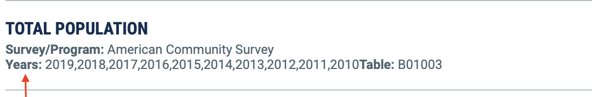

# Maps {-}

<!-- Put example in from Blackwell's slavery work. Need to add relevant data to PPBDS.data first. -->

<!-- Add something about street maps? http://joshuamccrain.com/tutorials/maps/streets_tutorial.html Or Map Box, which looks very cool. -->

<!-- Should we have the code run live or just save the data and pretend to run it live? Not sure! I am actually having trouble getting it to compile live. It seems like, when knitting, it does not have access to my API key. Why would that be? Running live takes a bunch of time. But the data is awfully large to store, much too large to put in Github, thereby preventing automated builds/testing. -->

<!-- Plan: No live downloads. Store data needed, perhaps even only the summary data. -->

<!-- Shorten beginning by just doing one download and then explaining all the parts? -->

<!-- Use summary.var from the very beginning? Related: Is this a teaching chapter (show the same thing in a bunch of ways) or a summary chapter (show one cool way and explain all the parts)? -->

In order to make maps, we first need some data.^[This section remixes some material from https://github.com/andrewbtran/NICAR-2019-mapping by Andrew Tran.]

## Tidycensus {-}

We need the **tidyverse** and **tidycensus** packages.  

```{r, message = FALSE}
library(tidyverse)
library(tidycensus)
```

Note that to use **tidycensus**, you'll need a Census API key.  You can request a key [here](https://api.census.gov/data/key_signup.html).  Once you have a key, use the `census_api_key()` function:

```{r, eval = FALSE}
census_api_key("API KEY")  # You must replace API KEY with your actual key.
```

If you run the `census_api_key()` function with the option `install = TRUE`, it will save your API key in your `.Renviron` so you don't have to run `census_api_key()` every time you want to get data from the Census. However, you should only do this once. You can examine/edit your `.Renviron` file directly with `usethis::edit_r_environ()`.

There are two main sources we will be getting data from: the **American Community Survey (ACS)** and the **Decennial Census**. Both sources are available at  [data.census.gov](https://data.census.gov).


When you click on [data.census.gov](https://data.census.gov)., you will be brought to a homepage with a search bar. You can then type the topic of interest.

```{r}
knitr::include_graphics("maps/images/searchbar.png")
```

For example, you could search for "resident population", and it will bring you to a page of various sources. Under each bolded title, you will see *Survey/Program* , which tells you the data source. We will only be focusing on the ACS and Decennial Census sources.

```{r}
knitr::include_graphics("maps/images/source-arrow.png")
```


To get data from the Decennial Census, use `get_decennial()`. The key arguments here are `geography`, `variables`, and `year`. 

* `geography` determines the unit of analysis (i.e. the "geography" of your data.  For example, we could use "state", but there are many other [geographies](https://walkerke.github.io/tidycensus/articles/basic-usage.html#geography-in-tidycensus) you could use, such as "us" for the entire country, "county" for counties, and so on.

* `variables` selects which Census variables you want. To know which variable you are dealing with, you have two options.  

**The first way:** look at the data.census.gov website. In addition to *Survey/Program*, you will also see the bolded term *Tables*. It will tell you the name of the variable. However, the variable names are a little tricky. For example, the variable name for population below is "BO1003".

```{r}
knitr::include_graphics("maps/images/table.png")
```

**The second way**:  use the `load_variables()` function in **tidycensus** to generate a tibble of variable names (described [here](https://walkerke.github.io/tidycensus/articles/basic-usage.html#searching-for-variables)). The two key arguments to `load_variables()` are the `year` and `dataset`.
For the year, you must use the year or end-year of the Decennial Census. For the `dataset` argument, you can either use "sf1" and "sf3". 


* `year` is the last argument to `get_decennial()` that we will be using. `get_decennial()` can obtain data from the 1990, 2000, and 2010 Census. You can find the year for your variable under *Years* .

```{r}

```

Now that we have a better understanding the arguments to the function `get_decennial()`, let's practice using it!

Consider the following code.

```{r, eval=FALSE}
library(tidyverse)

pop <- get_decennial(geography = "state",
                     variables = "P001001",
                     year = 2010)

glimpse(pop)
```

```{r, echo = FALSE, message = FALSE}
pop <- readRDS("other/data/maps_pop.rds")
glimpse(pop)
```

The output is a tibble with four columns:

- `GEOID` is part of the FIPS code, which is short for Federal Information Processing Standard. It's a standardized way to identify states, counties, census tracts, etc. In this instance it's only two characters wide. The more specific you get into the Census boundaries, the longer the code becomes.
- `NAME` is the generic name `get_decennial()` gives to the unit you selected with `geography`; here, they are state names.  Note that there are 52 observations; the "state" geography includes the District of Columbia and Puerto Rico, along with the 50 states.
- `variable` is the name of the variable you selected.
- `value` is the value of the variable you selected (here, population).

By default, `get_decennial()` will stack all the variables on top of each other if you select more than one, identifying them with the `variable` column.  So let's say that you wanted to know the proportion of the population of each state that lives in rural areas.  You would select two variables (total population and rural population) and would receive a tibble with 104 observations, with each state appearing once per variable. This may not be the most helpful way to receive the data, depending on your purposes. (When faceting, you may want the data in a long format like this, as we'll see below.)  You can request the data in wide format instead by using the option `output = "wide"`. 

```{r, eval = FALSE}
rural <- get_decennial(geography = "state",
                       variables = c("P001001", "P002005"),
                       year = 2010,
                       output = "wide")
glimpse(rural)
```

```{r, echo = FALSE}
rural <- readRDS("other/data/maps_rural.rds")

rural %>%
  as_tibble %>%
  select(-geometry) %>%
  glimpse()
```


Here, we created a tibble with states in the rows and total population ("P001001") and rural population ("P002005") in the columns.  To plot the proportion of each state's population that lives in rural areas is now a simple application of **tidyverse** functions we know and love.  First, let's create a variable for rural population proportion and order the states by that variable:


```{r}
rural %>%
  mutate(prop_rural = P002005/P001001) %>% 
  ggplot(aes(x = prop_rural, y = fct_reorder(NAME, prop_rural))) +
    geom_point() +
    labs(title = "Rural Population in US States in 2010",
         subtitle = "Maine and Vermont are the most rural states",
         caption = "Source: US Census",
         x = "Rural Population Proportion",
         y = NULL)
```

Maine and Vermont are very rural while Washington D.C. is entirely urban. What if we wanted a sense of how the proportion of rural residents varied geographically?  We need a map!

## Conceptual introduction to mapping {-}

There are two underlying important pieces of information for spatial data: the coordinates of the object and how the coordinates relate to a physical location on Earth, which is also known as a coordinate reference system or **CRS**.  

The coordinates are familiar from geography.  A CRS uses a three-dimensional model of the earth to define specific locations on the surface of the grid. An object can be defined in relation to longitude (East/West) and latitude (North/South).

Where this gets complicated is when attempting to create a projection.  A projection is a translation of the three-dimensional grid onto a two-dimensional plane.  The animation below demonstrates this process.

```{r, echo = FALSE}
knitr::include_graphics("other/images/projection_tween.gif")
```

Thus, the CRS determines how a geometric object will look when displayed on your two-dimensional screen.  We rarely need to specify a CRS when working with **tidycensus**, but it is good to know about the concept if you ever work with other spatial data.

### Vector versus spatial data {-}

Spatial data with a defined CRS can either be vector or raster data. Vector data is based on points that can be connected to form lines and polygons.  It is located within a *coordinate reference system.*  An example is a road map.

Raster data, however, are values within a *grid system,* such as satellite imagery. In this *Primer*, we will only be dealing with vector data, which is the format in which we get data from the **tidycensus** package.

### **sf** vs **sp** {-}

An older package, **sp**, lets a user handle both vector and raster data.  This book will focus on vector data and the **sf** package.  The main differences between the **sp** and **sf** packages are how they store CRS information. While **sp** uses spatial sub classes, **sf** stores data in data frames, allowing it to interact with **dplyr** methods we've learned so far. 

### Shapefiles {-}

R can handle importing different kinds of file formats for spatial data, including KML and geojson. We'll focus on shapefiles, which were created by Esri in the 1990s.  Though we refer to a "shapefile" in the singular, it's actually a collection of at least three basic files: 

* .shp - lists shape and vertices
* .shx - has index with offsets
* .dbf - relationship file between geometry and attributes (data)

All files must be present in the directory and named the same (except for the file extension) to import correctly.  Thankfully, **tidycensus** will grab the geometric information from the Census shapefile for you.

## Mapping with **tidycensus** and `geom_sf()` {-}

In order to start mapping in R, we need to get a little more data from the **tidycensus** package.  In particular, we need to set `geometry = TRUE`.

```{r, eval=FALSE}
rural <- get_decennial(geography = "state",
                       variables = c("P001001", "P002005"),
                       year = 2010,
                       output = "wide",
                       geometry = TRUE) 

glimpse(rural)
```

```{r, echo = FALSE}
glimpse(rural)
```

This is similar to the tibble we created before. However, there are two key differences. First, we now have this funky "multipolygon" column called `geometry`. This is a list column containing all the information `ggplot()` needs to create a map. Second, rural is no longer a tibble.

```{r}
class(rural)
```

`class()` is a function which tells us the, uh, "class" of an object. `rural` is of class "sf", which is a special kind of tibble which includes information for plotting. For this reason, **you should never use `as_tibble()` on an object of class "sf" since doing so strips the object of the key attributes it needs to make plotting easier.**

In order to create a map using `ggplot()`, we need a new geom: `geom_sf()`.  This works much like the geoms we have seen before, such as `geom_point()` and `geom_line()`, except with spatial data.  In particular, it is designed to work with objects of class "sf." Example:

```{r}
rural %>%
  ggplot() +
  geom_sf()
```

We have the boundaries of each state, including Alaska and Hawaii. But there are some problems. **ggplot2** is doing its best to fit everything on one image, which is taxing on the system. We can't see any particular state very well, because the map is zoomed far out.  Also, there are no colors because we didn't fill it with our data.

So, let's create a new map with `geom_sf()` and fill it with `prop_rural`. And we'll filter out Alaska, Hawaii, and Puerto Rico for now.

```{r}
rural %>%
  filter(! NAME %in% c("Alaska", "Hawaii", "Puerto Rico")) %>%
  ggplot(aes(fill = P002005 / P001001)) +
  geom_sf()
```

Now we have something usable!  This already has a lot of what we'd want from a map---most notably, the states are shaded based on our variable of interest, helping us to see some patterns in the data.  But it could use a bit of a makeover, which we'll give it in the next section. 

### Making maps pretty {-}

There are a few ways we can aesthetically improve this map:

- Make the fill colors easier to distinguish
- Make it so that darker colors map onto higher values of `prop_rural`
- Remove the gray background
- Give the legend an informative title and add a title and caption

A great function for providing the fill colors for maps is `scale_fill_viridis_c()`.  This has a few different color palettes that can be selected with the `option` argument, all of which are easily distinguishable both when displayed in black and white and for people with common forms of colorblindness.  You can also reverse the default order of the colors with the `direction = -1` option.  This function is for continuous variables such as `prop_rural`; if you have a discrete variable, you can use the analogous `scale_fill_viridis_d()`.

We'll also use `theme_void()`, a great theme for maps that gets rid of the gray background.  Finally, we'll use `labs()` to give the legend the title "Percent Rural" (and multiply the values of the variable by 100) and add an overall title and caption.

```{r}
rural %>%
  filter(! NAME %in% c("Alaska", "Hawaii", "Puerto Rico")) %>%
  ggplot(aes(fill = 100 * P002005 / P001001)) +
    geom_sf() + 
    scale_fill_viridis_c(option = "plasma",
                         direction = -1) +
    labs(title = "Rural geography of the United States",
         caption = "Source: Census 2010",
         fill = "Percent Rural") +
    theme_void()
```

With this map, it is clear that the more rural states are concentrated in the Great Plains, the South, and parts of New England, while the (South)west and Northeast are less rural.

### Adding back Alaska and Hawaii {-}

But what about Alaska and Hawaii?  If you want to display those on your map without having to zoom out, you can take advantage of an argument in `get_decennial()`, `shift_geo = TRUE`:

```{r, eval = FALSE}
rural_shifted <- get_decennial(geography = "state",
                               variables = c("P001001", "P002005"),
                               year = 2010,
                               output = "wide",
                               geometry = TRUE,
                               shift_geo = TRUE) %>%
  rename(state = NAME) %>%
  mutate(prop_rural = P002005/P001001)
```

```{r, echo = FALSE}
rural_shifted <- readRDS("other/data/maps_rural_shifted.rds") %>%
  rename(state = NAME) %>%
  mutate(prop_rural = P002005/P001001)
```

```{r}
rural_shifted %>%
  ggplot(aes(fill = prop_rural * 100)) +
  geom_sf() + 
  scale_fill_viridis_c(option = "plasma",
                       direction = -1) +
  labs(title = "Rural geography of the United States",
       caption = "Source: Census 2010",
       fill = "Percent Rural") +
  theme_void()
```

Now, Alaska and Hawaii can be displayed near the lower 48 states.  This option removes Puerto Rico from your tibble altogether, so it is not a good choice if you want to show data from Puerto Rico.

## Faceting maps {-}

A powerful tool in **ggplot2** to use with maps is faceting. Let's grab data from the ACS on the population in Harris County, Texas census tracts by race:

```{r, eval=FALSE}
racevars <- c(White = "B02001_002", 
              Black = "B02001_003", 
              Asian = "B02001_005",
              Hispanic = "B03003_003")
harris <- get_acs(geography = "tract",
                  variables = racevars, 
                  year = 2018,
                  state = "TX",
                  county = "Harris County",
                  geometry = TRUE,
                  summary_var = "B02001_001") 
```

```{r, echo = FALSE}
harris <- readRDS("other/data/harris.rds")
```

This code is very similar to what we've used before, except here we are retrieving the data from the American Community Survey using `get_acs()` instead of from the decennial census.  Some new features worth pointing out:

- The `year` for `get_acs()` is the last year of a five year sample.  Thus, our data will be from 2014--2018.  You can choose `year`s from 2009--2018.
- Since our geography is "tract", we are further specifying the `state` and `county`. 
- We are obtaining the data in a long format, which makes faceting easier.
- We added a `summary_var`, "B02001_001", which is the total population.  As we'll see, this appears as a separate column, which is helpful to us.  (As an exercise, try going back to the code that created `rural` and see how you would do that in a long format with `summary_var`.)

Let's take a look at `harris`:

```{r}
glimpse(harris)
```

These are similar to what we've seen before.  Note that we now have `moe` and `summary_moe` columns, which stand for "margin of error."  This is because, unlike the decennial census, the ACS is a survey and thus the values we get are estimates of the true value.^[Even the decennial census, of course, is an estimate, given the possibility of nonresponse and other errors, but it is closer to the true value than a survey.]

### Transforming and mapping the data {-}

Now we can use `facet_wrap()` to look at our race variables side-by-side:

```{r}
harris %>%
  mutate(Percent = 100 * (estimate / summary_est)) %>%
  ggplot(aes(fill = Percent, color = Percent)) +
  facet_wrap(~ variable) +
  geom_sf() +
  scale_fill_viridis_c(direction = -1) +
  scale_color_viridis_c(direction = -1) +
  labs(title = "Racial geography of Harris County, Texas",
       caption = "Source: American Community Survey 2014-2018") +
  theme_void()
```

Note how easy it was to create the percentages using `summary_est`.  We also used `color = Percent` and `scale_color_viridis_c()` to avoid having annoying borders around each of the census tracts.  Otherwise, this doesn't differ much from our code before, yet it is much easier to make comparisons across variables.  Faceting is a powerful tool to use with maps.


## Working with big data {-}

Instead of a census tract map for just one city, let's do a "big data" project involving every census track in the country, plotting the percentage of people who are two or more races. 

Start by finding the correct variable in the American Community Survey by using the `load_variables()` function. This function takes two required arguments: the year of the Census or endyear of the ACS sample, and the specific dataset. Example:

```{r,  eval = FALSE}
acs2018 <- load_variables(2018, "acs5")

acs2018
```

In the 2018 ACS, the variable we're looking for is called `"B02001_008"`. We also need total population (`"B02001_001"`) to calculate a percentage. There are a total of 74,134 census tracts in the US. Note that the `state.name` vector included base R, includes the names of every state in the US. 

In this case, we use `state.name` to make `continental`, a vector of every state in the US other than Alaska and Hawaii. 

```{r, eval = FALSE}
continental <- state.name[! state.name %in% c("Alaska", "Hawaii")]

races <- get_acs(geography = "tract",
                 state = continental,
                 variables = "B02001_008", 
                 year = 2018,
                 summary_var = "B02001_001",
                 geometry = TRUE)

races
```

```{r, echo = FALSE}
races <- read_rds("other/data/races.rds")

races
```

We set `size` to 0.003 to create thin outlines around our census tracts, any larger and they would make it hard to see our tracts. We also use the `inferno` option of `scale_fill_viridis()` for a different aesthetic from our previous plots. We add `theme_void()` and some `labs()` . 

```{r}
races  %>%
  mutate(Percent = 100 * (estimate / summary_est)) %>%
  ggplot(aes(fill = Percent)) +
  geom_sf(size = 0.003) +
  scale_fill_viridis_c(direction = -1, option = "inferno") +
  labs(title = "Percent of People Who are Two or More Races by Census Tract",
       caption = "Source: American Community Survey 2014-2018") +
  theme_void()
```

## PUMS {-}

Census microdata, often referred to as 'Public Use Microdata Samples' or PUMS, contains advanced census data on individual people. PUMS contains data for roughly 1% of the US population. To access PUMS, use the `get_PUMS()` function, which works in a very similar way to `get_decennial()` or `get_acs()`. 

If you're having trouble finding which PUMS variables represents what, the **tidycensus** dataset `pums_variables` can be helpful.

```{r}
glimpse(pums_variables)
```

Here we make `US_pums` contain age, sex, and income data for every single person in PUMS. `AGEP` is age, `FINCP` is income, and `SEX` is sex. 

```{r, eval = FALSE}
US_pums <- get_pums(variables = c("AGEP", "FINCP", "SEX"),
                    state = state.name,
                    recode = TRUE,
                    survey = "acs1")
```

<!-- DK: below discussion is awkward. Also, I don't like not looking at the data. But this data is too big to upload, so I am just ignoring the issue for now. The data is in other/data/us_pums.rds if we want to work with it. -->

Because we are using every single individual in PUMS to make `US_pums`, we get an enormous tibble with over 3 million rows! This might look intimidating at first, but we can use the same basic **dplyr** functions as usual.

One trade-off with using PUMS data as compared to aggregated data is that you only get the state and public use microdata area (PUMA) of each individual in the microdata. PUMAs are Census geographies that contain at least 100,000 people and are entirely within a single state. They are built from census tracts and counties and may or may not be similar to other recognized geographic boundaries. In New York City, for instance, PUMAs are closely aligned to Community Districts. So, if you are interested in pulling data about block groups, census tracts, or other small areas, you can’t use PUMS data. `get_pums()` will always return `SERIALNO`, `SPORDER`, `WGTP`, `PWGTP`, and `ST`. `SERIALNO` and `SPORDER` are the variables that uniquely identify observations, `WGTP` and `PWGTP` are the housing-unit and person weights, and `ST` is the state code. 

By setting `recode = TRUE`, we create new `_label` columns to recode these numerical values into what they represent.


## Plotting with PUMS {-}

But why is PUMS useful? Well, it allows us to create new interesting variables. 

Let's try making a map with PUMS. Let's say we wanted to make a map of the percentage of the population of states in the Northwest that are seniors, which we will define as the percent of the population that is 65 or above. Although there's no variable that will tell us this directly, we can use PUMS to construct it. We want our data to be as detailed as possible, so we will map our data by PUMAs. We define states in the northwest as Washington, Idaho, and Oregon. 


First, we want to put your custom PUMS estimates on a map. To do this, let’s use the **tigris** package to download PUMA boundaries for the states in the northwest as an sf object.

```{r, eval = FALSE, message = FALSE}
nw_states <- c("OR", "WA", "ID")
nw_pumas <- map(nw_states, 
                tigris::pumas, 
                class = "sf", 
                cb = TRUE) %>%
    reduce(rbind)
```


Now, we use `get_pums()` to get our data. We select `PUMA` and `AGEP`, which stand for PUMA and age respectively. 

```{r, eval = FALSE, message = FALSE}
nw_pums <- get_pums(variables = c("PUMA", "AGEP"),
                    state = nw_states,
                    recode = TRUE,
                    survey = "acs1",
                    year = 2018)
```

Now, we use `dplyr:group_by()` and `dplyr:summarize()` to make a modified version of `nw_pums` with new variables. `total_pop` represents the total population of a PUMA, and `pct_Senior` represents the fraction of the population in that PUMA that's 65 or over (>64).

```{r, eval = FALSE}
nw_Senior <- nw_pums %>%
    group_by(ST, PUMA) %>%
    summarize(total_pop = sum(PWGTP), 
              pct_Senior = sum(PWGTP[AGEP > 64]) / total_pop,
              .groups = "drop")
```

Working with PUMS data can be little tricky, so before we get to mapping we have to `left_join()` `nw_Senior` back into `nw_pums`, mapping `"STATEFP10"` to `ST`, and `"PUMACE10"` to `"PUMA"`. This is a confusing quirk of PUMS data that you do not need to worry about. 

```{r, eval = FALSE}
nw_final <- nw_pumas %>%
    left_join(nw_Senior, by = c("STATEFP10" = "ST", "PUMACE10" = "PUMA")) 
```

Then, we use `geom_sf()` to make our plot. We use `scale_fill_viridis_b(option = "magma")` and `theme_void()` to customize the look of our map, and use `labels = scales::label_percent(1))` as a handy trick to convert `pct_Senior`'s fractions into percentages. Add some `labs()` and we're done!

```{r, echo = FALSE}
nw_final <- read_rds("other/data/nw_final.rds")
```


```{r}
nw_final %>% 
  ggplot(aes(fill = pct_Senior)) +
    geom_sf() +
    scale_fill_viridis_b(name = NULL,
        option = "magma",
        labels = scales::label_percent(1)) +
    labs(title = "Percentage of population that are Seniors",
         caption = "Source: American Community Survey 2014-2018") +
    theme_void()
```


## Want to explore further? {-}

- Take a look at the [**tidycensus** website](https://walkerke.github.io/tidycensus/).
- If you have shapefiles from a place other than **tidycensus**, you can read them in using `st_read()` in the **sf** package, join them with other data using **dplyr** functions, and then map them with `geom_sf()` as we have shown above.
    - You may have to look into using [`coord_sf()`](https://ggplot2.tidyverse.org/reference/ggsf.html) if you have trouble displaying your data.
- Want to add interactivity to your maps?  Check out the **leaflet** package.  [Here's](https://juliasilge.com/blog/using-tidycensus/) a good introduction to using **leaflet** with **tidycensus**.
- Practice your skills with [Andrew Tran's case study slides](https://andrewbtran.github.io/NICAR/2019/mapping/02_case_study_slides.html), where you can replicate a graphic from the Washington Post. Note: this involves some packages we haven't shown you in this book, but if you follow along step by step you will be able to see how they are used.


Downloading feature geometry from the Census website.  To cache shapefiles for use in future sessions, set `options(tigris_use_cache = TRUE)`.
